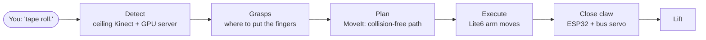

# Overview

**qBArm** is a table-top robot cell that finds objects with a ceiling camera and picks them up with a small robot
arm and a home-built claw. You name what you want ("tape roll", "bottle"), the cell finds it, works out where and
how to grab it, plans a collision-free motion and executes it.

## The cell at a glance

| Part | What it is |
|---|---|
| Robot arm | UFACTORY **Lite6**, 6 joints, ~0.44 m reach, controller at `192.168.1.23` |
| Gripper | **qB-AdaptiveGripper**: an FT-001 aluminium parallel claw (two parallelogram linkages), 70 mm max opening, driven by a Hiwonder **HX-06L** bus servo, controlled by an **ESP32-C3** over Wi-Fi |
| Camera | **Azure Kinect DK** on the ceiling, ~1.47 m above the table, looking down (RGB 1280x720 + depth) |
| Main computer | **qBArm** (Ubuntu 24.04, ROS 2 Jazzy): drivers, MoveIt, RViz, perception client, pick logic |
| GPU computer | **hbh-ai** (`192.168.1.220`, RTX 3060): object detection, segmentation, grasp prediction in a Docker container |

## How to read these docs

If you are new to robot arms, read the two primers first; everything else builds on their vocabulary.

1. [Project status](01-status.md) – where we are, what works, what is open, what we learned the hard way
2. [System architecture](02-architecture.md) – all parts, computers, processes, ROS nodes and how they talk
3. [Primer: ROS 2 and MoveIt](03-ros2-moveit-primer.md) – frames, URDF, planning scene, IK, planning, execution
4. [Primer: grasping](04-grasping-primer.md) – what a grasp is, approach/closing axes, pre-grasp, grasp quality
5. [Perception pipeline](05-perception-pipeline.md) – detection → segmentation → 3D localisation → grasps, in detail
6. [Pick execution](06-pick-execution.md) – how a grasp becomes arm motion
7. Module designs: [qb_arm](07-qb_arm.md), [camera calibration](08-camera-calibration.md),
   [qb_arm_vision](09-qb_arm_vision.md), [qb_arm_gripper firmware](10-qb_arm_gripper.md),
   [infrastructure](11-infrastructure.md)
8. [Operations](12-operations.md) – runbook, safety rules, troubleshooting
9. [Glossary](13-glossary.md)

The **Live status** page (top of the menu) shows what is running right now.

## Repositories

All on GitHub under `whoobee`, branch `develop`:

| Repository | Contents | On qBArm |
|---|---|---|
| `qb_arm` | ROS 2 package: launch files, claw model (URDF/SRDF), camera calibration, obstacle cloud, `cell` script | `~/prj/ros2_ws/src/qb_arm` |
| `qb_arm_vision` | ROS 2 packages (detector, pick executor, interfaces) + the GPU server (Docker) | `~/prj/ros2_ws/src/qb_arm_vision` |
| `qb_arm_gripper` | ESP32-C3 firmware (PlatformIO) for the claw | `~/prj/qb_arm_gripper` |
| `qb_arm_install` | `install.sh` (sets up the whole machine) and these docs | `~/prj/qb_arm_install` |
| `qb_arm_kinectdk_ros2` | Azure Kinect ROS driver, ported to Jazzy | `~/prj/ros2_ws/src/Azure_Kinect_ROS_Driver` |
| `qb_arm_lite6` | UFACTORY `xarm_ros2` (Lite6 driver, MoveIt config), unmodified | `~/prj/ros2_ws/src/xarm_ros2` |

Third-party, built from source in the workspace: `micro-ROS-Agent` and `micro_ros_msgs` (jazzy).
