# Project status

*State of 2026-09-29.*

## Where we are

**The cell has done its first complete real pick:** a tape roll lying flat on the table was detected by the ceiling
camera, grasped by its rim, lifted 10 cm, held, and dropped again on command. Every part of the chain is in place
and has run on the real hardware:

```mermaid
flowchart LR
    A["Camera pose<br/>calibrated"]:::done --> B["Detection +<br/>segmentation"]:::done
    B --> C["3D localisation<br/>+ collision shapes"]:::done
    C --> D["Grasp computation"]:::done
    D --> E["Motion planning<br/>(MoveIt)"]:::done
    E --> F["Arm execution"]:::done
    F --> G["Claw grip"]:::partial
    G --> H["Lift / release"]:::done
    H --> I["Place (set down)"]:::todo
    classDef done fill:#d8efe0,stroke:#2e7d4f,color:#123
    classDef partial fill:#fbeccb,stroke:#9a6b00,color:#321
    classDef todo fill:#eee,stroke:#999,color:#444,stroke-dasharray: 4 3
```

| Area | State |
|---|---|
| Lite6 + MoveIt (real and simulated) | Working. Launched as one unit with `cell start real` / `cell start sim`. |
| Ceiling Kinect + extrinsic calibration | Working. Camera pose from IMU tilt + ICP against the robot meshes, 4 mm RMS. |
| Obstacle avoidance (octomap) | Built and tested in sim, **off by default** in the cell (it also sees the object to pick). |
| Detection / segmentation / grasps (GPU server) | Working, ~3.7 s per request (Contact-GraspNet ~2.5 s of it). |
| Grasp logic for the claw | Working: CGN grasps + ring (rim) grasps + top-slice fallback, finger-landing check, closing-claw geometry. |
| Pick executor | Working on the real arm: pre-grasp → straight approach → close → attach → lift; release. |
| Claw hardware + firmware | Mounted on the arm (20 mm plate, −45°), calibrated, micro-ROS over Wi-Fi, OTA updates. |
| Grip force | **Weak**: holds a tape roll, but it slid out before the overshoot fix and is "not that strong" now. |
| Place (set an object down) | **Not implemented**: `release` just opens the claw where it is. |

## What is open

1. **Stronger grip.** Commands are clamped at 0.96 rad (pads touching), so a thin object leaves little position
   error for the servo to push with. Planned: allow commands past 0.96 (up to ~1.2 rad, still inside the servo's
   stored limit 650), raise `grip_overshoot` to 0.3 rad, and let `pick_executor` continue when the claw stops
   moving instead of waiting 5 s for a position it cannot reach. Rubber pads on the fingers would add friction.
2. **Place.** Move above a target, lower until contact/height, open, retract.
3. **A named "ready" pose** in MoveIt for the real arm (the all-zero "home" pose is unsafe with the claw, see below).
4. **Grip detection** ("adaptive"): the servo stops short of its target when it holds something; publish that as
   `/claw/gripping` and let the pick check it before lifting.
5. **Reach.** Top-down grasps only work up to ~33 cm from the base (the claw + plate add 111.5 mm to the flange).
6. **Octomap in picking**: filter the target object out of the obstacle cloud so obstacle avoidance can stay on.
7. Housekeeping: remove the temporary passwordless sudo on qBArm; reserve the DHCP addresses (qBArm .171, claw .123).

## Timeline

| Date | Milestone |
|---|---|
| 2026-09-27 | ROS 2 Jazzy + xArm driver + MoveIt on qBArm; Fast DDS discovery server as a service; real-time scheduling. Arm fault C16 (joint 6) cleared by power-cycling the arm. |
| 2026-09-27 | Azure Kinect driver ported to Jazzy; camera mounted on the ceiling; tilt from the IMU, yaw and position by fitting/ICP against the robot → 4 mm RMS. |
| 2026-09-27 | `install.sh` recreates the whole machine; tested end-to-end. |
| 2026-09-28 | Obstacle avoidance: depth → obstacle cloud → MoveIt octomap; table as a collision box. |
| 2026-09-28 | Claw modelled from the Fusion 360 export (two four-bar linkages as trees with mimic joints). |
| 2026-09-28 | Vision: GPU server (Grounding DINO + SAM 2 + Contact-GraspNet) and `qb_arm_vision` (detect + pick services); picks work in sim. |
| 2026-09-29 | ESP32-C3 claw firmware: HX-06L over the BusLinker, micro-ROS over Wi-Fi, OTA, calibration; micro-ROS agent as a service. |
| 2026-09-29 | Claw mounted on the arm: 20 mm plate, −45° about the flange axis. |
| 2026-09-29 | First real picks: two crashes (see below), both fixed; `cell` script; **first successful real pick**. |

## Lessons learned (incidents and their fixes)

These are worth reading: each one changed the design.

| # | What happened | Root cause | Fix |
|---|---|---|---|
| 1 | qBArm's USB port shut down (over-current) when the claw's supply was connected; the first ESP32 disappeared from USB | The small ESP32-C3 board ties its 5 V pin straight to USB VBUS; the buck converter's 5 V back-fed the PC's USB port | Never power the board from the buck **and** USB at once. OTA firmware updates, so USB is no longer needed. The port recovered after a full power-off. |
| 2 | Firmware updates over Wi-Fi failed at 5 %; up to 80 % packet loss | Small C3 boards distort at full TX power; the board also joined the weakest of three access points | TX power 8.5 dBm, modem sleep off, join the strongest AP → 0 % loss, 5 ms |
| 3 | A second subscriber appeared on `/claw/command` after each reboot | micro-ROS picked a random session key per boot; the agent kept the old session's entities | Session key derived from the MAC |
| 4 | **Crash 1**: a finger landed on top of the tape roll (arm stopped with C31 "collision caused abnormal joint current") | Contact-GraspNet grasp on a thin rim, tilted 30°, fingers closing *along* the rim; by the model one finger passed the tape at 3.7 mm — less than the real errors | Rim grasps for flat rings (straight down, closing radially); every grasp must keep objects out of the open fingers' paths with a 10 mm margin |
| 5 | **Crash 2**: fingers pressed into the table while closing; emergency stop | The claw is a parallelogram: closing moves the fingers **18.8 mm further down**. Only the open claw was checked against the table. | `claw.py` finger-drop model; grasp height raised by the drop; table check with the fully closed claw |
| 6 | Stale ROS processes from earlier launches: two pick executors executed one pick; the Kinect stayed busy | Ad-hoc `ros2 launch` + `pkill`; pkill patterns even matched the calling shell | `cell` script: one process group per cell, stopped as a whole |
| 7 | The tape roll slid out of the fingers | The servo is position-controlled; closing only 5 mm narrower than the object left ~3 servo steps of error, i.e. almost no force | Close `grip_overshoot` (0.2 rad) past the contact angle |

> **Safety rule born from this:** with the claw mounted, the arm's **all-zero joint pose** (xArm "home",
> UFACTORY app "go home") puts the claw **into the robot base**. Never send the real arm there.
