# Project status

*State on 2026-10-03.*

## Where we are

**The cell picks real objects end to end on the real hardware.** You name an object; the ceiling camera finds it, the
cell computes a grasp for the claw, MoveIt plans the motion, the Lite6 executes it, the claw closes and the arm lifts
the object; `place` sets it down at a point, on, into or next to another object — after checking in a fresh height
map from the camera that the spot is free (or `release` just opens the claw). Picked so far: a **tape roll** lying flat (gripped across its rim) and a
pair of **pliers** only ~7 mm high (gripped across the jaws). Since 2026-10-03 it also **hands objects to the user's
hand and takes them from it** (give / hold this), with the hands tracked by the camera. Every link of the pick chain
has run on the real arm:

```mermaid
flowchart LR
    A["Camera pose<br/>calibrated"]:::done --> B["Detection +<br/>segmentation"]:::done
    B --> C["3D localisation<br/>+ collision shapes"]:::done
    C --> D["Grasp computation"]:::done
    D --> E["Motion planning<br/>(MoveIt)"]:::done
    E --> F["Arm execution"]:::done
    F --> G["Claw grip"]:::partial
    G --> H["Lift / release"]:::done
    H --> I["Place (set down)"]:::done
    classDef done fill:#d8efe0,stroke:#2e7d4f,color:#123
    classDef partial fill:#fbeccb,stroke:#9a6b00,color:#321
    classDef todo fill:#eee,stroke:#999,color:#444,stroke-dasharray: 4 3
```

| Area | State |
|---|---|
| Lite6 + MoveIt (real and simulated) | Working. Launched as one unit with `cell start real` / `cell start sim`. |
| Ceiling Kinect + extrinsic calibration | Working. Camera pose from IMU tilt + ICP against the robot meshes, 4 mm RMS. |
| Obstacle avoidance (octomap) | **On by default** (2026-09-30, after the arm hit an undetected water bottle): the camera's point cloud minus the robot and the known objects → MoveIt's octomap; refreshed before every pick and place. Tested on the real cell (plan only): a pose 1 cm above the bottle refused, beside it accepted; picks of known objects still plan. |
| Detection / segmentation / grasps (GPU server) | Working, ~3.7 s per request (Contact-GraspNet ~2.5 s of it). |
| Grasp logic for the claw | Working: CGN grasps + ring (rim) grasps + narrow-slice grasps for flat/long objects + top-slice fallback, finger-landing check, closing-claw geometry, heights above the measured table plane. Picked: tape roll (rim), pliers (7 mm high, across the jaws). |
| Pick executor | Working on the real arm: servo-mode check → pre-grasp → straight approach → close until the fingers stop → attach → lift; release. Puts the arm back into servo mode itself before every pick and recovers arm faults automatically, carrying the step on (not the e-stop). |
| Table model | Plane from three claw touches (2026-10-02: flat against the robot base within 0.16°; the camera agrees within ~1.5 mm) used for object heights, fingertip clearance (3 mm) and MoveIt's collision table. |
| Process management | `cell start sim\|real` / `cell stop`: one process group, clean starts and stops. |
| Documentation | This site, `http://192.168.1.171:8080`, with live status. |
| Control page | `http://192.168.1.171:8081` (qb-arm-control.service): start / stop the cell, arm state, claw live data and charts, detection with a typed prompt, boundaries editor, log. |
| Claw hardware + firmware | Mounted on the arm (20 mm plate, −45°), calibrated, micro-ROS over **qBArm's own access point** `qbarm-claw` (0 % loss, ~4 ms), OTA updates, servo heat guard. |
| Grip | Closes to 1.2 rad (past pads-touching) and waits until the fingers stop; the servo pushes with the remaining error, limited by the firmware's stall guard. Grip check from stop position + servo current (INA219), on since 2026-10-01: servo position reads ~1.01 rad both empty and on a tape wall → INA219 current sensor ordered. |
| Place (set an object down) | Working on the real arm: at a point, on / into / next to a detected object → above the spot, straight down to the height at which it was grasped above the surface (+3 mm), open, straight up. Tape roll placed 2 mm / 12 mm from the target; tape roll and screwdriver placed into a bin. Height is computed, not felt (no current sensing yet). |
| Soft boundaries | Built and tested on the real cell (no motion): `config/boundaries.yaml` — vision workspace (the detector blacks out everything else before detection; place spots outside refused) and keep-out zones (MoveIt collision boxes: IK, plans and straight lines refused, checked with a temporary test zone). **The desk/pc zones are a first proposal from the camera image, to be confirmed.** |
| Handover (give / hold this) | Give: worked on the real arm 5 times (2026-10-03) — to a hand held still, released on the hand at the object (1 s) or on a pull (arm joint torques); stops on a hand near the arm, pauses and resumes when the hand moves. Take: first real run 10-03 (closed and held; then the old move home hit joint 4's limit, fixed); now holds the object where it took it; object measured once the hand has left. |
| Place check (height map) | Built and tested against the real camera (plan only): every spot is checked in a fresh height map (7 depth frames, robot cut out) — free under the object and the open fingers, seen by the camera; into a container, room below the rim above the contents, emptiest spot first, fill reported. **Not yet run with a real place motion.** |

## What is open

In rough order of priority:

0. **Helping hand / assistant** (2026-10-01): hold things while the user works (soldering) and hand over objects.
   Milestone 1 done: jog (micro adjustments) and named spots / poses (Config → spots). Next: (2) locate the user's
   hand from the ceiling camera (MediaPipe Hands + depth) and detect presence (slower speed when someone is in the
   cell, the hand as an obstacle); (3) handover — bring the held object to the hand, release on a button / on a pull;
   take an object from the hand; (4) "give me the tape", "hold this"; (5) hands-free commands (voice, foot pedal).
   Hand tracking feasibility (2026-10-01): MediaPipe HandLandmarker (CPU, `~/prj/venvs/hands`) on the Kinect colour
   image + aligned depth: 18 fps with the cell running, hand found in 99% of frames still / 81% moving, palm and
   fingertip steady to 1–2 mm, a flat hand 28 mm above the table (correct). Weak spots: a fingertip the depth camera
   sees behind the arm (fallback: palm depth + hand shape), the user's natural hand position (0.45–0.7 m) is at the
   edge of the depth image (top right missing) and beyond the arm's reach (0.44 m), left/right labels unreliable from
   above. Hand size as a depth estimate: useless from above. WFOV_2X2BINNED depth: wider, but no depth on most of the
   dark table — stays NFOV_UNBINNED (`depth_mode` launch argument for experiments).
   **Milestone 2 started (2026-10-01): `hand_tracker` node** built and running with the cell (~18 fps,
   /qb_arm_vision/hands + RViz markers, control page hands chip and panel); not yet tested live with hands.
   **2026-10-02: camera moved** along the wall towards the user (x −0.38 → 0.41) after an occlusion study (hand zone
   79 → 99 % visible, see [camera calibration](08-camera-calibration.md)); recalibrated, table plane from claw touches.
   **Next:**
   1. Live test of the tracker (control page Control tab + RViz *Hands*): one hand, two hands, moving, a hand near the
      arm; record /qb_arm_vision/hands for ~25 s → track stability (ids not switching), how often depth is carried
      over, near-arm detection, latency; tune confirm_frames / lost_timeout / One Euro / tip_agreement.
   2. Presence in motion planning: while a hand is present, a reduced speed limit (independent of Config → motion);
      a hand near the arm → no new motion / stop (design first: a stop needs a fast path, not a 1 s poll).
   3. The hands as obstacles in MoveIt (boxes / capsules around the hand landmarks, refreshed), except for the hand
      during a deliberate handover.
   4. Handover zone: where hands and arm meet (≤ ~0.40 m from the base, inside depth coverage); then milestone 3
      (bring the held object to the hand, release on a button first, later on a pull via the claw current).
   **Milestone complete (2026-10-02): camera view, live view and a stable wired cell.**
   - Camera moved along the wall (x −0.38 → 0.41) after an occlusion study; recalibrated; the table plane comes from
     three claw touches (flat within 0.16°; the old 0.87° tilt was a calibration error).
   - Control page: live camera video (MJPEG) with the tracked hands drawn in; two-column layout without scrolling
     on 1920×1080.
   - Wired LAN (USB-C hub/Ethernet combo, 192.168.1.135): arm, ROS and the LAN over the cable, Wi-Fi .171 as backup;
     ROS limited to that one interface. Arm link 0.85 ms; control-loop overruns 37–47/min (Wi-Fi) → 2.6/min (cable +
     real-time priority, now also for cells started from the page).
   - Detector pairs colour + depth within 5 ms; 16 MB shared-memory segments tried and reverted (camera crash).
   - Start-up race (lost replies → trajectory controller unconfigured / inactive): qb_arm's own `controller_starter`
     replaces the spawner (3 s per reply, reads the state back, never configures twice — the action server is created
     once; controller active 15–18 s after a start), and the pick executor configures / activates the controller
     itself when the arm is ready.

   **Open from this milestone:**
   - `controller_starter` in sim mode (with the `joint_state_broadcaster`) is not tested yet.
   - C24 "Speed Exceeds Limit" on free moves: the user limit-tests `velocity_scaling` 0.9 (Config → motion; the repo
     default stays 0.5), now with real-time priority.
   - Reserve 192.168.1.135 for MAC 00:e0:4c:36:02:83 in the router.
   - From the new camera position the bin (behind the robot) is ~40 % visible: "into the bin" worked for the tape
     roll, the bigger yellow box was refused by the free-spot check.
   - Then continue with item 1 above (live test of the hand tracker).

   **Milestone (2026-10-03): handover — give and take.** See [pick execution](06-pick-execution.md#handover-give-and-take).
   - **Give**: the arm brings the held object to a hand held still (the one nearest to the robot), 10 cm in front of
     the palm, slowly; it opens when the hand has been at the object for 1 s, or on a pull (joint torques of the arm,
     0.8 Nm for 0.15 s). Worked on the real arm (08:16, 08:18, 08:20, 12:38, 14:13).
   - **Take (hold this)**: the claw comes to the hand open; it closes once the camera sees something between the fingers
     and every hand clear of the claw for 0.5 s (or on *close now*) and **holds it right there** (user, 10-03: no
     retract, no home — the point is to hold it while you work on it); the object is measured in the depth image once
     your hand has left it and held as `handed_N` — jog it, give it back or place it like a picked one.
   - Safety: watched every 30 ms — a hand within 5 cm of the arm or the stop button stops it within ~0.1 s (the
     trajectory controller's goals are cancelled); the hand moving / leaving / the tracker's gaps pause it, then it
     re-plans (up to 3 times). Natural arm configurations only (the controller's C22), the user's hand left out of the
     octomap, back off = the approach reversed. Picks are vertical first (tilted only when vertical isn't possible).
   - Sim suite: give 8 scenarios, take 7.

   **Open from this milestone:**
   - Real-arm test of take (and of give since the octomap fix `a302090`): close trigger, measured box, give back, place.
   - Handover parameters on the control page's Config tab (now `ros2 param set` only).
   - The handover pose search sometimes skips the preferred 34° tilt and takes 52° / 69°: KDL's IK gets 0.2 s per
     pose and fails more often right after a plan, while the machine is busy (load ~5 of 8 cores: Kinect driver,
     hand tracker, the control page's live view, an idle pick executor at ~50 %, RViz animating the plan). The log
     line *Handover pose: … (skipped: …)* shows why candidates failed.
1. **Grip sensing — measured and in use (2026-10-01).** Empty vs tape / thin cardboard / sponge, 3 trials each: the
   empty check uses stop position and holding current together (see [pick execution](06-pick-execution.md)). Next:
   re-check the empty baseline with a warm servo (~50 °C), then force control by current and a stall guard that
   really limits the push (the firmware's is a no-op at 1.2 rad).
2. **Claw drive train.** Check for slip between servo horn and gear (the servo turns ~0.2 rad more than the fingers
   move). Rubber pads on the fingers would add friction on smooth objects.
3. **Place, next steps.** Relative placement and the height-map check are built; the check still needs a real
   place run (e.g. next to / into the bin). Then — with the INA219 — lower until contact instead of to a computed
   height. The map sees nothing under the arm: if that gets in the way, move the arm aside before the check.
4. **A named "ready" pose** for the real arm in MoveIt (the all-zero "home" pose puts the claw into the robot base).
5. **Better grasp points on long objects.** The pliers hung by their jaws; rank narrow-slice grasps by the centre of
   mass (the joint) instead of the middle of the outline.
6. **Detection confidence of small objects.** "pliers" scores 0.32–0.38 against the 0.30 threshold and is sometimes
   missed; more specific prompts or a lower threshold per request.
7. **Reach.** Top-down grasps work up to ~33 cm from the base (claw + plate add 111.5 mm to the flange); tilted
   approaches would extend it.
8. **Octomap during picks.** Filter the target object out of the obstacle cloud so obstacle avoidance can stay on.
9. **Servo alternative**, if current sensing isn't enough: Feetech STS3215 (same bus; torque limit and current in the
   servo), needs a new servo library and mount.
10. **ESP32 temperature — watching.** The claw's ESP32-C3 chip reads ~73 °C (`/claw/esp_temperature`; it was 76–78 °C
    before the firmware went to 80 MHz with an idle pause per loop). Warm to the touch, within spec (85–105 °C). The
    rest is the always-on Wi-Fi radio and the board's linear regulator. If it climbs: Wi-Fi modem sleep (claw commands
    up to ~100 ms slower, off during OTA), 3.3 V from a buck converter instead of the regulator, or air / a heat sink.
11. Housekeeping: remove the temporary passwordless sudo on qBArm; reserve qBArm's address (.171) in the router.

## Timeline

| Date | Milestone |
|---|---|
| 2026-09-27 | ROS 2 Jazzy + xArm driver + MoveIt on qBArm; Fast DDS discovery server as a service; real-time scheduling. Arm fault C16 (joint 6) cleared by power-cycling the arm. |
| 2026-09-27 | Azure Kinect driver ported to Jazzy; camera mounted on the ceiling; tilt from the IMU, yaw and position by fitting/ICP against the robot → 4 mm RMS. |
| 2026-09-27 | `install.sh` recreates the whole machine; tested end-to-end. |
| 2026-09-28 | Obstacle avoidance: depth → obstacle cloud → MoveIt octomap; table as a collision box. |
| 2026-09-28 | Claw modelled from the Fusion 360 export (two four-bar linkages as trees with mimic joints). |
| 2026-09-28 | Vision: GPU server (Grounding DINO + SAM 2 + Contact-GraspNet) and `qb_arm_vision` (detect + pick services); picks work in sim. |
| 2026-09-29 | ESP32-C3 claw firmware: HX-06L over the BusLinker, micro-ROS over Wi-Fi, OTA, calibration; micro-ROS agent as a service. |
| 2026-09-29 | Claw mounted on the arm: 20 mm plate, −45° about the flange axis. |
| 2026-09-29 | Documentation + docs server (this site). |
| 2026-09-29 | Grip rework (close past closed, stop detection, heat guard); claw moved to qBArm's own access point `qbarm-claw`; INA219 support in the firmware. |
| 2026-09-29 | Table measured as a plane (tilted 0.87°); narrow-slice grasps; parameter-file fix; **first flat object picked (pliers)**. |
| 2026-09-29 | Automatic servo mode before every pick (UFACTORY's service driver in the cell). |
| 2026-09-30 | **Place**: tape roll picked 40 cm out and set down at (0.25, 0.10) on the real arm. |
| 2026-09-30 | **Relative placement** (on / into / next_to), two review rounds; tape roll placed **into a bin**; sim claw separated from the real claw. |
| 2026-09-30 | Object ids from the query (`white_bin`, `tape_1`). **Place check**: height map service, free-spot check, container fill (emptiest spot first). |
| 2026-09-30 | **Soft boundaries**: vision workspace + keep-out zones for the work desk, `show_boundaries`, the zone editor. |
| 2026-09-30 | **Obstacle avoidance on** in the cell: known objects left out of the octomap, octomap refreshed before every pick and place. |
| 2026-09-29 | First real picks: two crashes (see below), both fixed; `cell` script; **first successful real pick**. |
| 2026-10-02 | **Wired LAN** (USB-C hub/Ethernet combo): arm link and ROS over the cable, Wi-Fi as backup; ROS limited to one interface (two on one subnet left the trajectory controller unconfigured). |
| 2026-10-02 | **Camera moved** towards the user after an occlusion study; recalibrated; table plane from three claw touches (the 0.87° tilt was a calibration error). |
| 2026-10-02 | `controller_starter` replaces the spawner (start-up race); real-time priority for cells started from the page. |
| 2026-10-03 | **Handover — give**: to the user's hand, released on the hand at the object or on a pull; watched, stop / pause / resume; worked on the real arm. Picks vertical first. |
| 2026-10-03 | **Handover — take** (hold this): closes when an object is between the fingers and the hand is clear; the object measured from depth; sim-tested. |
| 2026-10-04 | **Automatic recovery**: an arm fault during any motion (collision, …) is cleared and the step re-planned from where the arm stopped and carried on (max 3 per step, then bail out; stuck in contact → carried on unchecked / 3 cm up first); e-stop codes never. |
| 2026-10-04 | Jog (micro adjustments) no longer collision-checked: only reach and joint limits stop a step. |
| 2026-10-04 | **Hand gestures**: finger-state poses (held still) and swipes from the hand tracker's landmarks, mapped to the control page's commands; Config → gestures (live readout, capture from the hand, mapping); master switch, on at start. Not yet tuned on real hands. |
| 2026-10-04 | **Jog by hand**: gestures get thumb direction, palm axis, spread, fingertip touch, wave / flex motions and repeat-while-active: come here / push back / thumb left-right-up-down jog continuously, L shape opens and fox closes the claw, fist stops. |
| 2026-10-04 | Gestures **tuned on recordings of the user's hand**: recognition on MediaPipe's metric hand shape (new `Hand.shape`), half/bent finger states, thumb-direction cones, beak = close claw; replay: every gesture in its own segment, none in the gaps. |
| 2026-10-04 | **Reach overlay** on the camera view: pick from above (8–44 cm, on the table) and hand-over with the claw level (to ~61 cm, at 10–30 cm height), from MoveIt IK, cached. |
| 2026-10-04 | **Wrap grasps** for the semi-compliant claw: round bodies (≤ 64 mm) gripped at their widest point, deep in the claw (up to the inner bars), tried first; other narrow bodies get deeper grasps too. Not yet tried on the real arm. |
| 2026-10-05 | Gestures **rotate x / y / z**: index finger pointing along the axis + circling → the claw turns about that axis (5° steps, direction = circling direction). Not yet tried live. |
| 2026-10-05 | Gestures: a **hand zone** in the boundaries (polygons, any height; editor + camera overlays) and **step sizes** (jog_step mm, turn_step deg). Rotate z skipped for now (the index pointing at the ceiling camera is not tracked). |
| 2026-10-05 | **MCP server** (`qb-arm-mcp.service`, :8082): the arm as 20 tools for an AI agent (Hermes on hbh-ai, voice via Home Assistant), through the control center, bearer token. |
| 2026-10-05 | **Side grasps** for tall, thin objects (spray can, bottle): the claw level, fingers around the body at half height; tried first. Plan-only on the real cell OK; real pick not yet tried. |

## Lessons learned (incidents and their fixes)

These are worth reading: each one changed the design.

| # | What happened | Root cause | Fix |
|---|---|---|---|
| 1 | qBArm's USB port shut down (over-current) when the claw's supply was connected; the first ESP32 disappeared from USB | The small ESP32-C3 board ties its 5 V pin straight to USB VBUS; the buck converter's 5 V back-fed the PC's USB port | Never power the board from the buck **and** USB at once. OTA firmware updates, so USB is no longer needed. The port recovered after a full power-off. |
| 2 | Firmware updates over Wi-Fi failed at 5 %; up to 80 % packet loss | Small C3 boards distort at full TX power; the board also joined the weakest of three access points | TX power 8.5 dBm, modem sleep off, join the strongest AP → 0 % loss, 5 ms |
| 3 | A second subscriber appeared on `/claw/command` after each reboot | micro-ROS picked a random session key per boot; the agent kept the old session's entities | Session key derived from the MAC |
| 4 | **Crash 1**: a finger landed on top of the tape roll (arm stopped with C31 "collision caused abnormal joint current") | Contact-GraspNet grasp on a thin rim, tilted 30°, fingers closing *along* the rim; by the model one finger passed the tape at 3.7 mm — less than the real errors | Rim grasps for flat rings (straight down, closing radially); every grasp must keep objects out of the open fingers' paths with a 10 mm margin |
| 5 | **Crash 2**: fingers pressed into the table while closing; emergency stop | The claw is a parallelogram: closing moves the fingers **18.8 mm further down**. Only the open claw was checked against the table. | `claw.py` finger-drop model; grasp height raised by the drop; table check with the fully closed claw |
| 6 | Stale ROS processes from earlier launches: two pick executors executed one pick; the Kinect stayed busy | Ad-hoc `ros2 launch` + `pkill`; pkill patterns even matched the calling shell | `cell` script: one process group per cell, stopped as a whole |
| 7 | The tape roll slid out of the fingers | The servo is position-controlled; closing only 5 mm narrower than the object left ~3 servo steps of error, i.e. almost no force | Close past the contact angle (first +0.2 rad, now always to 1.2 rad) |
| 8 | The claw closed only ~0.2 rad and the pads never touched the tape | A fallback in the pick replaced grasp widths under 15 mm with the object's size: a 13.8 mm tape wall became 81 mm | Closing no longer uses the estimated width at all: close to 1.2 rad and wait until the fingers stop |
| 9 | "Nothing grasped" although the tape was between the fingers; servo at 66 °C | The servo reads ~1.01 rad both empty and on the tape (give in the drive train), so position can't show contact; pushing at full error heats the servo | Empty check off by default; firmware stall guard (hold with 30 steps after 0.3 s, derate from 60 °C, limp from 70 °C); INA219 ordered |
| 10 | Claw link lost up to 75 % of the packets; OTA impossible | ESP32 on the arm among metal, far from the building access points | Second Wi-Fi adapter on qBArm (TP-Link Archer T4U v3) running the access point `qbarm-claw` next to the arm: 0 % loss, ~4 ms, RSSI −42 dBm |
| 11 | NetworkManager crashed (assertion) on a `systemctl reload`; the access point's dnsmasq was left orphaned | NetworkManager bug on reload | Don't reload NetworkManager; if it happens: kill the orphaned dnsmasq, `nmcli con up qbarm-claw` |
| 12 | Pliers dropped as "height 0 cm" | The table is tilted 0.87° against the robot base (−1.7 mm at the base, −6 mm at 30 cm) and heights were measured from z = 0; minimum height 1 cm; thin metal reads flat in depth (7 mm) | `measure_table` → table plane used for heights, fingertip clearance and MoveIt's table; minimum 5 mm; clearance 3 mm |
| 13 | Changing `fingertip_clearance` in the YAML had no effect | The vision nodes run in `/qb_arm_vision`, the YAML was keyed `object_detector:` → never applied; code defaults happened to equal the files | Keys `/**/<node>:` (also `obstacle_cloud` in `/kinect`) |
| 14 | MoveIt's table was missing after some starts | `planning_scene_setup` waited only 10 s; move_group answers slowly right after start-up | 30 s timeout, 3 attempts |
| 15 | Picks failed with MoveIt error −4 after the pliers were taken out of the claw | The arm had been taken out of servo mode (mode 0); ros2_control can't drive it then | Before every pick: check the arm's mode and set servo mode through `xarm_api` (`/uf_api`), started by the cell; arm errors are still left to a person |
| 16 | The screwdriver couldn't go "into" the bin: "no reachable way down" | Gripped at its centre, the claw had to go above the bin's centre, 44 cm from the base — beyond the reach | "into" tries drop points shifted towards the robot inside the opening while the object still fits |
| 17 | Sim tests opened and closed the real claw (and heated it) | The real claw's ESP32 is always connected and listens on `/claw/command`; the simulated claw used the same topic | Simulated claw in `/sim_claw`; the pick executor's command topic follows `claw_hw` |
| 18 | The first height maps showed the parked arm as 41–56 cm obstacles, a 10–25 mm "object" beside the bin, and random 10 mm bumps on the empty table | The Lite6's forearm lies up to 10 cm beside the line between its joint frames; mixed depth pixels form a ramp behind a tall edge; one depth frame is noisy (±10 mm) on the dark table | Cut the robot out by its URDF collision boxes; cells just behind a taller edge (seen from the camera) count as not seen; median of 7 depth frames and the 75th percentile per cell |
| 19 | Reviews of the place check and the boundaries found the checks too coarse in both directions (an unseen bin corner waved through, the arm's whole silhouette refused) and several ways to lose the keep-out zones silently (a typo `keepout:`, a failed scene setup) | Unseen cells were counted, not reasoned about; config errors were tolerated | Per-cell "how high could something hide here", counted per part; strict config validation, the table always added, the cell stops without its zones, the executor checks the zones are in MoveIt's scene before moving |
| 20 | "Cannot lift it (0 cm possible)" after a good grasp; every place from there failed too | The held tape roll's model touched the table by 0.1 mm (the table is tilted 0.87°, the object's bottom is level): the arm's pose counted as a collision, and every plan must start collision-free | While an object is in the claw its contact with the table is allowed (the claw and arm stay checked) |
| 21 | Still "cannot lift it (0 cm possible)" with the obstacle map on | The moving claw left ghost voxels in the octomap (camera frames and joint states not in step); stopped in them, the claw's pose counted as a collision | The obstacle cloud leaves the robot out generously (link boxes + 5 cm, a 10 cm cylinder around the claw and what it holds); the octomap is also refreshed before the lift and the retreat. A failing lift or retreat now names what it would touch |
| 22 | "Trajectory controller is unconfigured / inactive" after most cell starts (2026-10-02 evening) | While ~17 nodes register with the discovery server, the controller manager's reply to the just-started spawner got lost (*failed to send response … (timeout)*): load → "already loaded" on the retry, configure → 60 s wait. Worse while the Wi-Fi and the new LAN cable were both on the same subnet (every node advertised two addresses) | ROS limited to one interface (`fastdds_qbarm.xml`); `controller_starter` instead of the spawner (its retry configured the controller again, which re-created the action server: MoveIt then failed with *Action client not connected* / error −4); the pick executor configures / activates the controller itself when the arm is ready |
| 23 | Arm jitter and C24 "Speed Exceeds Limit" on fast free moves | Control-loop overruns: Wi-Fi round trips in `read()` (37–47/min) and, for cells started from the control page, no real-time priority (the service didn't allow it) | Wired LAN (cable + RT idle: 2.6/min); `LimitRTPRIO=99` in `qb-arm-control.service`. C24 at `velocity_scaling` 0.9 still being limit-tested |
| 24 | Kinect driver: "Failed to poll cameras" (first ever) | 16 MB shared-memory segments, tried the same evening so the 3.7 MB colour frames go through shared memory — the driver's publishing stalled | Reverted to the default segments; the detector pairs colour + depth within 5 ms instead of by equal stamps (they differ by ~10 µs) |
| 25 | A watched handover move ran to its end although the watchdog had fired | MoveIt's cancel of the running trajectory (ExecuteTrajectory) did not stop the execution | The executor cancels the trajectory controller's goals itself: the arm stands within ~0.1 s |
| 26 | C22 (self-collision) on the real arm while backing off from a handover | The back-off ran along the tilted claw towards the base with the forearm turned over; MoveIt's model found it collision-free, the controller's own model did not | Natural configurations only (shoulder not leaning back > 10°, forearm roll ≤ 120°), the back-off is the approach reversed, the object held ≥ 30 cm from the base |
| 27 | "Your hand is out of the arm's reach" with nothing in the way (the user: "there was NO obstacle") | The user's own hand was in the octomap: camera frames already on their way when the hand was masked were inserted after the octomap was cleared, and the table under the hand is filtered out, so no later ray removed it | Wait 0.8 s after masking before clearing; also mask the spots in front of the hand and the held object; the reply names what blocks |
| 28 | After a take the arm stopped on its way home with C23 (*joint angle exceed limit*), then C31; afterwards every home / jog said *"no collision-free way"* although nothing was in the way | Home aimed joint 4 at exactly +360° (the turn of 0 nearest to where it was, +260° after the handover); the arm stopped 0.14° past its limit, and MoveIt refuses to plan from a joint out of bounds — reported as no collision-free way (the jog named a harmless base–table contact) | Executor targets stay ≥ 5° inside the joint limits (home: joints 4 and 6 unwind to 0 instead); handover IK solutions use the nearest turn of joints 1 / 4 / 6; a joint up to 0.5° past its limit is planned from the limit; otherwise the reply names the joint |
| 29 | Control page: live view, hands and arm state all gone, the cell fine (2026-10-05 10:24) | The control center's ROS executor thread died: a camera subscription of the boundaries preview's snapshot was destroyed while the executor waited on it (rclpy `InvalidHandle`) — the web server went on without ROS data | The executor logs such errors and spins on (qb_arm c451611) |
| 30 | Camera dead while the cell runs (11:07), log: *Failed to poll cameras: node cannot continue* | The Kinect driver ends on a capture timeout and reports it as a clean exit, so launch did not restart it; no USB disconnect in the kernel log | `respawn=True`, 3 s delay, in the driver fork (qb_arm_kinectdk_ros2 7983b53); tested: driver stopped → back in ~3 s, live view running |

> **Safety rule born from this:** with the claw mounted, the arm's **all-zero joint pose** (xArm "home",
> UFACTORY app "go home") puts the claw **into the robot base**. Never send the real arm there.
