# Project status

*State at the end of 2026-09-29.*

## Where we are

**The cell picks real objects end to end on the real hardware.** You name an object; the ceiling camera finds it, the
cell computes a grasp for the claw, MoveIt plans the motion, the Lite6 executes it, the claw closes and the arm lifts
the object; `place` sets it down at a given point on the table (or `release` just opens the claw). Picked so far: a **tape roll** lying flat (gripped across its rim) and a
pair of **pliers** only ~7 mm high (gripped across the jaws). Every link of the chain has run on the real arm:

```mermaid
flowchart LR
    A["Camera pose<br/>calibrated"]:::done --> B["Detection +<br/>segmentation"]:::done
    B --> C["3D localisation<br/>+ collision shapes"]:::done
    C --> D["Grasp computation"]:::done
    D --> E["Motion planning<br/>(MoveIt)"]:::done
    E --> F["Arm execution"]:::done
    F --> G["Claw grip"]:::partial
    G --> H["Lift / release"]:::done
    H --> I["Place (set down)"]:::done
    classDef done fill:#d8efe0,stroke:#2e7d4f,color:#123
    classDef partial fill:#fbeccb,stroke:#9a6b00,color:#321
    classDef todo fill:#eee,stroke:#999,color:#444,stroke-dasharray: 4 3
```

| Area | State |
|---|---|
| Lite6 + MoveIt (real and simulated) | Working. Launched as one unit with `cell start real` / `cell start sim`. |
| Ceiling Kinect + extrinsic calibration | Working. Camera pose from IMU tilt + ICP against the robot meshes, 4 mm RMS. |
| Obstacle avoidance (octomap) | Built and tested in sim, **off by default** in the cell (it also sees the object to pick). |
| Detection / segmentation / grasps (GPU server) | Working, ~3.7 s per request (Contact-GraspNet ~2.5 s of it). |
| Grasp logic for the claw | Working: CGN grasps + ring (rim) grasps + narrow-slice grasps for flat/long objects + top-slice fallback, finger-landing check, closing-claw geometry, heights above the measured table plane. Picked: tape roll (rim), pliers (7 mm high, across the jaws). |
| Pick executor | Working on the real arm: servo-mode check → pre-grasp → straight approach → close until the fingers stop → attach → lift; release. Puts the arm back into servo mode itself before every pick (arm errors are left to a person). |
| Table model | Measured plane (tilted 0.87° against the robot base, 1.7 mm RMS) used for object heights, fingertip clearance (3 mm) and MoveIt's collision table. |
| Process management | `cell start sim\|real` / `cell stop`: one process group, clean starts and stops. |
| Documentation | This site, `http://192.168.1.171:8080`, with live status. |
| Claw hardware + firmware | Mounted on the arm (20 mm plate, −45°), calibrated, micro-ROS over **qBArm's own access point** `qbarm-claw` (0 % loss, ~4 ms), OTA updates, servo heat guard. |
| Grip | Closes to 1.2 rad (past pads-touching) and waits until the fingers stop; the servo pushes with the remaining error, limited by the firmware's stall guard. **No reliable "object held" signal yet**: servo position reads ~1.01 rad both empty and on a tape wall → INA219 current sensor ordered. |
| Place (set an object down) | Working on the real arm: `/qb_arm_vision/place {x, y}` → above the spot, straight down to the height at which it was grasped above the table (+3 mm), open, straight up. Tape roll placed 2 mm / 12 mm from the target. Height is computed, not felt (no current sensing yet). |

## What is open

In rough order of priority:

1. **Grip sensing — INA219 (ordered).** Wiring plan and firmware are ready (`/claw/current`, I²C GPIO6/7). Once it's
   in: measure the current idle, moving, closed empty and on an object; then "gripping" from current, force control
   by current, and turn the empty-grasp check (`check_grip`) back on. Servo position can't do it: it reads ~1.01 rad
   both empty and on a tape wall.
2. **Claw drive train.** Check for slip between servo horn and gear (the servo turns ~0.2 rad more than the fingers
   move). Rubber pads on the fingers would add friction on smooth objects.
3. **Place, next steps.** Relative placement (on / into / next_to) is built; "into" tested on the real arm (tape roll
   into a bin 44 cm out). Next: check that the target spot is free in the camera image before moving (MoveIt only knows detected
   objects), and — with the INA219 — lower until contact instead of to a computed height.
4. **A named "ready" pose** for the real arm in MoveIt (the all-zero "home" pose puts the claw into the robot base).
5. **Better grasp points on long objects.** The pliers hung by their jaws; rank narrow-slice grasps by the centre of
   mass (the joint) instead of the middle of the outline.
6. **Detection confidence of small objects.** "pliers" scores 0.32–0.38 against the 0.30 threshold and is sometimes
   missed; more specific prompts or a lower threshold per request.
7. **Reach.** Top-down grasps work up to ~33 cm from the base (claw + plate add 111.5 mm to the flange); tilted
   approaches would extend it.
8. **Octomap during picks.** Filter the target object out of the obstacle cloud so obstacle avoidance can stay on.
9. **Servo alternative**, if current sensing isn't enough: Feetech STS3215 (same bus; torque limit and current in the
   servo), needs a new servo library and mount.
10. Housekeeping: remove the temporary passwordless sudo on qBArm; reserve qBArm's address (.171) in the router.

## Timeline

| Date | Milestone |
|---|---|
| 2026-09-27 | ROS 2 Jazzy + xArm driver + MoveIt on qBArm; Fast DDS discovery server as a service; real-time scheduling. Arm fault C16 (joint 6) cleared by power-cycling the arm. |
| 2026-09-27 | Azure Kinect driver ported to Jazzy; camera mounted on the ceiling; tilt from the IMU, yaw and position by fitting/ICP against the robot → 4 mm RMS. |
| 2026-09-27 | `install.sh` recreates the whole machine; tested end-to-end. |
| 2026-09-28 | Obstacle avoidance: depth → obstacle cloud → MoveIt octomap; table as a collision box. |
| 2026-09-28 | Claw modelled from the Fusion 360 export (two four-bar linkages as trees with mimic joints). |
| 2026-09-28 | Vision: GPU server (Grounding DINO + SAM 2 + Contact-GraspNet) and `qb_arm_vision` (detect + pick services); picks work in sim. |
| 2026-09-29 | ESP32-C3 claw firmware: HX-06L over the BusLinker, micro-ROS over Wi-Fi, OTA, calibration; micro-ROS agent as a service. |
| 2026-09-29 | Claw mounted on the arm: 20 mm plate, −45° about the flange axis. |
| 2026-09-29 | Documentation + docs server (this site). |
| 2026-09-29 | Grip rework (close past closed, stop detection, heat guard); claw moved to qBArm's own access point `qbarm-claw`; INA219 support in the firmware. |
| 2026-09-29 | Table measured as a plane (tilted 0.87°); narrow-slice grasps; parameter-file fix; **first flat object picked (pliers)**. |
| 2026-09-29 | Automatic servo mode before every pick (UFACTORY's service driver in the cell). |
| 2026-09-30 | **Place**: tape roll picked 40 cm out and set down at (0.25, 0.10) on the real arm. |
| 2026-09-30 | **Relative placement** (on / into / next_to), two review rounds; tape roll placed **into a bin**; sim claw separated from the real claw. |
| 2026-09-29 | First real picks: two crashes (see below), both fixed; `cell` script; **first successful real pick**. |

## Lessons learned (incidents and their fixes)

These are worth reading: each one changed the design.

| # | What happened | Root cause | Fix |
|---|---|---|---|
| 1 | qBArm's USB port shut down (over-current) when the claw's supply was connected; the first ESP32 disappeared from USB | The small ESP32-C3 board ties its 5 V pin straight to USB VBUS; the buck converter's 5 V back-fed the PC's USB port | Never power the board from the buck **and** USB at once. OTA firmware updates, so USB is no longer needed. The port recovered after a full power-off. |
| 2 | Firmware updates over Wi-Fi failed at 5 %; up to 80 % packet loss | Small C3 boards distort at full TX power; the board also joined the weakest of three access points | TX power 8.5 dBm, modem sleep off, join the strongest AP → 0 % loss, 5 ms |
| 3 | A second subscriber appeared on `/claw/command` after each reboot | micro-ROS picked a random session key per boot; the agent kept the old session's entities | Session key derived from the MAC |
| 4 | **Crash 1**: a finger landed on top of the tape roll (arm stopped with C31 "collision caused abnormal joint current") | Contact-GraspNet grasp on a thin rim, tilted 30°, fingers closing *along* the rim; by the model one finger passed the tape at 3.7 mm — less than the real errors | Rim grasps for flat rings (straight down, closing radially); every grasp must keep objects out of the open fingers' paths with a 10 mm margin |
| 5 | **Crash 2**: fingers pressed into the table while closing; emergency stop | The claw is a parallelogram: closing moves the fingers **18.8 mm further down**. Only the open claw was checked against the table. | `claw.py` finger-drop model; grasp height raised by the drop; table check with the fully closed claw |
| 6 | Stale ROS processes from earlier launches: two pick executors executed one pick; the Kinect stayed busy | Ad-hoc `ros2 launch` + `pkill`; pkill patterns even matched the calling shell | `cell` script: one process group per cell, stopped as a whole |
| 7 | The tape roll slid out of the fingers | The servo is position-controlled; closing only 5 mm narrower than the object left ~3 servo steps of error, i.e. almost no force | Close past the contact angle (first +0.2 rad, now always to 1.2 rad) |
| 8 | The claw closed only ~0.2 rad and the pads never touched the tape | A fallback in the pick replaced grasp widths under 15 mm with the object's size: a 13.8 mm tape wall became 81 mm | Closing no longer uses the estimated width at all: close to 1.2 rad and wait until the fingers stop |
| 9 | "Nothing grasped" although the tape was between the fingers; servo at 66 °C | The servo reads ~1.01 rad both empty and on the tape (give in the drive train), so position can't show contact; pushing at full error heats the servo | Empty check off by default; firmware stall guard (hold with 30 steps after 0.3 s, derate from 60 °C, limp from 70 °C); INA219 ordered |
| 10 | Claw link lost up to 75 % of the packets; OTA impossible | ESP32 on the arm among metal, far from the building access points | Second Wi-Fi adapter on qBArm (TP-Link Archer T4U v3) running the access point `qbarm-claw` next to the arm: 0 % loss, ~4 ms, RSSI −42 dBm |
| 11 | NetworkManager crashed (assertion) on a `systemctl reload`; the access point's dnsmasq was left orphaned | NetworkManager bug on reload | Don't reload NetworkManager; if it happens: kill the orphaned dnsmasq, `nmcli con up qbarm-claw` |
| 12 | Pliers dropped as "height 0 cm" | The table is tilted 0.87° against the robot base (−1.7 mm at the base, −6 mm at 30 cm) and heights were measured from z = 0; minimum height 1 cm; thin metal reads flat in depth (7 mm) | `measure_table` → table plane used for heights, fingertip clearance and MoveIt's table; minimum 5 mm; clearance 3 mm |
| 13 | Changing `fingertip_clearance` in the YAML had no effect | The vision nodes run in `/qb_arm_vision`, the YAML was keyed `object_detector:` → never applied; code defaults happened to equal the files | Keys `/**/<node>:` (also `obstacle_cloud` in `/kinect`) |
| 14 | MoveIt's table was missing after some starts | `planning_scene_setup` waited only 10 s; move_group answers slowly right after start-up | 30 s timeout, 3 attempts |
| 15 | Picks failed with MoveIt error −4 after the pliers were taken out of the claw | The arm had been taken out of servo mode (mode 0); ros2_control can't drive it then | Before every pick: check the arm's mode and set servo mode through `xarm_api` (`/uf_api`), started by the cell; arm errors are still left to a person |
| 16 | The screwdriver couldn't go "into" the bin: "no reachable way down" | Gripped at its centre, the claw had to go above the bin's centre, 44 cm from the base — beyond the reach | "into" tries drop points shifted towards the robot inside the opening while the object still fits |
| 17 | Sim tests opened and closed the real claw (and heated it) | The real claw's ESP32 is always connected and listens on `/claw/command`; the simulated claw used the same topic | Simulated claw in `/sim_claw`; the pick executor's command topic follows `claw_hw` |

> **Safety rule born from this:** with the claw mounted, the arm's **all-zero joint pose** (xArm "home",
> UFACTORY app "go home") puts the claw **into the robot base**. Never send the real arm there.
