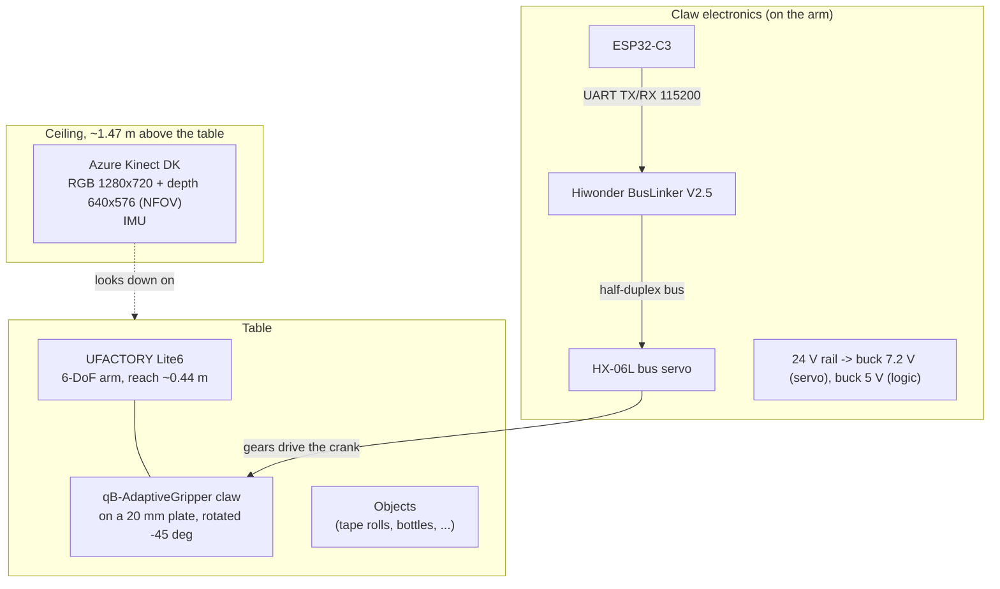
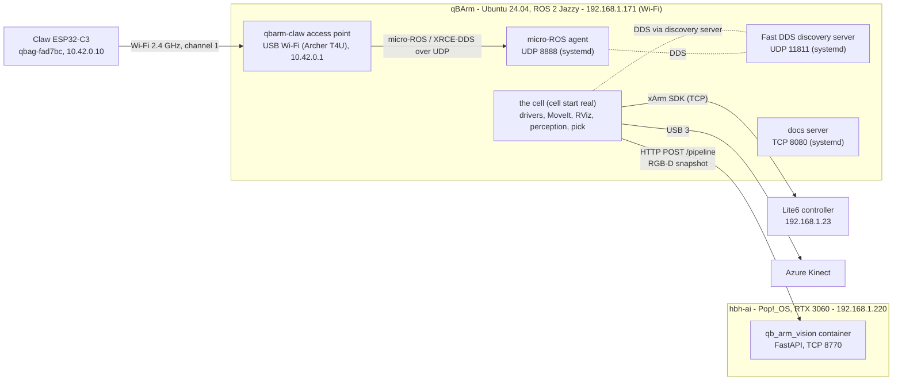
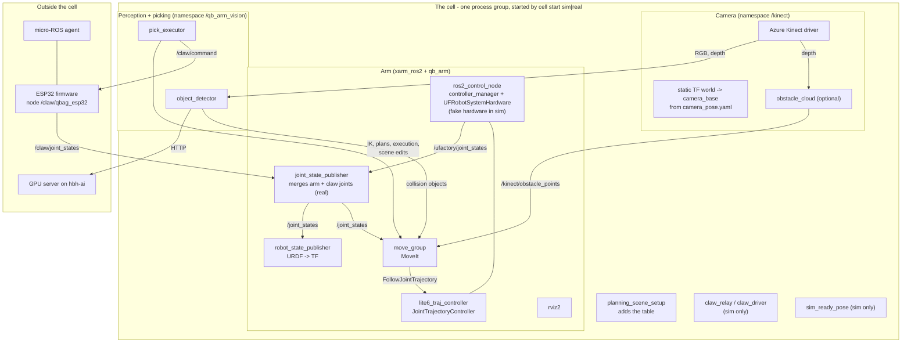
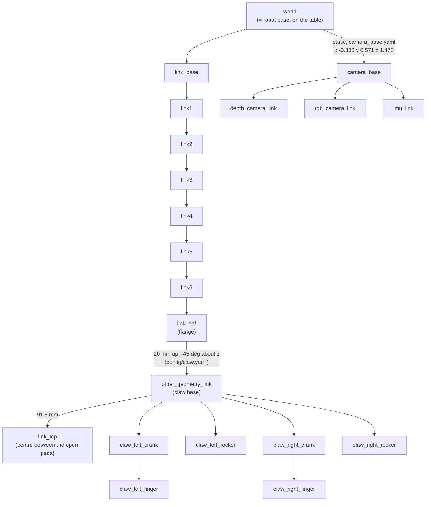
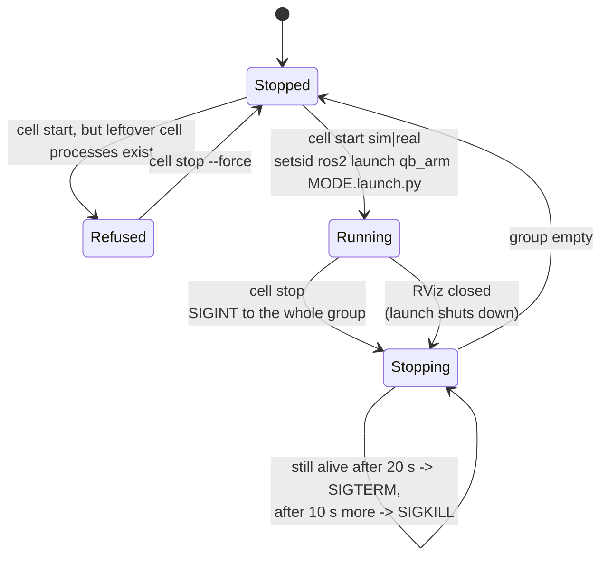
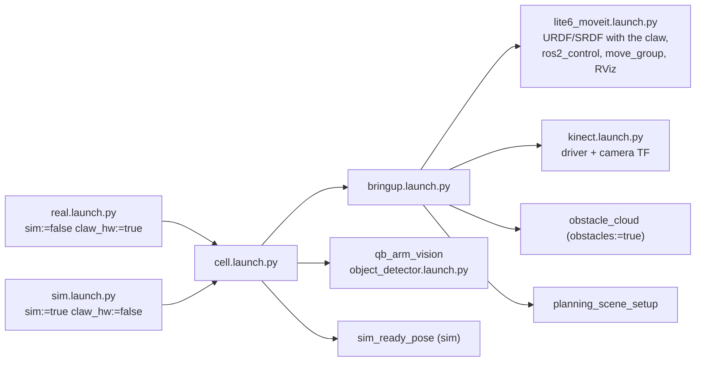

# System architecture

This page describes the cell top-down: hardware and computers, the network, the software components and where they
run, the ROS graph (nodes, topics, services, actions), the coordinate frames, and the process model.
The per-module pages go one level deeper.

## Physical setup

## Computers and network

| Host | Address | Role |
|---|---|---|
| qBArm | `192.168.1.171` (DHCP, not reserved yet) | Everything ROS: drivers, MoveIt, RViz, perception client, pick logic, micro-ROS agent, discovery server, docs |
| Lite6 controller | `192.168.1.23` | Arm controller; qBArm talks to it with the UFACTORY SDK inside the ros2_control hardware plugin |
| hbh-ai | `192.168.1.220` (`hbh-ai.local`) | GPU inference server (shared with other services: ollama, immich, speech-to-speech on the second GPU) |
| Claw ESP32-C3 | `10.42.0.10` on `qbarm-claw` (fixed by MAC) | Claw controller; micro-ROS client; OTA on port 3232 |
| Spare ESP32-C3 | `10.42.0.11` on `qbarm-claw` | Same firmware, not wired; only one board may run at a time |
| `qbarm-claw` | `10.42.0.1/24`, 2.4 GHz channel 1 | qBArm's own access point for the claw, on a second (USB) Wi-Fi adapter next to the arm; NetworkManager, WPA2, DHCP with fixed addresses per board |

**ROS discovery.** ROS 2 nodes normally find each other with multicast. qBArm instead runs a *Fast DDS discovery
server* ("ROS master"-like) on UDP 11811; every node points to it with `ROS_DISCOVERY_SERVER`
(`ros_env.sh`). Other machines join with `ROS_DISCOVERY_SERVER=192.168.1.171:11811`. Side effect: new nodes and
CLI tools need ~10–15 s until they see all topics.

## Software components

### Who does what

| Component | Package | Responsibility |
|---|---|---|
| `ros2_control_node` | xarm_ros2 | Runs the controller manager at 150 Hz; the hardware plugin `UFRobotSystemHardware` talks to the Lite6 controller (servo mode, mode 1) |
| `lite6_traj_controller` | ros2_controllers | Executes joint trajectories (action `/lite6_traj_controller/follow_joint_trajectory`) |
| `joint_state_publisher` | ROS | Real arm only: merges `/ufactory/joint_states` (arm) and `/claw/joint_states` (claw) into `/joint_states` |
| `robot_state_publisher` | ROS | Turns the URDF + `/joint_states` into the TF tree |
| `move_group` | MoveIt | Planning scene, collision checking, IK, motion planning (OMPL), Cartesian paths, trajectory execution |
| `rviz2` | ROS | Visualisation and interactive planning; **closing it stops the whole cell** (xArm launch behaviour) |
| Kinect driver | qb_arm_kinectdk_ros2 | Camera images, depth, point cloud, IMU, camera model (namespace `/kinect`) |
| `world_to_camera_base` | qb_arm | Static TF: where the camera hangs, from `config/camera_pose.yaml` |
| `obstacle_cloud` | qb_arm | Depth → workspace-cropped, voxel-thinned cloud for MoveIt's octomap (only with `obstacles:=true`) |
| `planning_scene_setup` | qb_arm | Adds the table as a collision box, then exits |
| `object_detector` | qb_arm_vision | Service `/qb_arm_vision/detect`: snapshot → GPU server → objects + grasps → planning scene, markers, debug image. Service `/qb_arm_vision/surface_map`: height map of a region from 7 fresh depth frames, robot cut out |
| `pick_executor` | qb_arm_vision | Services `/qb_arm_vision/pick`, `/place`, `/release`: grasp → MoveIt plans → execution → claw; sets the held object down after checking the spot in a height map |
| ESP32 firmware | qb_arm_gripper | Node `/claw/qbag_esp32`: `/claw/command`, `/claw/torque` → servo; publishes `/claw/joint_states`, voltage, temperature |
| `claw_driver` | qb_arm | Sim only: a simulated claw with the same topics (or `claw_relay` for sim arm + real claw) |
| `sim_ready_pose` | qb_arm | Sim only: moves the fake arm off the all-zero pose (claw inside the base) |
| `ufactory_driver` (`/uf_api`) | xarm_ros2 (`xarm_api`) | Real arm only: UFACTORY's service driver (second connection to the controller); the pick executor uses `set_mode`/`set_state`/`motion_enable` to restore servo mode |
| GPU server | qb_arm_vision/server | `POST /pipeline`: Grounding DINO, SAM 2, Contact-GraspNet |

## The ROS graph

Interfaces between the components (real arm). `→` publishes/calls.

| Name | Kind | Type | From → To |
|---|---|---|---|
| `/joint_states` | topic | `sensor_msgs/JointState` | joint_state_publisher → robot_state_publisher, move_group, pick_executor |
| `/ufactory/joint_states` | topic | `sensor_msgs/JointState` | hardware plugin → joint_state_publisher |
| `/ufactory/robot_states` | topic | `xarm_msgs/RobotMsg` | hardware plugin → (monitoring: state, mode, err) |
| `/claw/joint_states` | topic | `sensor_msgs/JointState` | ESP32 → joint_state_publisher (20 Hz) |
| `/claw/command` | topic | `std_msgs/Float64` | pick_executor, you → ESP32 (claw_joint in rad) |
| `/claw/torque` | topic | `std_msgs/Bool` | you → ESP32 (false = limp) |
| `/claw/supply_voltage`, `/claw/temperature` | topic | `std_msgs/Float32` | ESP32 → (monitoring, 1 Hz) |
| `/tf`, `/tf_static` | topic | `tf2_msgs/TFMessage` | robot_state_publisher, static publishers → everyone |
| `/kinect/rgb/image_raw`, `/kinect/depth_to_rgb/image_raw`, `/kinect/rgb/camera_info` | topic | `sensor_msgs/Image`, `CameraInfo` | Kinect driver → object_detector (only during a snapshot / surface map) |
| `/kinect/depth/image_raw` | topic | `sensor_msgs/Image` | Kinect driver → obstacle_cloud |
| `/kinect/obstacle_points` | topic | `sensor_msgs/PointCloud2` | obstacle_cloud → move_group (octomap) |
| `/qb_arm_vision/detect` | service | `qb_arm_vision_interfaces/Detect` | you → object_detector |
| `/qb_arm_vision/objects` | topic (latched) | `ObjectArray` | object_detector → pick_executor |
| `/qb_arm_vision/markers`, `/qb_arm_vision/debug_image` | topic (latched) | `MarkerArray`, `Image` | object_detector → RViz |
| `/qb_arm_vision/surface_map` | service | `qb_arm_vision_interfaces/SurfaceMap` | pick_executor → object_detector |
| `/qb_arm_vision/surface_map_markers` | topic (latched) | `MarkerArray` | object_detector → RViz (the last height map: a cube per seen cell, blue = table, red = 10 cm+) |
| `/robot_description` | topic (latched) | `std_msgs/String` | robot_state_publisher → object_detector (link collision boxes), pick_executor |
| `/qb_arm_vision/pick` | service | `qb_arm_vision_interfaces/Pick` | you → pick_executor |
| `/qb_arm_vision/place` | service | `qb_arm_vision_interfaces/Place` | you → pick_executor |
| `/qb_arm_vision/release` | service | `std_srvs/Trigger` | you → pick_executor |
| `/compute_ik`, `/compute_cartesian_path`, `/get_planning_scene`, `/apply_planning_scene`, `/check_state_validity` | services | MoveIt | pick_executor, object_detector → move_group |
| `/move_action`, `/execute_trajectory` | actions | MoveIt | pick_executor → move_group |
| `/lite6_traj_controller/follow_joint_trajectory` | action | `control_msgs/FollowJointTrajectory` | move_group → controller |

## Coordinate frames (TF tree)

Every position in the system is expressed in some frame; TF knows how they relate at every moment.
`world` is the robot base on the table surface.

- **`link_tcp`** (tool centre point) is the frame every grasp is expressed in: origin between the two open grip
  pads, **z** pointing along the fingers (the approach direction), **y** the direction the fingers close in.
- **`rgb_camera_link`** is the frame of the colour image and the registered depth; the perception pipeline
  deprojects pixels there and transforms them to `world`.

## Process model: the `cell` script

Everything that belongs to one run of the cell is started as **one process group** and stopped as one. This is what
keeps runs clean (see lesson 6 on the [status page](01-status.md)).

Launch file hierarchy:

Always running outside the cell (systemd): `ros2-discovery`, `ros2-microros-agent`, `qb-arm-docs`.
The claw firmware is independent of the cell: it keeps its connection to the agent and holds its last command.
