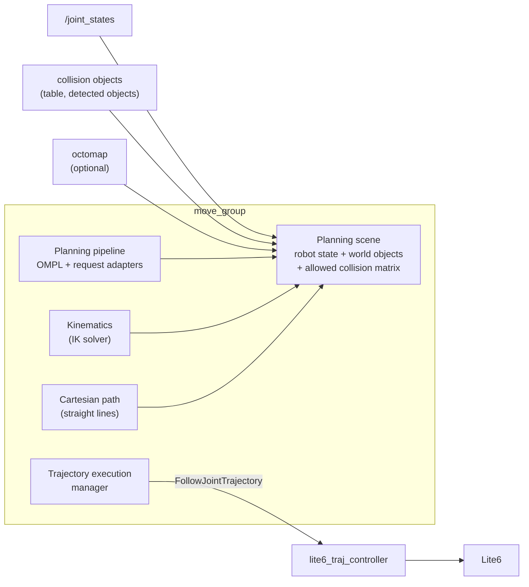
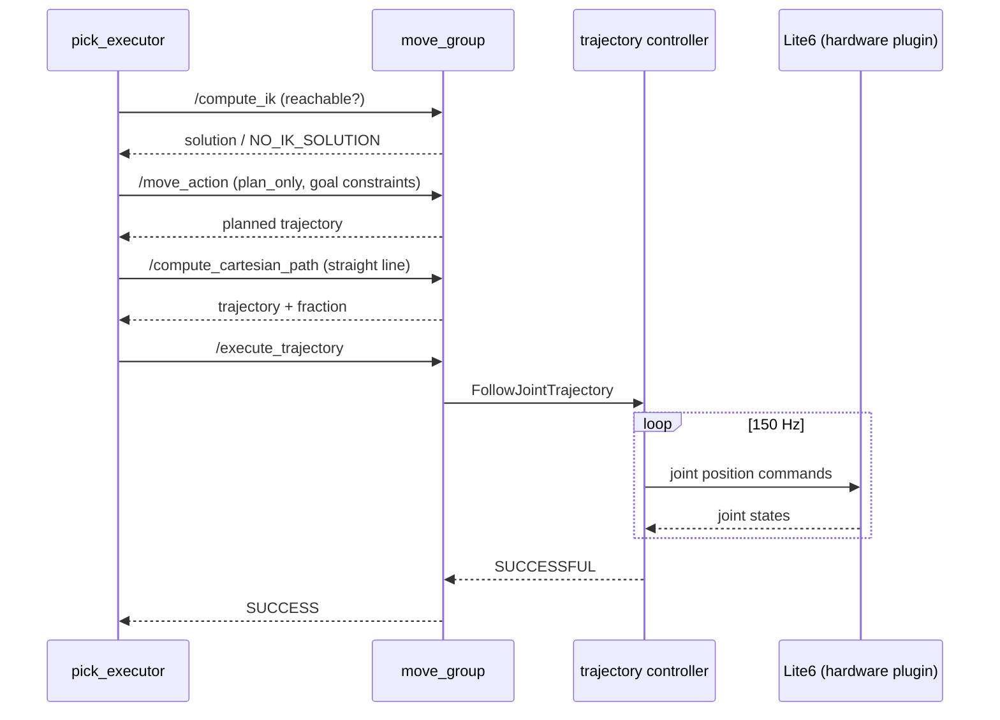

# Primer: ROS 2 and MoveIt

This page explains the concepts the rest of the documentation relies on, using the qBArm cell as the example
throughout. No prior robotics knowledge assumed.

## ROS 2 in five ideas

ROS 2 is a set of libraries and conventions for splitting a robot's software into small programs that talk to
each other over the network.

| Idea | What it is | Example in qBArm |
|---|---|---|
| **Node** | One program (or part of one) with a name | `/qb_arm_vision/pick_executor`, `/move_group`, the ESP32 (`/claw/qbag_esp32`) |
| **Topic** | A named stream of messages; many publishers, many subscribers, fire-and-forget | `/joint_states` (the current angle of every joint, ~150 Hz) |
| **Service** | Request → one reply, like a function call | `/qb_arm_vision/detect` (prompt in, objects out) |
| **Action** | A long-running request with feedback and a final result, cancellable | `/execute_trajectory` (move the arm along a path) |
| **Parameter** | A named setting of a node, loaded from YAML at start | `grip_overshoot: 0.2` in `pick_executor.yaml` |

Messages have fixed types (`sensor_msgs/JointState`, `geometry_msgs/PoseStamped`, ...). The transport underneath is
**DDS**; qBArm uses a *discovery server* so nodes find each other without multicast.

**micro-ROS** is ROS 2 for microcontrollers: the ESP32 runs a tiny ROS client and talks (XRCE-DDS over UDP) to a
*micro-ROS agent* on qBArm, which represents it in the normal ROS graph. To everyone else the claw is just a node.

## Frames, poses and TF

A **pose** is a position (x, y, z) plus an orientation, *expressed in some frame*. The same physical point has
different coordinates in the camera frame and in the robot's frame. **TF** is the ROS service that knows the
transform between every pair of frames at every moment and converts between them.

- Fixed relations (camera on the ceiling, claw on the flange) are **static transforms**.
- Relations through joints change as the arm moves; `robot_state_publisher` computes them from the joint angles
  (forward kinematics).

Conventions used here: distances in metres, angles in radians, orientation as a **quaternion** (x, y, z, w) in
messages. A 4x4 **homogeneous matrix** `T` (rotation `R` in the top-left 3x3, translation in the last column) is the
convenient form in code: `p_world = T_world_cam · p_cam`. The columns of `R` are the frame's x, y, z axes expressed
in the parent frame — that is how the code reads "approach direction = z column of the grasp pose".

## Describing the robot: URDF and SRDF

The **URDF** (Unified Robot Description Format, XML, usually generated with the macro language **xacro**) describes
the robot as a **tree of links connected by joints**:

- a **link** is a rigid body with visual meshes, collision meshes and inertia;
- a **joint** connects a parent link to a child link: `fixed`, `revolute` (rotates about an axis, with limits),
  `prismatic`, ...; a **mimic** joint copies another joint's value (times a multiplier).

qBArm's URDF (`qb_arm/urdf/qb_arm.urdf.xacro`) is the stock Lite6 description plus the claw
(`qbag.xacro`). The claw is two closed four-bar linkages, which a *tree* cannot represent, so each side is cut
open into a tree and every joint mimics the one actuated joint `claw_joint` (details in [qb_arm](07-qb_arm.md)).

The **SRDF** (Semantic Robot Description) adds what MoveIt needs on top:

| SRDF element | qBArm |
|---|---|
| **Planning group**: a set of joints planned together | `lite6` (the 6 arm joints, tip `link_tcp`), `qbag` (the claw joints) |
| **Group state**: a named configuration | `lite6/home` (all zeros – **unsafe with the claw**), `qbag/open`, `qbag/close` |
| **End effector** | `qbag`, attached at `link_tcp` |
| **Disabled collisions**: link pairs never checked | claw parts among themselves (they are pinned together), claw vs. flange |

## MoveIt

**MoveIt** is the motion-planning framework. Its central node, **`move_group`**, keeps a model of the robot and its
surroundings and offers services and actions to compute and execute motions.

### The planning scene

MoveIt's picture of the world, used for every collision check:

- **Robot state**: current joint angles (from `/joint_states`) → all link poses.
- **World collision objects**: shapes with an id and a pose. qBArm adds `table` (a 2x2 m box whose top is 5 mm below
  the robot base) and one `obj_<n>` per detected object (a mesh: the object's top-view outline extruded down to the
  table).
- **Octomap** (optional): a 3D occupancy grid (2 cm cells) built from the camera, for everything not modelled.
- **Allowed Collision Matrix (ACM)**: pairs of bodies whose contact is *not* a collision. A grasp *must* touch the
  object, so the pick allows claw ↔ target-object contact.
- **Attached objects**: an object held by the robot. After closing the claw the pick *attaches* the object to
  `link_tcp`: from then on it moves with the arm and is collision-checked against the world — e.g. the arm may no
  longer swing the held object through the table.

A state is **valid** if nothing in it collides (except allowed pairs). MoveIt refuses to plan *from* an invalid
start state (`CheckStartStateCollision`) — which is why the simulated arm, which starts with the claw inside the
robot base, first has to be moved to a ready pose.

### Inverse kinematics (IK)

**Forward kinematics** (joint angles → where is the TCP?) is easy and unique. **Inverse kinematics** asks the
opposite: *which joint angles put `link_tcp` at this pose?* There may be several solutions (elbow up/down, wrist
flipped) or none (out of reach). `/compute_ik` returns one solution, optionally only collision-free ones. The Lite6
config uses the **KDL** solver: a numerical solver that iterates from a seed state (5 ms timeout, 3 attempts per
call), so it can occasionally miss a solution that exists. The pick
uses it as a **millisecond reachability check** before spending seconds on planning.

A 6-joint arm can reach a position with a given orientation only in a limited region. For the Lite6 with the claw,
a straight-down TCP pose is reachable up to ~33 cm from the base; tilting the approach or going higher changes that.

### Motion planning

A **motion plan** is a path through *joint space* from the current state to a goal that is collision-free all along.
MoveIt uses **OMPL** (sampling-based planners; the xArm config sets **RRT** as the Lite6 default): it randomly samples joint
configurations, keeps the collision-free ones and connects them into a path. A response adapter then assigns
timestamps with **time-optimal trajectory generation** (TOTG) within the joint velocity/acceleration limits scaled by
`velocity_scaling` (0.2 in the pick), and validates the result.

The **goal** is given as **constraints**. The pick asks for:
- a **position constraint**: `link_tcp` inside a sphere of 2 mm around the pre-grasp position;
- an **orientation constraint**: `link_tcp` orientation within 0.01 rad of the grasp orientation.

The path between start and goal is free-form: joints move in coordination, the TCP does *not* move in a straight line.

### Cartesian paths

For the last centimetres to the object and for lifting, a free-form path is wrong — the fingers must move in a
**straight line** along the approach axis. `/compute_cartesian_path` interpolates the TCP along a straight line in
5 mm steps, solves IK at each step, and checks each step for collisions. It returns the **fraction** of the line it
managed (1.0 = all the way). The pick requires ≥ 0.99 for the approach and accepts a shorter lift (≥ 2 of 10 cm).

### Execution and control

A planned **trajectory** is a list of joint positions with timestamps. `/execute_trajectory` hands it to the
**trajectory execution manager**, which first checks that the trajectory starts where the robot is now (tolerance
0.01 rad), then sends it to the controller.

**ros2_control** runs the control loop (`controller_manager`, 150 Hz): the **`JointTrajectoryController`** interpolates
the trajectory and writes joint commands to the **hardware interface**; for the real arm that is UFACTORY's
`UFRobotSystemHardware`, which streams them to the Lite6 controller (in **servo mode, mode 1**; after a fault or an
emergency stop the arm is in mode 0 and must be put back, which a fresh `cell start real` does). In simulation a
fake hardware interface simply reports back what it was commanded.

### Error codes you will meet

| MoveIt code | Meaning | Typical cause here |
|---|---|---|
| `1` SUCCESS | | |
| `-4` CONTROL_FAILED | Execution failed or was aborted | Arm stopped on a fault (e.g. C31 collision), trajectory start ≠ current state |
| `-31` NO_IK_SOLUTION | Pose unreachable | Too far, too high, orientation impossible |
| Start state in collision | Planning refuses | Claw overlapping something in the model (base, table) |

Lite6 controller errors appear in `/ufactory/robot_states` (`err`): e.g. **C31** "collision caused abnormal joint
current" (the arm felt unexpected resistance and stopped), **C16** servo error of joint 6.
