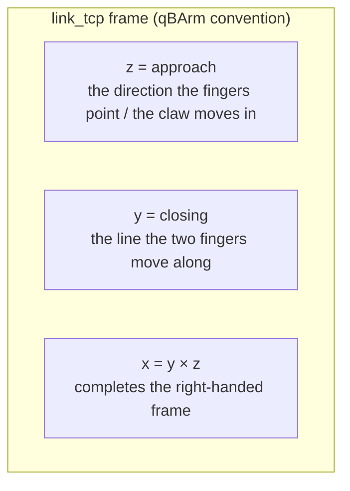
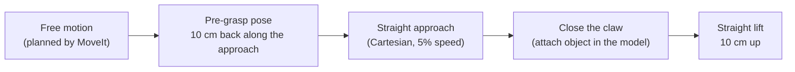
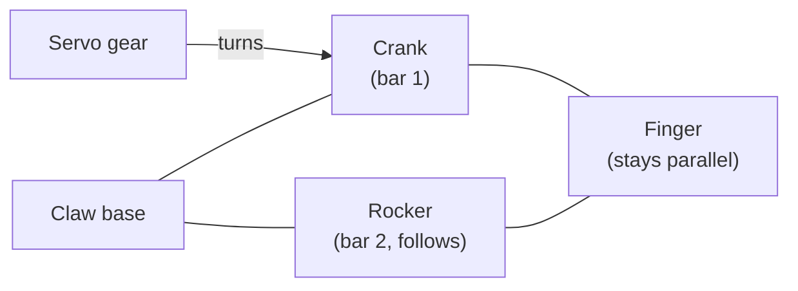
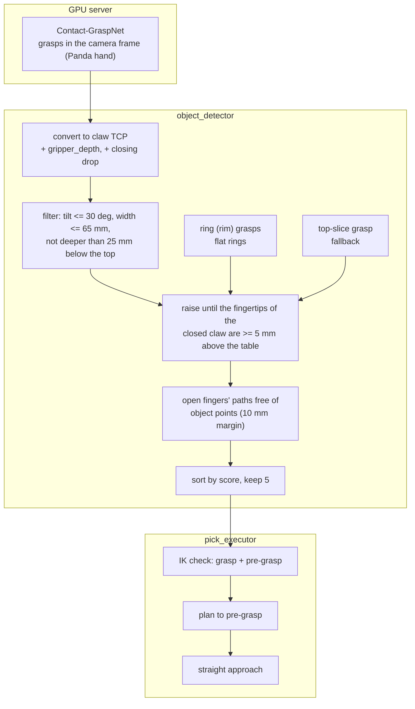

# Primer: grasping

What does it actually mean to "compute a grasp"? This page builds the idea up from scratch and ends with how the
qBArm claw differs from a textbook gripper — which is exactly where our two real-arm crashes came from.

## A grasp is a pose plus a width

For a two-finger gripper, a grasp is fully described by:

1. **Where the gripper should be** — a 6-DoF pose (3 numbers for position, 3 for orientation) of a reference point on
   the gripper, the **TCP** (tool centre point). For the claw the TCP (`link_tcp`) is the point midway between the two
   open grip pads.
2. **How far the fingers must close** — the object's **width** between the two contact points.

The orientation is easiest to think of as three axes attached to the TCP:



- **Approach axis (z)**: the claw comes in along this direction, fingers first. "Top-down" means z points straight
  down at the table (`z = (0, 0, −1)` in `world`).
- **Closing axis (y)**: the two fingers move towards each other along this line. The object is squeezed along it.
- A grasp turned by 180° about z is the same grasp for a symmetric gripper (fingers swapped) — the pick tries both,
  because one of them is often easier for the arm to reach.

So "grasp computation" = choosing, for an object seen by the camera, good values of (position, approach, closing,
width), and ranking them.

## What makes a grasp good

### Contact and antipodal grasps

The fingers touch the object at two **contact points**. With friction, each finger can push not only straight into
the surface but at an angle up to the **friction cone** half-angle (atan μ; μ ≈ 0.3–0.6 for metal on plastic).
A two-finger grasp holds when the line between the contacts lies inside both friction cones — an **antipodal grasp**:
the two surfaces face each other, and the squeeze has nowhere to slip to. Squeezing a box across two parallel sides
is antipodal; squeezing it corner-to-corner is not.

Two more things decide whether the object stays in the fingers when lifted:

- **Grip force × friction must exceed the weight** (and inertia when moving). Force comes from the actuator; friction
  from the pad material. Smooth metal pads on smooth tape give little friction — that is part of our grip problem.
- **Where the contacts are relative to the centre of mass**: grasping far off-centre makes the object rotate out.

### Collision-free and reachable

A grasp that is perfect for the object is useless if:

- the **fingers or palm hit something** on the way in — the table, a neighbouring object, *or the object itself*
  (a finger landing on top of it instead of beside it);
- the **arm cannot reach the pose** (inverse kinematics has no solution) or cannot get there without collisions.

This is why the grasp pipeline filters twice: geometrically when the grasps are computed (fast, conservative
checks), and with MoveIt before executing (full robot model, IK, planning).

### Grasp quality score

Grasp generators attach a **score** (0–1) to each candidate: an estimate of the probability that it succeeds.
Scores from different methods are not comparable in an absolute sense; they are for ranking. In qBArm, the
geometric grasps get fixed scores chosen to sit relative to Contact-GraspNet's typical 0.1–0.3: ring grasps 0.3
(minus a small distance term), top-slice fallback 0.1.

## How grasps are found

There are three families of methods; qBArm uses the first two.

| Family | Idea | In qBArm |
|---|---|---|
| **Analytic / geometric** | Derive grasps from the object's shape: e.g. squeeze across the narrowest part of the top | Ring (rim) grasps for flat rings; top-slice fallback |
| **Learned (data-driven)** | A neural network trained on millions of simulated grasps predicts grasps directly from a point cloud | **Contact-GraspNet** on the GPU server |
| Sampling + evaluation | Sample many random gripper poses, score each with a model | not used |

### Contact-GraspNet in one picture

Contact-GraspNet (NVIDIA, 2021) looks at the **3D point cloud** of the scene (from the depth image) and treats
*every point on the object* as a potential contact point of one finger. For each such point it predicts:

- a **score** — how likely a grasp with a finger at this point succeeds,
- the **approach direction** and the **baseline direction** (closing axis) of the gripper,
- the **width** — how far the fingers need to be apart.

From (contact point, approach, baseline, width) the gripper pose follows geometrically: the other finger is at
`contact + width · baseline`, and the gripper's own reference frame sits `gripper_depth` behind the contacts along the
approach. The network was trained for the **Franka Panda** hand, whose frame is 0.1034 m behind the finger contacts
— that is the `gripper_depth` parameter used to convert its grasps to our claw's TCP.

Because it only sees the side of the object the camera sees, and was trained for a different gripper, its grasps
are *suggestions*: qBArm converts them, filters them for the claw, and mixes them with geometric grasps.

## Executing a grasp: pre-grasp, approach, close, lift

A grasp pose alone doesn't say how to get there. Moving the arm freely straight into the grasp pose would sweep the
fingers sideways through the object. Every pick therefore uses the same four-phase motion:



- **Pre-grasp**: the grasp pose moved back along the approach axis (`T_pre = T − d · z`, d = 10 cm, or 5 cm if
  that is out of reach). The arm can get there any way it likes.
- **Approach**: a straight line along the approach axis to the grasp pose, slowly. Only here may the claw touch the
  object (allowed in the collision matrix).
- **Close** the fingers; the object is **attached** to the TCP in MoveIt's model.
- **Lift** straight up.

## The qBArm claw: what is special

The **qB-AdaptiveGripper** is not a textbook parallel-jaw gripper where the fingers slide sideways on rails. Each
finger sits on a **parallelogram linkage** (two bars, a crank driven by the servo gears and a rocker that follows):



Because both bars have equal length the finger **translates without rotating** — the pads stay parallel, which is
good for antipodal grasps. But a crank turns on a circle, so the finger moves on a circular arc: as the claw closes,
the fingers move **inwards and forwards at the same time**. In the TCP frame (y = closing, z = approach), with the
crank vector `(CY, CZ) = (−34.64 mm, 22.50 mm)` from the crank pivot to the finger pivot and `a` = `claw_joint`:

```
inward shift per finger   =  CY·cos a + CZ·sin a − CY
gap between the pads      =  70 mm − 2 · (inward shift)
forward drop of fingers   = −CY·sin a + CZ·(cos a − 1)
```

| claw_joint | gap | fingers deeper than when open |
|---|---|---|
| 0 (open) | 70 mm | 0 |
| 0.36 rad | 50 mm | 10.7 mm |
| 0.63 rad | 30 mm | 16.1 mm |
| 0.82 rad | 15 mm | 18.2 mm |
| 0.96 rad (closed) | 3.6 mm | 18.8 mm |

**Consequences for grasp computation** (both learned the hard way, see the [status page](01-status.md)):

1. The pads meet the object **deeper** than where they were when the claw was open. The grasp's TCP must be placed
   *higher* by the drop at the object's width, or the grip ends up too low.
2. The fingertips of a *closing* claw reach up to 18.8 mm further than those of the open claw. The clearance to the
   table must be checked with the **fully closed** claw (in case the object is thinner than measured or slips).

A second property: the servo is **position-controlled**. It does not "squeeze with force F"; it drives towards a
target angle and pushes in proportion to how far it still is from it. When the pads are stopped by the object, the
remaining **position error** sets the grip force. Commanding exactly the object's width gives almost no force; the
pick therefore commands 1.2 rad — *past* the angle at which the pads touch each other (0.96) — and the object stops
the fingers earlier. The servo can't report torque or current, and its position turned out to read nearly the same
with and without an object (give in the drive train), so "is something held?" needs a current sensor (INA219).

## How it all fits together in qBArm



The detailed algorithms are on the [perception pipeline](05-perception-pipeline.md) and
[pick execution](06-pick-execution.md) pages.
