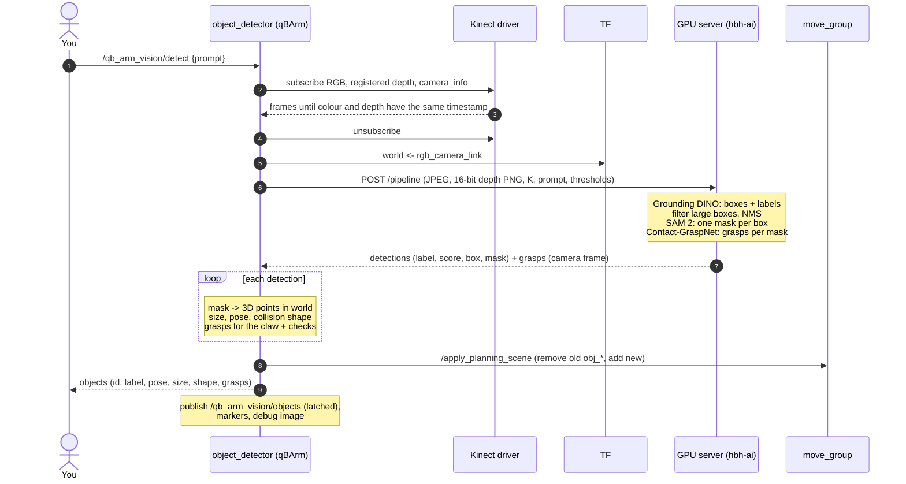
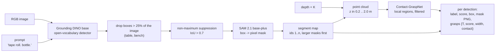
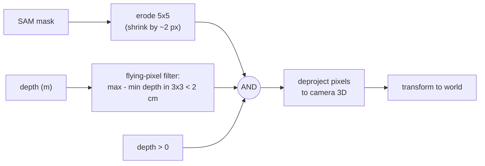
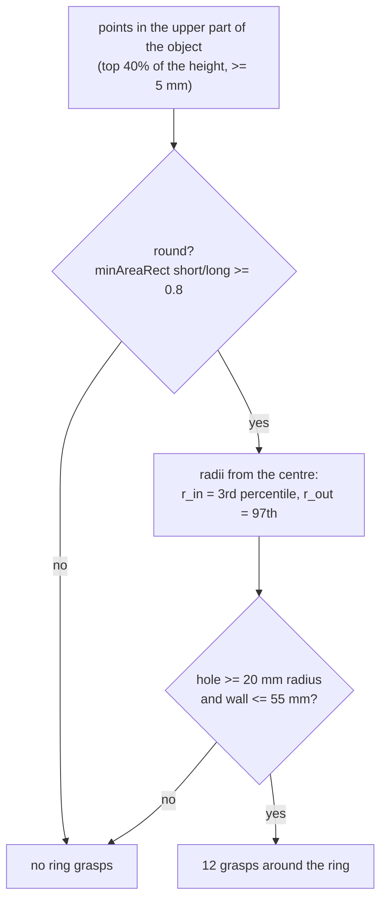

# Perception pipeline: detection, localisation, grasps

What happens between `ros2 service call /qb_arm_vision/detect ... "{prompt: 'tape roll.'}"` and a list of objects with
grasps. Two programs are involved: the ROS node **`object_detector`** on qBArm and the **GPU server** on hbh-ai.

## Sequence



Typical timing (tape rolls on the bench): detection 0.43 s, segmentation 0.19 s, Contact-GraspNet 2.5 s — 3.1 s on the
server (it reports these as cumulative times: 0.43 / 0.62 / 3.1), **~3.7 s** per call including the transfer.

## Step 1 – Snapshot (object_detector)

`snapshot()` subscribes to three topics **only for the duration of the snapshot** (holding the 30 fps streams all
the time costs a quarter of a CPU core):

| Topic | Content |
|---|---|
| `/kinect/rgb/image_raw` | colour, 1280x720, BGRA |
| `/kinect/depth_to_rgb/image_raw` | depth **registered to the colour camera**: same size, same pixels; uint16 in mm |
| `/kinect/rgb/camera_info` | intrinsics `K` (focal lengths fx, fy, principal point cx, cy) |

It waits until an RGB and a depth frame with the **same timestamp** have arrived (same capture), then looks up the
camera pose `T_world_cam` (world ← `rgb_camera_link`) from TF. Because the depth is registered to the colour
image, pixel (u, v) in the mask and pixel (u, v) in the depth image are the same point in space.

## Step 2 – GPU server: detection, segmentation, grasps

The ROS node sends the snapshot as a multipart HTTP request: the colour image as JPEG (quality 92), the depth as a
lossless 16-bit PNG, `K` as JSON, plus the prompt and thresholds. The server (FastAPI, one request at a time on
the GPU, `server/app/server.py`) runs three models:



### Grounding DINO – *what* and *where in the image*

An **open-vocabulary** detector: instead of a fixed list of classes it takes a text prompt ("tape roll. bottle.")
and returns bounding boxes with the phrase that matched and a confidence. Two thresholds: `box_threshold` 0.3
(box confidence) and `text_threshold` 0.25 (how strongly a phrase must match). Then:

- boxes covering more than `max_box_fraction` (25 %) of the image are dropped — typically the table itself;
- **non-maximum suppression**: of boxes overlapping with IoU > 0.7, only the most confident one is kept.

### SAM 2 – *exactly which pixels*

**Segment Anything 2** turns each box into a pixel-accurate **mask** of the object. The masks are merged into one
**segment map** (pixel → object id), larger masks painted first so a small object lying on a big one keeps its
pixels.

### Contact-GraspNet – *how to hold it*

The depth image is deprojected into a 3D point cloud (camera frame); points with depth outside 0.2–2.0 m are
dropped. The segment map tells Contact-GraspNet which points belong to which object; it predicts grasps in **local
regions** around each object (using the full scene for context) and filters them to grasps whose contacts lie on the
object. Each grasp comes back as a 4x4 pose `T` of the **Panda hand** in the camera's optical frame (x right, y down,
z forward), a score, the opening width and the contact point. See the [grasping primer](04-grasping-primer.md) for
what the network predicts.

## Step 3 – From mask to a 3D object (object_detector.make_object)

For each detection the node builds an `Object`: where it is, how big, a collision shape, and grasps.

### 3a. Clean the mask and deproject



- **Erosion**: masks tend to bleed one or two pixels onto the background at the silhouette; shrinking them avoids
  picking up table points.
- **Flying pixels**: at an object's edge a depth pixel often mixes foreground and background and lands *between*
  them in 3D. A pixel is dropped if the valid depths in its 3x3 neighbourhood span more than `edge_threshold`
  (2 cm).
- If fewer than 30 pixels survive, the detection is dropped ("no depth").

**Deprojection** (pinhole camera model): a pixel (u, v) with depth z (metres along the optical axis) is the 3D point

```
x = (u − cx) · z / fx
y = (v − cy) · z / fy
z = z
```

in the camera's optical frame, then `p_world = R · p_cam + t` with `T_world_cam = [R | t]` from TF.

### 3b. Robust extent and filters

- **Outlier removal in xy**: compute the median xy of the points and each point's distance to it; keep points
  closer than `max(3 × median distance, 2 cm)`. Remaining background pixels are far away and go.
- **Workspace**: drop objects whose median is more than `workspace_radius` (0.8 m) from the robot base.
- **Height**: `top` = 95th percentile of z (robust against a few noisy points); `height = top − table(x, y)`, where
  `table(x, y) = a·x + b·y + c` is the **measured table plane** under the object (`table_plane` from qb_arm's
  `config/table.yaml`, measured with `measure_table`; the table is tilted 0.87° against the robot base, −1.7 mm at the
  base, −6 mm at 30 cm). Without a plane: the table seen in a ring 4–12 px around the mask. Objects outside
  5 mm–40 cm are dropped. Thin metal reads flat in depth (pliers: 7 mm). If the table seen around the object is more
  than 15 mm above the plane (`support_threshold`), the object stands on something (e.g. placed "on" another object) and
  its base is that support.
- **Held in the claw**: while the claw holds an object, a detection with a visible point within 6 cm (xy) of the TCP
  and its top within 5 cm of the TCP's height is the held object and is left out (a held object hangs with its top at
  the claw; an object on the table next to the claw has its top far below it); new ids are numbered after the held one.
  "Stands on something" additionally requires the object's own lowest points not to reach below that support.
- **Footprint**: keep xy between the 2nd and 98th percentile per axis; the **minimum-area rectangle** around them
  (OpenCV `minAreaRect`) gives the footprint centre, long and short side and the yaw of the long side.

### 3c. Pose, size and collision shape

- `pose`: centre of the footprint, `z = table + height/2`, x axis along the long side.
- `size`: (long side, short side, height).
- `shape`: the **convex hull** of the footprint points (simplified to 2 mm), **extruded** from the table to the top,
  as a triangle mesh relative to `pose`. The camera only sees the top and one side, so everything below the visible
  outline is assumed solid — conservative for collision checking. This mesh becomes the collision object `obj_<n>`.

## Step 4 – Grasps for the claw

Three sources of candidate grasps, then shared checks. Target frame: `link_tcp` (z = approach, y = closing,
origin between the open pads).

### 4a. Contact-GraspNet grasps → claw TCP (`claw_grasps`)

For each network grasp `Tg` (in the camera frame):

1. `Tg_world = T_world_cam · Tg`; approach = its z column, closing = its x column (Panda convention).
2. **Tilt filter**: keep only if the angle between the approach and straight down is ≤ `max_tilt_deg` (30°).
3. **Width filter**: keep only if the predicted width ≤ `max_grasp_width` (65 mm; the claw opens 70 mm).
4. Build the claw frame: columns `[closing × approach, closing, approach]`.
5. **Move the origin** from the Panda hand frame to the claw TCP: `+ gripper_depth · approach` (0.1034 m, Panda frame →
   finger contacts).
6. **Closing drop**: `− drop(claw_angle(width)) · approach` — the claw's pads reach the object deeper than their open
   position, so the TCP goes back by that much (see the [grasping primer](04-grasping-primer.md)).
7. **Table clearance**: `keep_fingertips_above` — if the fingertips of the *fully closed* claw would be lower than
   the table plane under the object + `fingertip_clearance` (3 mm), move the grasp back along its approach until they
   are not.
8. **Depth limit**: drop grasps whose TCP is more than `max_grasp_depth` (25 mm) below the object's top — deeper, the
   claw's palm would hit the object.

### 4b. Ring (rim) grasps for flat rings (`ring_grasps`)

Added after crash 1 (a network grasp tried to close along a tape roll's rim). Tape rolls lying flat are recognised
geometrically:



For each of the 12 directions `a = k · 30°` with radial unit vector `r̂`:

- position: `centre + (r_in + r_out)/2 · r̂` — the middle of the wall;
  height: `top − min(15 mm, height/2) + drop(claw_angle(wall))`;
- orientation: approach straight down, **closing = r̂** (radial): one finger goes into the hole, the other stays
  outside, and they close across the wall;
- width = wall thickness; score `0.3 − 0.05 · (distance from the robot base)`, so the side of the ring nearest the
  robot is tried first (most reachable);
- then the same table clearance as above.

On the bench tape roll this finds a hole radius of 31–33 mm and an outer radius of 47–48 mm; with the claw open
(70 mm) each finger has ~30 mm clearance to the wall on its side.

### 4c. Narrow-slice grasps for flat and long objects (`slice_grasps`)

Added for the pliers: Contact-GraspNet returns no grasps for objects a few millimetres high, and the whole outline (68 mm
with open handles) is too wide for the claw. The top of the object is cut into 1 cm strips across its long axis
(minimum-area rectangle); for every strip whose width (5th–95th percentile across, + 4 mm) is at most 55 mm, a grasp
straight down across the strip, pads 15 mm below the top or at half the height (+ closing drop), then the table
clearance. Score `0.2 · (1 − 0.5·|offset from the middle| / half length) − 0.05 · distance from the base`: strips near
the middle first. The finger-landing check then drops strips where a finger would come down on another part (the
other handle). Pliers: 8–9 strips, picked across the jaws.

### 4c'. Top-slice fallback (`top_down_grasp`)

Only when the object is not a ring: take the points in the top 3 cm (`top_slice`), fit a minimum-area rectangle,
and if its short side ≤ 65 mm, grasp straight down across the short side, pads 15 mm below the top (+ closing
drop), score 0.1. This finds bottle caps and necks.

### 4d. Shared check: no finger lands on the object

Added after crash 1. MoveIt cannot catch this: during the final approach the claw is *allowed* to touch the target
object, so a finger descending onto its top is not a collision in the model. So every grasp is tested geometrically
against the object's own 3D points:

```
for each object point p (world):
    q = R_tcpᵀ · (p − t_tcp)            # the point in the grasp's TCP frame
    in the path of a finger if:
        |q.x| < 8 mm + margin                         (pad width 16 mm)
        35 mm − margin < |q.y| < 43 mm + margin        (pad: 8 mm thick, outside the 70 mm gap)
        −100 mm < q.z < 12 mm                          (from the palm to the open fingertips)
reject the grasp if more than 5 points are in a finger's path   (margin = 10 mm)
```

`q.z < 12 mm` includes everything *behind* the open fingertips along the approach — the whole volume the finger sweeps
through on its way in. The 10 mm margin covers camera calibration error (~4 mm RMS) and model error; the crashed grasp
passed the tape at 3.7 mm.

### 4e. Ranking

All surviving grasps (network + ring or fallback) are sorted by score; the best 5 (`grasps_per_object`) are kept.

## Object ids

Ids come from the query (`qb_arm_vision/names.py`): the phrase the detector matched, lower case, words joined by `_`
(`white bin` → `white_bin`). Several objects with the same name are numbered by distance from the robot base, nearest
first (`tape_1`, `tape_2`). While the claw holds an object its id is reserved (a second screwdriver becomes
`screwdriver_1`). The services accept the name typed with spaces or capitals (`"white bin"`). Grounding DINO works best
with descriptive phrases: `bin.` found nothing where `white bin.` scored 0.77.

## Outputs

| Output | Content |
|---|---|
| Service response / `/qb_arm_vision/objects` (latched) | `Object[]`: id (`white_bin`, `tape_1`), label, score, pose, size, shape, grasps (best first) |
| MoveIt planning scene | the previous detection's objects removed; each object added as a mesh collision object |
| `/qb_arm_vision/markers` (latched) | object hulls (blue = has grasps, grey = none), labels, grasps as claw outlines (green = best) |
| `/qb_arm_vision/debug_image` (latched) | colour image with masks, boxes, labels, reasons for dropped detections, the best grasp's finger positions, "out of reach" hints |

## Known limitations

- The camera sees objects from above: hidden undersides are assumed solid (extruded hull), overhangs are not modelled.
- Thin or transparent objects give poor depth; black objects sometimes too.
- One snapshot per call: if an object moves, detect again (the pick uses the latest detection).
- Contact-GraspNet was trained for the Panda hand; its grasps are converted, not native to the claw.
- Objects must be ≲ 33 cm from the base for top-down grasps (reach).
