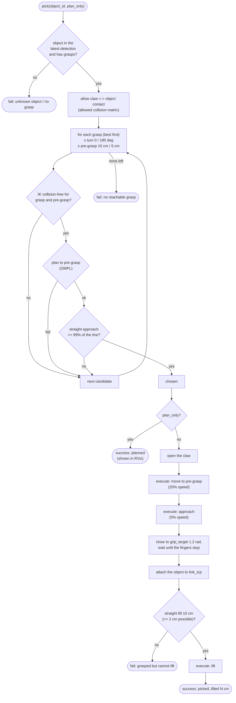
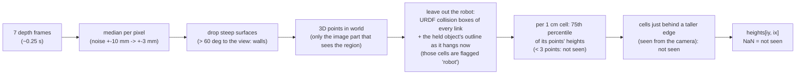
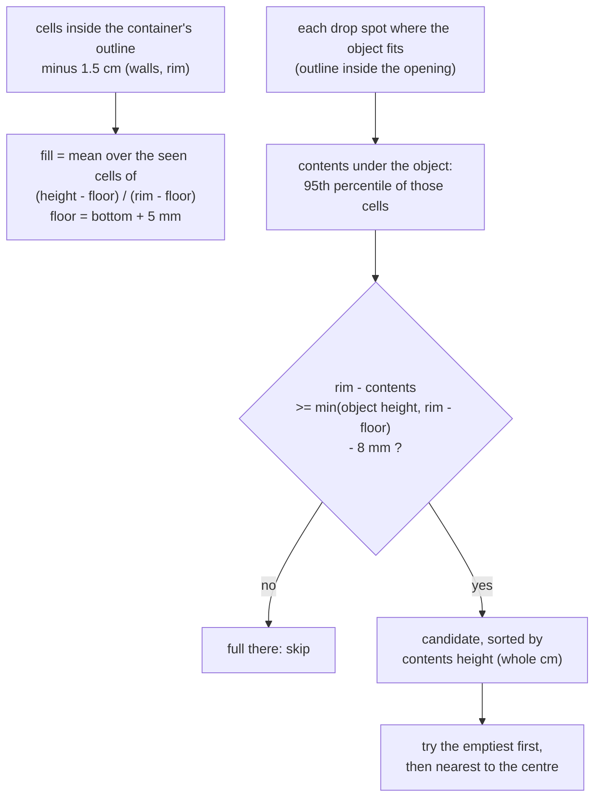

# Pick execution

How `pick_executor` turns a detected object and its grasps into arm and claw motion, how `place` sets it down
(after checking the spot in a fresh height map) and how `release` ends a pick.
Source: `qb_arm_vision/qb_arm_vision/pick_executor.py`, parameters in `config/pick_executor.yaml`.

## Interfaces

| Interface | Type | Purpose |
|---|---|---|
| `/qb_arm_vision/pick` | service `Pick` | `{object_id, plan_only}` → `{success, message, grasp}` |
| `/qb_arm_vision/place` | service `Place` | `{position, relation, reference, side, gap, plan_only}`: set the held object down at a point, on, into or next to another object |
| `/qb_arm_vision/surface_map` | client (`SurfaceMap`, object_detector) | fresh height map of the place, to check it's free / how full a container is |
| `/qb_arm_vision/release` | service `std_srvs/Trigger` | open the claw, detach and remove the held object (drop it) |
| `/qb_arm_vision/home` | service `qb_arm_vision_interfaces/Home` | move the arm to its home pose (`plan_only` to only plan) |
| `/qb_arm_vision/save_home` | service `std_srvs/Trigger` | the arm's current pose becomes the home pose |
| `/qb_arm_vision/objects` | subscription (latched) | the latest detection: objects by id |
| `/joint_states` | subscription | current `claw_joint` (to wait for the claw) |
| `/claw/command` | publisher | claw target angle |
| MoveIt | clients | `/compute_ik`, `/move_action`, `/compute_cartesian_path`, `/execute_trajectory`, `/get_planning_scene`, `/apply_planning_scene`, `/check_state_validity` |

**Before every pick** (also `plan_only`), on the real arm: the arm's controller state (`/ufactory/robot_states`) is
checked. An arm **error** (`err` ≠ 0) ends the request with the error code — a person recovers the arm. If the arm is
**not in servo mode** (mode ≠ 1, or state 4 stopped / 5 config changed — e.g. after manual/teach mode or the UFACTORY
app), the pick enables the motors and sets mode 1 and state 0 through UFACTORY's service driver (`/uf_api/...`, started
by the cell) and waits for the arm to confirm; the arm does not move. Without this, every trajectory is aborted with
MoveIt error −4 until the cell restarts.

The node runs a multi-threaded executor with a re-entrant callback group, so a service callback can wait for
MoveIt replies (futures) while the executor keeps processing them. A lock rejects a second pick while one is running.

## The pick, step by step



### 1. Allow contact with the target

The approach ends *inside* the object's collision shape (the fingers go around it, and the extruded hull is solid,
hole included), so the pick edits the planning scene's **allowed collision matrix**: every claw link
(`other_geometry_link`, cranks, fingers, rockers) may touch the target object. Everything else — arm links vs. the object,
claw vs. table, claw vs. other objects — is still checked.

### 2. Candidates

For each of the object's grasps (best first), each grasp also **turned 180° about its approach axis** (the claw is
symmetric; the turned version often suits the arm's wrist better), and each **pre-grasp distance** (10 cm, then
5 cm for tall objects at the edge of the reach):

```
T      = grasp pose (possibly turned)
T_pre  = T with its position moved back by d along its z axis (the approach):  t_pre = t − d · z
```

### 3. Quick reachability (IK)

`reachable(T)` and `reachable(T_pre)`: `/compute_ik` for `link_tcp` with collision avoidance, 50 ms timeout. This
rejects out-of-reach candidates in milliseconds, before any planning.

### 4. Plan to the pre-grasp

`/move_action` with `plan_only`: goal = position constraint (sphere of 2 mm around `T_pre`) + orientation constraint
(0.01 rad), 3 attempts, 5 s, velocity/acceleration scaling 0.2. The result is a joint trajectory from the current
state. (The start state is the *current* robot state — which must be valid, i.e. collision-free.)

### 5. Plan the straight approach

`/compute_cartesian_path` from the **end** of the pre-grasp trajectory (its last joint positions are used as the start
state) to `T`, 5 mm steps, collisions checked, velocity scaling 0.05. Needs ≥ 99 % of the line. The first candidate
for which steps 3–5 succeed is chosen; with `plan_only` the pick stops here (MoveIt shows the plan in RViz).

### 6. Execute

1. **Open the claw** (`/claw/command` 0.0) and wait until `claw_joint` is within 0.02 rad (max. 5 s).
2. **Move to the pre-grasp** (`/execute_trajectory`).
3. **Approach** in a straight line, slowly.
4. **Close**: command `grip_target` (1.2 rad, **past** pads-touching at 0.96) and wait until the claw stops moving
   (position unchanged for 0.4 s) — the object stops the fingers, and the position-controlled servo keeps pushing
   with the remaining error: that is the grip force. The firmware's stall guard then reduces the push to 30 servo
   steps (see [claw firmware](10-qb_arm_gripper.md)). The estimated width is **not** used for closing (it once
   was, and a fallback turned a 13.8 mm wall into 81 mm, leaving the fingers 60 mm apart); it only sets the grasp
   height. **Grip check** (`check_grip`, on; never in sim): once the fingers have settled (within 0.01 rad over
   0.5 s, at most 2.5 s — a sponge gives way for ~2 s), the claw counts as **empty** only if the fingers went on to
   `grip_empty_angle` (1.045 rad) or further **and** the mean servo current (INA219, `/claw/servo_current`, over
   0.5 s) is at most `grip_empty_current` (540 mA). Then the claw opens and the pick fails with the numbers
   (*"Nothing grasped …: fingers stopped at 1.066 rad …, holding 431 mA -> empty"*); otherwise the stop position
   and current are logged with the grip. Without current data, position alone decides (with a warning).

   Measured on the real claw (2026-10-01, closing to 1.2 rad, 3 trials each, servo 41–44 °C):

   | | fingers stop | current passes 300 mA at | holding current | peak |
   |---|---|---|---|---|
   | empty | 1.066–1.072 rad | 1.068 rad (pads meeting) | 418–482 mA | 439–608 mA |
   | tape roll (wall) | 0.960–0.966 rad | 0.89–0.94 rad | 610–633 mA | 1.06–1.63 A |
   | thin cardboard | 1.005–1.027 rad | 0.87–0.99 rad | 592–712 mA | 756–877 mA |
   | sponge | 0.904–0.921 rad | 0.78–0.80 rad | 567–580 mA | 1.49–1.88 A |

   Holding current follows how far the fingers stop short of 1.2 rad (the servo pushes with the error), except on
   soft objects, which give way. Position alone gets tight on thin objects (0.04 rad), current alone on soft ones
   (574 vs ≤ 482 mA); together they separate all four. The peak (the impact) is too noisy to use.
5. **Attach** the object to `link_tcp` (touch links = the claw links). From now on MoveIt carries it with the arm.
   Its contact with the `table` is allowed while it is held: standing on the tilted table, its level bottom can
   touch the table box by a fraction of a millimetre, which made the lift and every later plan start "in collision".
6. **Lift**: straight line 10 cm up from the current TCP pose; at least 2 cm must be possible (edge of the reach).

### Failure handling

Any exception (MoveIt not answering, a rejected goal, execution failure) ends the pick with `success=false` and the
message; nothing is retried automatically and the arm stays where it stopped. If the arm itself faulted (e.g. C31),
the controller aborts the trajectory and MoveIt reports error −4; the arm must be recovered by a person
(see [operations](12-operations.md)).

## Place

`/qb_arm_vision/place` (`qb_arm_vision_interfaces/srv/Place`) puts the object held since the last successful pick down:

| `relation` | Where | Surface its bottom goes to |
|---|---|---|
| `""` | its centre at `position` (x, y in `world`; (0, 0) = back where it was picked) | the table plane |
| `"on"` | centred on `reference` (an object id from the latest detection, e.g. `white_bin`) | the reference's top (or the highest point measured under the object, if slightly higher) + 3 mm |
| `"into"` | into `reference` (cup, box, bin, …): the **emptiest** spot inside the opening where it fits (see [How full is a container?](#how-full-is-a-container)) | the reference's rim + 1 cm, then released |
| `"next_to"` | beside `reference` on `side` (`left` +y, `right` −y, `front` +x away from the robot, `back`; empty = every side, nearest to the robot first), `gap` apart (default 2 cm) | the table plane |

```bash
ros2 service call /qb_arm_vision/place qb_arm_vision_interfaces/srv/Place "{relation: next_to, reference: white_bin}"
ros2 service call /qb_arm_vision/place qb_arm_vision_interfaces/srv/Place "{relation: on, reference: white_bin, plan_only: true}"
ros2 service call /qb_arm_vision/place qb_arm_vision_interfaces/srv/Place "{relation: into, reference: white bin}"
```

- **next_to spacing**: the reference's outline and the held object's outline (the detector's convex hulls, not their
  bounding boxes — a round object's box overestimated by ~40 %) plus the gap — and at least the **open claw's reach**:
  when the claw lets go its pads swing out to 46 mm from the TCP along the closing axis, which can be more than the object.
  The reply states the real distance between the objects.
- **into fit check**: the held object goes down in its pick orientation or turned 180°; its outline must stay inside
  the container's outline minus a 5 mm wall **in every direction** (72 directions checked). Drop spots lie on a 2 cm
  grid over the opening; all of them are checked, the 40 emptiest go on to planning. If the object fits nowhere the place
  is refused with how much too wide it is. After an "into" the object is removed from the scene (where it fell is unknown; the next
  detection sees it).
- **The opening claw is collision-checked**: the claw opens without a plan, so before a candidate is accepted MoveIt
  checks the final pose at claw angles from the gripped one down to fully open in 0.12 rad steps
  (`/check_state_validity` with the claw's group `qbag`: only the moving claw links; a whole-robot check also failed on
  unrelated contacts, e.g. a bin's outline touching the robot base). Part-way the fingers are already outside the object
  but still low. A candidate whose fingers would hit the reference, another object or the
  table is skipped.
- **next_to** uses the whole open claw's reach (pads 46 mm, finger knuckles 64 mm along the closing axis, palm 35 mm
  across) and refuses a reference that stands on something unmodelled (its support would be under the held object).
- **into, off centre**: a bin 44 cm from the base was out of reach at its centre (the Lite6 reaches ~40 cm at that
  height); spots nearer the robot were reachable. Unreachable spots cost little: the IK check rejects them in ~50 ms.
- After a place (not into) the object's new pose (`T_place · T_grasp⁻¹ · T_object`, down by the clearance) replaces its old
  one in the executor's detection — its grasps moved the same way — so it can serve as a reference or be picked again
  right away.
- Detect again while holding is fine: the detector leaves out the object in the claw (near the TCP and floating above
  the table) and never gives a new object the held one's id.


The object moves rigidly with the claw, so its pose after placing is `T_place · T_grasp⁻¹ · T_object`, with `T_grasp` the
TCP pose recorded when the object was attached. The height is **computed, not felt**: the claw lowers to where the
object's bottom should be 3 mm above the measured table plane (`place_clearance`) and opens. If the object slipped in
the claw it ends up that much off (no force/current sensing yet). The servo-mode check runs first, as for the pick.

### Is the spot free? The height map

MoveIt only knows the objects of the **last detection**. Anything put down since, moved, or never asked for in the
prompt is invisible to it. So before planning, the executor asks the detector for a **height map** of the place: a grid
of 1 cm cells over the region around all candidate spots, each holding the height of whatever stands there right now.



For each candidate spot (and each of its two turns) the executor lays three footprints over the map, each grown by 1 cm:
the **held object's outline**, the **band the open fingers sweep** (±43 mm along the closing axis, 16 mm wide) and the
**claw body** (knuckles and cranks ±64 mm, palm ±35 mm, from 28 mm above the TCP):

- **Outside the boundaries**: no footprint may touch a cell outside the vision workspace or in a keep-out zone
  (*"outside the vision workspace or in a keep-out zone"*) — the camera doesn't look there.
- **Outside the map**: the footprints must lie completely inside the map (*"partly outside the checked region"*).
- **Occupied**: a seen cell is higher than what will be above it — the object's bottom under the object, the fingertips
  under the fingers, the claw body under the body — and at least 8 mm (`free_tolerance`) above the surface. Two such
  cells (`min_blocked_cells`) make the spot occupied: *"something 23 mm high at (0.215, 0.005) under the open fingers"*.
- **Could something be hidden there?** For every cell it can't see, the detector says how high something could stand
  there unseen (`hidden_top`): in the shadow of something taller — a bin, the arm itself — it is the line of sight over
  that occluder; where nothing explains the gap (no depth return from a dark or glossy surface, out of view, right under
  the arm) it is unknown. Only unseen cells where something hidden could reach what comes down there matter:
  - in a shadow, **two such cells** refuse the spot: *"something up to 220 mm high could hide behind a taller object or
    the arm at (0.285, 0.062)"*;
  - unknown ones and mixed-pixel veils are tolerated up to 40 % (`max_hidden`) **of each part** — the object's
    footprint, the fingers' band, the claw body — so a small object can't slip onto an unseen patch because the large
    claw body is well seen: *"70 % of the area under the object not seen by the camera"*.

  A cup's inside, hidden by its own walls, can hide nothing above the rim, so it never stops an "into" whose object is
  released above the rim; a tall item in a bin that hides something reaching above the rim does.
- **"on"**: the object comes to rest on the highest part of the reference's top under it; if the map measures that a
  little higher than the detection did (up to 8 mm), the set-down height follows the map.
- **"back where it was picked"** is not checked: the object hangs above that spot and hides it, and it was just
  picked from there.

Before any pick or place the executor clears MoveIt's octomap and lets the camera refill it (1.2 s, so objects that
are known now or have moved leave no ghost voxels), lets the detected objects touch the fixed robot base (`link_base`:
a bin outline reaching the base otherwise made every arm pose a collision), and checks that MoveIt's scene has the
table and every keep-out zone of
`boundaries.yaml` (*"MoveIt's planning scene lacks keepout_desk ...: not moving"*), plans picks with the claw
**open** (it opens before moving, whatever it was before), checks that the claw can open where the arm is (pick
start, `release`), and straight-line paths are cut at a joint jump of more than 0.5 rad between two 5 mm steps
(an IK branch switch would sweep the arm through unchecked space).

**Why so much filtering** — measured on the real cell (2026-09-30):

| Effect | Seen as | Fix |
|---|---|---|
| Depth noise on the dark table | one frame: cells up to 10 mm, 7 cells above 8 mm in a 16 × 16 cm patch | median of 7 frames: ±3 mm; 75th percentile per cell (instead of the maximum) |
| The Lite6's forearm lies up to 10 cm beside the line between its joint frames | the arm, parked above the bin, showed up as 41–56 cm "obstacles" | cut out every link's collision-mesh box (from `/robot_description`, + 3 cm) |
| **Mixed pixels past an edge** ("veil"): a depth pixel that sees part rim and part table reads a depth in between | a 10–25 mm ramp beside the bin's rim, on the side away from the camera | cells just behind a ≥ 3 cm taller edge, seen from the camera, within the edge's shadow length + 4 cm, count as not seen |

### How full is a container?

"Is the centre hole at least as deep as the rim is high?" would give one yes/no for the whole bin. The height map allows
something better, because the ceiling camera looks **into** the container:



- A spot is usable when the object, resting on the contents under it, fits **completely below the rim** (8 mm
  tolerance). An object taller than the container only goes onto an (almost) empty part of the floor.
- **Cups and deep boxes**: the camera can't see their inside at all (walls). Such spots are still allowed — dropped
  above the rim — if nothing unseen under the object could reach above the rim, but only after every spot whose
  contents were seen; the reply says *"its contents not seen"*.
- The container is "full" **for this object** when no spot is usable: a pen may still fit where a bottle doesn't. The
  reply then lists the spots and why, e.g. *"full there: contents 1.9 cm high leave 7.6 cm below the rim, it needs
  8.7 cm"*.
- The claw drops where the container is **emptiest**, so it fills evenly instead of piling up in the middle.
- Every reply for "into" reports the fill: *"white_bin 7% full, 35% of the inside seen"*.

**Limits**: the camera looks in at ~20°, so the strip along the wall nearest to the camera is hidden (about 0.4 × the
wall height, plus the veil band): spots there count as not seen. Very dark or transparent contents return little or no
depth (not seen), a shiny white bin's floor reads ~1 cm too low (light bouncing between the walls). With the arm
parked right above the container most of the inside is hidden — the map is taken from wherever the arm is when place
is called.

| Parameter | Default | Meaning |
|---|---|---|
| `place_clearance` | 0.003 m | object bottom above the table when the claw opens |
| `place_distances` | `[0.10, 0.05]` | m, above the place: the straight way down starts here |
| `retreat_distance` | 0.10 m | straight up afterwards |
| `home_after_place` | true | then to the home pose (`home_file`: qb_arm `config/home.yaml`) |
| `into_clearance`, `into_margin` | 0.01 m, 0.01 m | release height above a container's rim; both walls together |
| `into_step`, `into_max_spots` | 0.02 m, 40 | grid of drop spots over the opening; all are checked, this many (emptiest first) go on to planning |
| `next_to_gap` | 0.02 m | default gap between the outlines |
| `check_place` | true | check the spots in a fresh height map first |
| `free_tolerance` | 0.008 m | higher above the surface under the object / fingers = something there |
| `free_margin` | 0.01 m | around the object's outline and the fingers' band |
| `min_blocked_cells` | 2 | 1 cm cells that must be too high before a spot is occupied |
| `max_hidden` | 0.4 | a spot with more of its area not seen is refused |
| `container_wall`, `container_floor` | 0.015 m, 0.005 m | inside = outline minus this; floor above the container's bottom |
| `max_survey_half_size` | 0.5 m | largest height map (± this), as object_detector's `max_map_half_size` |

The place-check parameters are read at every place, so `ros2 param set /qb_arm_vision/pick_executor check_place false`
(or any of the others) applies to the next one.
| `table_plane` | from qb_arm `config/table.yaml` | measured table plane |

First real run (2026-09-30): tape roll picked 40 cm from the base, placed at (0.25, 0.10); the camera found it at
(0.252, 0.112) afterwards.

## Release

`/qb_arm_vision/release` opens the claw (waits for it), then, if an object is attached, **detaches** it and
**removes** it from the planning scene. The object falls from wherever the claw is; `place` is the controlled way down.

While an object is attached, poses where it would collide are invalid, including the start of any plan that begins
with the object inside the table or the robot; release before planning elsewhere.

## Home

The home pose is a set of joint values in qb_arm's `config/home.yaml` (launch argument `home_file`), read at every
move home and checked against the joint limits. Default: the ready pose, TCP at (0.200, 0.000, 0.088), claw pointing
down. After every successful place and retreat the arm goes home (`home_after_place`, default true, live); if no
collision-free way home is found the place still succeeds and the reply says *"not home: …"*. The ±2π joints (1, 4, 6)
go to the equivalent angle nearest to where they are, so the arm never unwinds a full turn to get home.

`/qb_arm_vision/save_home` (control page: **save pose as home**) writes the arm's current pose to `home.yaml`: jog the
arm to where it should rest (out of the camera's way), then save.
A save is refused while the arm's joint states aren't in yet (right after a cell start they are all exactly 0) and for
any pose MoveIt finds in collision; a home pose in collision is reported (*"The home pose … is in collision …: save a
new one"*) instead of planned.

## Parameters

| Parameter | Default | Meaning |
|---|---|---|
| `group` | `lite6` | MoveIt planning group |
| `tcp_link` | `link_tcp` | link the grasps refer to |
| `pregrasp_distances` | `[0.10, 0.05]` | m, tried in order |
| `lift_distance` | 0.10 | m |
| `min_lift_distance` | 0.02 | m, a shorter lift is accepted |
| `velocity_scaling` / `acceleration_scaling` | 0.2 / 0.2 | of the joint limits: free motion (pre-grasp, place, home) / every motion |
| `approach_velocity_scaling` | 0.05 | straight approach to the grasp and way down to the place |
| `lift_velocity_scaling` | 0.2 | straight lift after gripping, retreat after releasing |
| `pause_before_grip`, `pause_after_grip` | 0, 0 | s at the grasp pose before closing; after closing, before the lift |
| `pause_before_release`, `pause_after_release` | 0, 0 | s at the place before opening; after opening, before the retreat |

The eight motion parameters above are read at every motion (`ros2 param set` works live; ranges 0.01–1 and 0–10 s are enforced) and set from qb_arm's `config/motion.yaml` (launch argument `motion_file`), which the control page's Config → motion writes.

| Parameter | Default | Meaning |
|---|---|---|
| `planning_time` | 5.0 | s per plan |
| `grip_target` | 1.2 | rad, claw command when gripping (past fully closed; clamped to 1.2) |
| `check_grip` | true | after closing, fail the pick (claw opened) if it looks empty (never in sim) |
| `grip_empty_angle`, `grip_empty_current` | 1.045 rad, 0.54 A | empty = the fingers at this angle or further **and** holding current at most this |
| `grip_settle_timeout`, `grip_current_window` | 2.5 s, 0.5 s | wait for the fingers to settle; current averaged over the window |
| `claw_current_topic` | `/claw/servo_current` | the claw's INA219 servo current (A) |
| `claw_joint`, `claw_links` | | names in the URDF |

`grip_target` and the grip-check parameters are read at every pick: `ros2 param set /qb_arm_vision/pick_executor ...`
tunes them without a restart.

## Example session

```bash
cell start real
ros2 service call /qb_arm_vision/detect qb_arm_vision_interfaces/srv/Detect "{prompt: 'tape roll.'}"
ros2 service call /qb_arm_vision/pick qb_arm_vision_interfaces/srv/Pick "{object_id: tape, plan_only: true}"
ros2 service call /qb_arm_vision/pick qb_arm_vision_interfaces/srv/Pick "{object_id: tape}"
ros2 service call /qb_arm_vision/place qb_arm_vision_interfaces/srv/Place "{position: {x: 0.25, y: 0.10}}"
# or drop it where it is:
ros2 service call /qb_arm_vision/release std_srvs/srv/Trigger
ros2 service call /qb_arm_vision/home qb_arm_vision_interfaces/srv/Home "{plan_only: true}"
```
