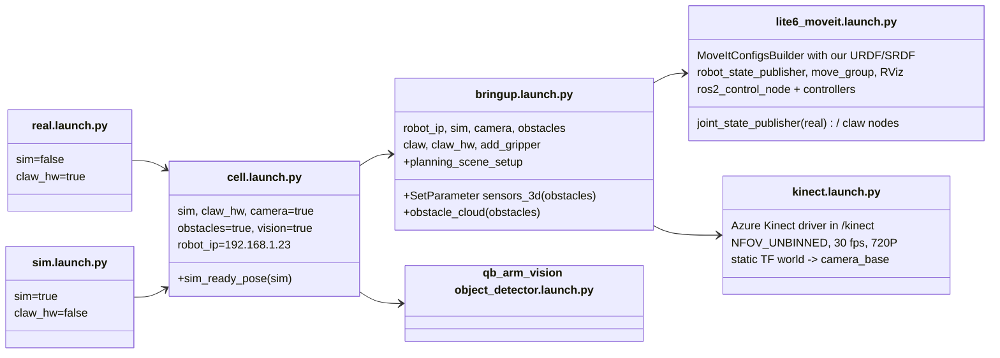
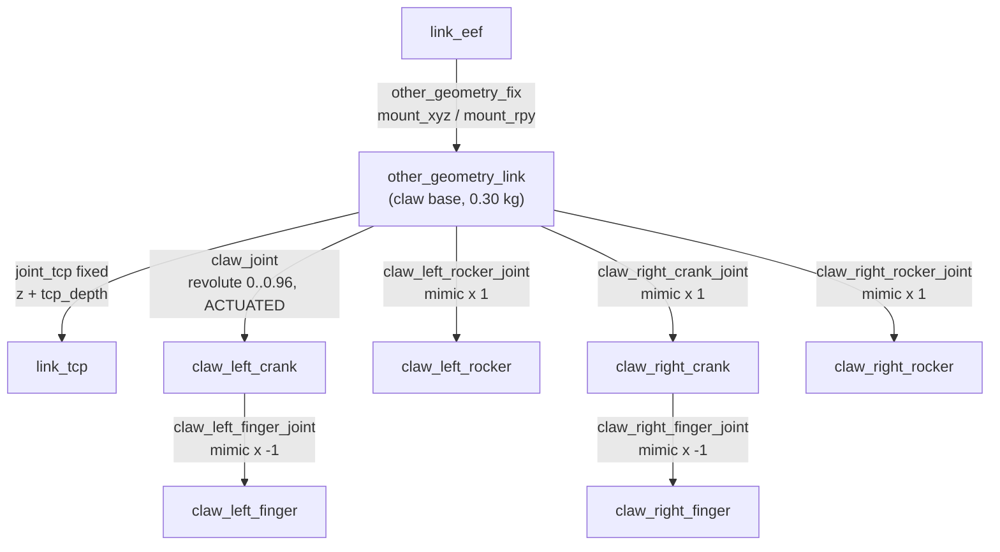
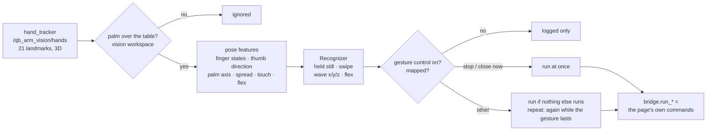
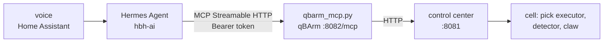

# Module: qb_arm

The cell's base ROS 2 package (ament_cmake + Python): how the cell is launched, the robot model with the claw,
MoveIt configuration glue, obstacle avoidance, the simulated claw, and the `cell` process manager. Camera calibration
has [its own page](08-camera-calibration.md).

Repository `whoobee/qb_arm`, in the workspace at `~/prj/ros2_ws/src/qb_arm`.

```
qb_arm/
├── launch/    real / sim / cell (whole cell), bringup, lite6_moveit, kinect
├── urdf/      qb_arm.urdf.xacro (Lite6 + claw), qbag.xacro (claw), meshes/ (Fusion 360 STL)
├── srdf/      qb_arm.srdf.xacro (MoveIt semantics: xArm + claw)
├── config/    claw.yaml, camera_pose.yaml, obstacles.yaml, sensors_3d.yaml
├── rviz/      qb_arm.rviz
├── scripts/   cell, controller_starter, sim_ready_pose, claw_driver, obstacle_cloud, planning_scene_setup,
│              measure_camera_tilt, fit_camera_yaw, refine_camera_pose
└── qb_arm/    camera_pose.py (Python module)
```

## Launch files



### `lite6_moveit.launch.py` — our robot in the xArm MoveIt stack

The xArm launch files always load the stock xArm description, so this file rebuilds the same launch with our
URDF/SRDF swapped in and reuses everything else from `xarm_moveit_config` / `xarm_controller`:

1. Read `config/claw.yaml` (mount offset, mount yaw, TCP depth).
2. `generate_ros2_control_params_temp_file` → controller config for the Lite6.
3. `MoveItConfigsBuilder` (UFACTORY's) for robot type `lite`, dof 6, with `controllers` or `fake_controllers`, the
   real (`UFRobotSystemHardware`) or fake (`UFRobotFakeSystemHardware`) hardware plugin, and — when the claw is on —
   `add_other_geometry:=true`. That flag makes the xArm SRDF put `link_tcp` into the `lite6` group and disable
   collisions between the "other geometry" link and link5/link6/link_eef: our claw base is deliberately named
   `other_geometry_link` to reuse this.
4. Replace the robot description with `urdf/qb_arm.urdf.xacro` and the semantic description with
   `srdf/qb_arm.srdf.xacro`, passing the xArm xacro arguments through plus the claw arguments.
5. Start: robot_state_publisher, the common MoveIt launch (`move_group` + RViz with `rviz/qb_arm.rviz`),
   `ros2_control_node`, 8 s later `controller_starter` for `lite6_traj_controller` (in sim also
   `joint_state_broadcaster`).
6. Joint states: **real** arm → a `joint_state_publisher` merges `ufactory/joint_states` and `claw/joint_states` into
   `/joint_states`. **Sim** → the joint_state_broadcaster publishes `/joint_states` directly and the claw's state is
   remapped onto it.
7. Claw: `claw_hw:=false` → `claw_driver` (simulated claw). `claw_hw:=true` → the ESP32 serves `/claw/*` itself; in
   sim a `claw_driver` in relay mode (`claw_relay`) forwards `/claw/joint_states` to `/joint_states`.

### `bringup.launch.py`

Includes `lite6_moveit.launch.py` and `kinect.launch.py`, and with `obstacles:=true` (needs the camera) injects the
MoveIt 3D-sensor configuration (`config/sensors_3d.yaml`) into the group via `SetParameter` — the MoveIt launch
builds `move_group`'s parameters itself, so this is the way to add them; `ParameterValue(List[str])` keeps lists as
lists. Starts `obstacle_cloud` (obstacles) and `planning_scene_setup` (always).

### `kinect.launch.py`

The Azure Kinect driver inside `PushRosNamespace('kinect')` — the driver starts its own robot_state_publisher and
joint_state_publisher for the camera model, which would clash with the arm's in the global namespace. Depth mode
`NFOV_UNBINNED` (the driver's default `WFOV_UNBINNED` cannot run at 30 fps and crashed), colour 720P, point cloud on,
`overwrite_robot_description:=false`. A `static_transform_publisher` places `camera_base` in `world` from
`config/camera_pose.yaml` (see [camera calibration](08-camera-calibration.md)).

## The claw model (`urdf/qbag.xacro`)

The claw was modelled in Fusion 360. Its meshes are exported in the **assembly frame** (millimetres), so re-exporting
updates them in place. The Fusion URDF export itself is not used: the claw has **two closed four-bar linkages**, and a
URDF must be a tree.

**Solution:** each side is cut open into a tree, and every joint follows the one actuated joint `claw_joint`
through **mimic** joints:



- The crank rotates by `a`; the finger joint on the crank rotates by `−a`, so the finger keeps its orientation
  (parallelogram); the rocker rotates by `a` like the crank (the second bar of the parallelogram). The loops stay
  closed within 0.1 mm over the whole range.
- The right side is mirrored in y (`s = −1`), and its axes are flipped so it turns the other way.
- Every link keeps the Fusion assembly orientation (+z along the fingers, +x towards the servo, fingers open along
  y); only the origins move to the pivots. Pivots (left, mm, assembly frame): crank (y −23.358, z −19.306), rocker
  (−6.951, −9.771), finger on crank (−58.003, 3.191); mounting face at z −51.5.
- `claw_joint`: 0 = open (70 mm between the pads), 0.96 rad = pads touching.
- `tcp_depth` 0.0915 m: `link_tcp` = centre between the open pads, 91.5 mm from the mounting face.

**Mounting** (`config/claw.yaml`): `mount_offset` 0.02 m (20 mm adapter plate), `mount_yaw` −π/4 (the claw is turned
−45° about the flange axis; with joint6 at +46° it is back in its default orientation), `tcp_depth` 0.0915. With the
plate, `link_tcp` is 111.5 mm from the flange.

**SRDF** (`srdf/qb_arm.srdf.xacro`): includes the xArm SRDF, adds group `qbag` (the six claw joints) with states
`open` (0) and `close` (0.96), the end effector `qbag` at `link_tcp`, and disables collision checks between all claw
parts (pinned together, layered) and between the claw and link6/link_eef. The group is named `qbag` so it sorts after
`lite6`: the stock xArm RViz config names a non-existent group and RViz then picks the first one alphabetically.

## Scripts

### `cell` — process manager

Bash. Starts `ros2 launch qb_arm {sim|real}.launch.py` with `setsid` so the launch leads a **new process group**
(its PID = the group id, stored in `$XDG_RUNTIME_DIR/qb_arm_cell/pgid`); everything the launch starts inherits the
group. Log: `~/.ros/log/qb_arm_cell.log`. Sources `ros_env.sh` itself when `ros2` is not on the PATH.

| Command | Behaviour |
|---|---|
| `start sim\|real [args]` | Refuses if a cell group is alive or **stray cell processes** exist (matched by executable name, outside the group); otherwise starts the launch; fails if it exits within 1 s |
| `stop` | `SIGINT` to the whole group; after 20 s `SIGTERM`; after 10 s more `SIGKILL`; waits until empty; then reports strays (exit 1) |
| `stop --force` | additionally kills stray cell processes (SIGINT, then SIGKILL) |
| `status` | group, process count, strays |
| `log` | `tail -f` of the log |

Stray patterns use the `[x]` regex trick (e.g. `[m]ove_group`) so `pgrep -f` never matches the script's own command
line.

### `controller_starter`

Brings the ros2_control controllers up at the cell's start and exits, in place of controller_manager's spawner.
While ~17 nodes register with the discovery server, the controller manager's replies to a just-started client get
lost now and then (*failed to send response … (timeout)*). The spawner waited 60 s per lost reply; its retry either
left the controller unconfigured ("already loaded") or configured it again — which re-creates the trajectory
controller's action server, and MoveIt then can't send it trajectories (*Action client not connected*, error −4) until
the cell restarts. The starter waits 3 s per reply, reads the states back after every call and takes the next step
from the state: not loaded → load, unconfigured → configure, inactive → activate (at most 5 times: the arm's driver
keeps it inactive while the arm has a fault). A configured controller is never configured again.
`controller_starter <controller> ... [--timeout 120] [--call-timeout 3]`.

### `sim_ready_pose`

The fake hardware starts with all joints at 0 — with the claw mounted, the claw is then *inside* the robot base and
MoveIt refuses to plan (start state in collision). The node waits for the trajectory action, then sends the ready
pose `[0, 0.1733, 0.555, 0, 0.3817, 0]` rad straight to the controller, **retrying until the goal is accepted**
(the action server exists before `controller_starter` activates the controller), and exits.

### `claw_driver` — simulated claw

`claw_driver` (namespace **`sim_claw`**, never `claw`: the real claw's ESP32 is always connected and listens on
`/claw/command`, so a simulated claw there moved the real one) publishes `claw_joint` on `joint_states` at 20 Hz and moves it towards
`/claw/command` at 1.5 rad/s, clamped to 0..0.96. With `hardware:=true` it only relays `/claw/joint_states` to
`output_topic` (sim arm + real claw).

### `obstacle_cloud`

Turns the Kinect **depth image** (0.7 MB, instead of the 29 MB colour point cloud) into an obstacle cloud for MoveIt's
octomap, at 5 Hz:

1. On the first `camera_info`: precompute, for every pixel, the **undistorted ray** with z = 1
   (`cv2.undistortPoints` with the lens distortion).
2. Per depth frame: depth (mm → m) × ray = 3D point in the depth camera frame; keep 0.25–3.0 m.
3. Flying-pixel filter: drop pixels whose valid 3x3 neighbours span more than `edge_threshold` (5 cm).
4. Transform to `world`; keep points with `0.03 < z < 1.0` m (drops the table) within 0.8 m of the base.
5. **Known objects left out**: points inside the outline (+2 cm, `object_margin`) of every object the pick executor
   knows (`/qb_arm_vision/scene_objects`: the last detection, with objects moved by a place, minus forgotten ones) are
   dropped. MoveIt has those as exact collision objects, and the claw must be allowed to touch the one it picks — in
   the octomap it would be an obstacle like any other (why the octomap used to be off). Everything else stays: a
   bottle nobody asked about, cables, a hand.
6. **The robot, generously**: on top of MoveIt's own self-filter (5 cm), every link's collision geometry as a box
   (`qb_arm/robot_geometry.py`, from `/robot_description`) grown by `robot_margin` (5 cm), and a cylinder around
   `link_tcp` (radius 10 cm, from 15 cm below to 10 cm above it) for the claw and whatever it holds. The moving claw
   otherwise left ghost voxels that a lift then started "in collision" with; clearing the octomap before the lift
   alone was not reliable (a lift stopped after 1 cm). Since this, lifts and retreats go through. The price: a real
   obstacle within those few cm of the arm is not added while the arm is there (what was seen before stays).
7. **Voxel thinning**: one point per 1 cm voxel (key = 3 × 21-bit voxel indices packed into one int64, `np.unique`).
8. Publish in the **depth camera frame** (MoveIt uses the cloud's frame origin as the sensor position to clear free
   space along the rays).

MoveIt side (`config/sensors_3d.yaml`): `PointCloudOctomapUpdater`, 2 cm octomap in `world`, max range 3 m, robot
self-filter padding 5 cm (points this close to the robot are not obstacles; the object in the claw is filtered
too). **On by default in the cell** since 2026-09-30, after the arm hit a water bottle nobody had detected. Before
every pick and place the executor clears the octomap and waits `octomap_settle` (1.2 s) for the camera to refill it:
voxels of an object that is now known (and left out of the cloud) would otherwise stay, since the camera can't clear
them through the object. The same after the claw grasped (before the lift) and after it let go (before the retreat): the
moving claw leaves **ghost voxels** (camera frames and joint states are not exactly in step, so the self-filter
misses parts of it for a moment), and where it stopped the camera can't clear them — the lift started "in collision"
with the claw's own trail. Limits: things lower than 3 cm are not obstacles (the table cut), what the arm itself hides
at that moment is unknown and MoveIt treats unknown as free.

### `planning_scene_setup`

Waits for `move_group`, adds `table`: a 2 × 2 × 0.04 m box whose top follows the measured table plane
(`config/table.yaml`, tilted 0.87°), or level at z = −0.005 without a measurement, and one box `keepout_<name>` per
keep-out zone of `config/boundaries.yaml` (red, translucent in RViz); waits up to 30 s per attempt, 3 attempts (right
after start-up move_group can take longer than 10 s — the table was once silently missing). Then it checks the arm's
current state against the zones (an arm already inside one makes every plan fail: logged as an error) and exits.

### `control_center` — the control page (port 8081)

`qb-arm-control.service` (installed by qb_arm_install, `--no-control` to skip) runs
`scripts/control_center` permanently, independent of the cell: **http://192.168.1.171:8081**. Stdlib HTTP server +
an rclpy node (`control_center`); the page is `web/control_center.html` (Vue 3, vendored in `web/vendor/`, so it works
offline; a HUD style), Config → boundaries is `web/boundary_editor.html` in a frame.

**Status bar** (always visible): **cell** — a button: click twice to start (real) / stop the cell; **arm · recover** — ok / stopped / the fault code (C31 …), click twice to recover the arm; hands (count; amber = in view, red = near the arm; from
`/qb_arm_vision/hands`), what the claw holds (`/qb_arm_vision/held`, published by the
pick executor on every change), servo current, servo and ESP32 temperature (amber / red from 250 / 400 mA, 55 / 65 °C,
80 / 90 °C), claw angle.

| Tab | What | ROS / system side |
|---|---|---|
| Control (first, the default) | a prompt + **detect**; the camera panel: **live** video (MJPEG `/api/live.mjpg`, ~10–15 fps: the hand tracker's `/qb_arm_vision/camera_preview`, else the colour image scaled down; the tracked hands drawn in — skeleton, id, distance to the arm, red within 15 cm, amber = depth carried over; detected objects outlined; streamed only while the Control tab is visible) or the **last detection** image. **Plan / real switch** (top right of the camera panel, remembered per browser, plan at first): every motion button exists once — in *plan* it only plans (RViz; a *PLAN ONLY* badge on the image), in *real* the arm moves (click twice; jog at once). Over the image: the **jog pad** top left (below) and an **action bar** at the bottom: *go to* one button per spot / pose, *+ save here* (as spot or pose), *save pose as home*, *hold this* (claw empty) or *give to me* / *back where picked* / *release* (claw holds something), *close now* while taking, **stop** (any running motion); the *controls* box hides both. **Pick mode** (claw empty): click an object (image or list) → pick; click free table → **go here**: the arm goes above that point, at a height typed in cm (10 by default, remembered), the claw straight down (keeping its turn about the vertical), **level along x** (pointing away from the robot, like the *edge of the table* pose) or as it is (`/api/goto` with a point; GoTo.srv `point` + `orientation` down / level / keep). A click in the violet reach ring beyond the green one (reach shown) picks *level* by itself, at the ring's height; holding something, *only go there* keeps the claw's orientation. **Place mode** (claw holds something): click an object → into / on / next to (side) it; click free table → place at that point (the pixel's ray meets the measured table plane), or only go there holding it. Below the image the mission log, then the objects | `/qb_arm_vision/detect`, `/pick`, `/place`, `/release`, `/home`, `/save_home`, `/jog`, `/go_to`, `/handover`, `/stop`, `/held`, `/debug_image`, `/objects`, `/camera_preview`, `/hands`; `/kinect/rgb/camera_info` (`/kinect/rgb/image_raw` only without the tracker) |
| Status | cell: **start real / start sim / stop** (click twice to confirm); arm state / mode / error (code + meaning) / TCP, **recover arm** after a fault (clear error + warning, motors on, servo mode, ready; `/uf_api/*`); links (arm, claw, GPU server), services; the claw: live servo current, angle, temperatures, supply voltage, Wi-Fi signal, charts (30 s, temperatures 5 min), **open / half / close / grip / limp** (close: pads touching, no squeezing; **grip**: 1.2 rad like a pick — closes on what is between the fingers and keeps a moderate push). Old links `#cell`, `#claw` open it | `cell` script; `/ufactory/robot_states`; `ping`; `systemctl is-active`; `/claw/*`; `/claw/command` (angles clamped to 0..0.96 rad; grip sends 1.2), `/claw/torque` |
| Config | a menu on the left: **motion** (below), **spots** (below), **gestures** (below) and **boundaries** (vision / no-go zones on a top view of the table, below); later: current and temperature limits. Links: `#config/motion`, `#config/boundaries` (`#boundaries` still works) | `config/motion.yaml` + the pick executor's parameters; `config/boundaries.yaml` |
| Log | the cell log, colour-coded by level and node, local times, cell starts marked; filters: level, node, text search (highlighted), error / warning counters; the controller's 150 Hz overrun warnings are hidden (they were 796 of 800 lines) | `~/.ros/log/qb_arm_cell.log` |

The arm moves only through the pick executor, when a motion is executed (real) from the Control tab; the claw moves
from the Status tab. The service passes the desktop session (`WAYLAND_DISPLAY`, `DISPLAY`, `XDG_RUNTIME_DIR`) to the
cell it starts, so RViz opens on qBArm's screen, and uses `KillMode=process` with the server as the main process
(`exec python3 …`, not `ros2 run`, a wrapper that stayed behind holding the port): restarting the control center
never stops a running cell. No login — it is meant for the local network only.

**Config → motion**: travel speed, acceleration, approach speed, lift / retreat speed (fractions of the Lite6's joint
limits; red above 0.5) and the pauses before / after the grip and before / after the release (0–10 s) — a slider and
an exact value each, the pause sequence drawn as a timeline. **Apply & save** sets them on the running pick executor
in one atomic `set_parameters_atomically` call (it refuses out-of-range values itself) and writes
`config/motion.yaml`, loaded at every cell start; the next pick / place / home uses them. With the cell stopped (or an
executor from before these parameters) it is saved only and applies at the next start. Where the running cell differs
from the saved file, the page shows both.

**Control → jog pad** (over the camera image, top left; under it **open** / **close** — the claw only, also in *plan*: close grips moderately like a pick; open while holding something = release, click twice): **home** in the middle; around it a ring of four moves —
forward (away from the robot, +x), back, left (+y), right; around that a ring of four tilts — the claw tip forward /
back (∓ pitch about y) and left / right (± roll about x), about world axes through the TCP; a bar on the left for up /
down and one on the right for turn (yaw ↺ / ↻). Steps of 1 / 5 / 10 / 50 mm and 1 / 5 / 15°; optionally the keyboard
(↑ ↓ ← →, PgUp / PgDn, Q / E — not while typing); the TCP pose live. In *real* every jog click moves at once, without
the two-click confirm: the steps are small, straight and slow (not collision-checked since 2026-10-04: only reach and
joint limits stop one); in *plan* it only plans. **Control → go to**: one button per spot / pose; **+ save here** saves
the current TCP as a new spot or pose by name.

**Config → spots**: `config/spots.yaml` (`qb_arm/spots.py`: load / validate / write, shared with the pick executor).
A top view around the robot (the camera image on request, a 10 cm grid, the ~44 cm reach, keep-out zones in red,
the claw now) with a draggable marker per spot (green) or pose (violet, with its heading); a table with exact values
(mm, degrees); *here* takes the current TCP; checked live (name, numbers, nothing inside a keep-out zone), saved with a
backup of the old file; the next go-to uses it — no restart.

**Reach overlay** (Control → camera, *reach*, on by default; 2026-10-04): how far the arm reaches, drawn over the
live and the detection view. Joint 1 turns ±360°, so the reach depends only on the distance from the base axis: the
control center asks MoveIt's IK (`/compute_ik`, collisions ignored) every 1 cm along one direction — **pick from
above** (green, drawn on the table): the claw straight down at a grasp 3 cm above the table *and* its pre-grasp 10 or
5 cm above it; **hand-over** (violet, dashed, drawn at the chosen height 10–30 cm above the table): the claw level
with the table, pointing away from the base, in a natural configuration (as the handover: shoulder not leaning back,
forearm not turned over). The widest run of reachable radii is the ring (single IK hits near the base left out).
Computed in the background on first use (~25 s, needs the cell), cached in `~/.ros/qb_arm_reach.json`; *recompute*
after a change to the robot model. Measured: pick 8–44 cm; level claw out to ~61 cm (its inner edge 25–38 cm by
height). Kinematic reach only: obstacles, keep-out zones and the handover's own limits (object held 30–50 cm from the
base, `handover_max_reach`) are not drawn.

**Gestures** (2026-10-04; `qb_arm/gestures.py`, `config/gestures.yaml`, class `GestureControl` in the control
center): hand poses and motions seen by the ceiling camera mapped to the page's commands — mainly to jog the claw by
hand.



- **Pose** (each part optional; *index points* works like *thumb points*, plus *along x / y / z* = either way), measured on MediaPipe's **metric 3D hand shape** (`Hand.shape`, its world
  landmarks rotated into the world frame by the hand tracker — the image landmarks lifted with depth were distorted
  along the view: palms 4–7 cm wide, fingers bent 340°): fingers *extended* (bend < 115°) / *half* / *curled*
  (> 240°) / *bent* (half or curled) / *any* — bend = the angles between the finger's bones added up; the thumb
  extended < 40°, curled > 42°; **thumb points** +x / −x / +y / −y / up / down = within 60° of that direction (not
  "the closest axis": the user's thumb leans towards the robot); **palm faces** an axis: flat, x, y (the axis only:
  MediaPipe's left/right is unreliable from above); **thumb–index** angle range (thumb vs the index finger's base
  bone); touch (thumb tip at fingertips — not used: the shape's scale drifts, palm widths 3–7 cm).
- **Motion**: *held still* (pose for `hold` s, palm < 15 cm/s, fingers moving < 30°; fires once per showing);
  *swipe* in a direction (≥ 10 cm in 0.8 s, once per movement); *wave x / y / z* (the palm back and forth along the
  axis: ≥ 2 turns of ≥ 2 cm within 2 s, at least as much along it as sideways); *flex* (the four fingers' mean bend
  up and down: ≥ 2 turns of ≥ 80° within 2 s); *circle x / y / z* (the palm going round about the axis — its path
  projected across the axis, the angle about the path's centre summed: ≥ 270° net within 2 s, mostly one way, radius
  ≥ 2 cm; the turning direction, right-handed about the axis, is the gesture's sign: a jog turn without a sign, e.g.
  `rz 5`, takes it). Wave, flex and circle are **active while the motion goes on**; the pose must
  match in 60 % of that window's frames; one moving gesture per hand (the first in the list wins: a beckon also
  moves the palm along x).
- **Repeat** (per mapping): the command runs again after each run while its gesture stays active (0.4 s grace) —
  continuous jogging in 10 mm steps, ending with the gesture. A stop gesture ends a repeat too.
- **Commands**: stop, jog `<±x|±y|±z> <mm>`, claw open / close (close = grip: 1.2 rad, the pick's grip target), home, give, take (hold this), close now, release,
  place back, go to `<spot>`, detect `<prompt>`, pick `<object>`, recover — exactly as from the page (no
  confirmation); stop and close-now run even while another command runs, anything else is ignored (and logged) then.
- **Default set** (the user's, directions as on the jog pad: +x away from the robot = towards the user, +y = left):

| Gesture | Pose | Motion | Command |
|---|---|---|---|
| rotate x / y / z | index finger straight, pointing along x / along y / up; the other fingers bent | circle x / y / z | jog rx / ry / rz 5° (roll / pitch / yaw about the world axis through the claw), repeat; the turn follows the circling direction (right-handed about the axis) |
| come here | thumb extended | flex | jog +x (jog_step), repeat |
| push back | palm facing x | wave x | jog −x 10 mm, repeat |
| thumb left / right | fingers bent, thumb within 60° of −y / +y (the user's left = −y) | wave y | jog −y / +y, repeat |
| thumb up / down | fingers bent, thumb within 60° of up / down | wave z | jog +z / −z, repeat |
| l shape | all extended | held 0.5 s | claw open |
| beak | four fingers half bent, thumb–index ≤ 50° | held 0.5 s | claw close **with grip force** (1.2 rad, like a pick: the firmware keeps ~0.17 rad of push on what is held) |
| fist | all curled | held 0.3 s | stop |

Tuned on two 3-minute recordings of the user making each gesture (2026-10-04; recorder + replay scripts in the
session scratchpad): measured bends L 42–108°, beak 121–170°, thumb gestures 145–236°, fist 250–284°; thumb
extended 6–39°, in a fist 42–55°; thumb–index beak ~40°, thumb gestures 55–99°. Replayed, every gesture fires in its
own segment and none in the gaps (push back is active in 13 % of the come-here frames). A thumb wave needs a
visible movement (a few cm): held nearly still (3 cm/s) it is not a wave.

- **Hand zone** (Config → boundaries, *+ hand zone*, amber; `hand_zone` in `config/boundaries.yaml`): a hand counts for
  gestures only with its palm over one of its polygons, at any height; without one, hands over the vision workspace
  count. Edited like the vision zones (drag, corners, 5 mm snap), shown in the camera preview and on the Control tab's
  camera (*hand zone*). The control center re-reads it every 10 s: no cell restart.
- **Moves**: `jog_step` (mm, default 10) and `turn_step` (deg, default 5) — the step of every jog mapping without its
  own (`+x`, `rz`); a mapping can still set one (`+z 20`). Each step runs at the jog speed (Config → motion).
- **Master switch**: header chip *gestures*; switching on needs two clicks; **on
  at every control-center start** (user 2026-10-04; the switch state is not saved). Events go to the Control tab's
  feed.
- **Config → gestures**: live readout per hand (finger states and bends, thumb direction, palm axis, spread, touch,
  flex, speed, matching poses, active gestures); the gesture table (fingers on the first line; thumb, palm, spread,
  touch, motion, hold on the second; *capture* takes fingers, thumb direction, palm and touch from the hand under the
  camera); the mapping with *repeat*; the recognition limits. Checked live (`gestures.parse`), saved with a backup,
  used at once.

**Config → boundaries**: a top view of the table (the colour image warped onto the table plane, 2.5 mm per pixel, x up /
y left), vision zones (free quadrilaterals) and no-go zones (boxes: move, resize, heights, turn, name), checked
live with `boundaries.load`, previewed in the camera view (`image_outside` + `draw` on a fresh snapshot), saved with
a backup of the old file, optionally with a cell restart.

### `mcp/qbarm_mcp.py` — the arm as MCP tools for an AI agent (port 8082)

An MCP server (Streamable HTTP, `mcp` 2.0 in `~/prj/venvs/mcp`, systemd `qb-arm-mcp.service`) so an agent — Hermes
Agent on hbh-ai, driven by voice through Home Assistant — can run the arm. Every tool goes through the control
center's HTTP API (the control page's own commands, with the same checks); nothing talks to ROS. Every request needs
`Authorization: Bearer <token>` (`~/.config/qbarm/mcp_token`, mode 600, made by `install.sh`).



| Tool | What it does |
|---|---|
| `status`, `look`, `list_objects`, `list_places` | read only: state, detection (`look` takes phrases like "tape roll, bin"), objects with ids and reach, named places |
| `pick`, `place`, `release`, `hand_over`, `take_from_hand`, `close_claw_now` | the pick / place / handover commands; `place`: back, on / into / next_to a reference, or at a point |
| `go_home`, `go_to`, `jog`, `turn`, `claw` | moves; `jog` up to 300 mm and `turn` up to ±180°, done in equal steps within the jog's limits (≤ 50 mm, ≤ 15°) one after the other — "turn 90°" = 6 × 15°; a failed step ends it (not collision-checked); `claw`: open, close, grip |
| `stop` | stops the arm at once — also while another tool is still moving it (the tools are async) |
| `recover_arm`, `gesture_control`, `start_cell`, `stop_cell` | arm fault recovery, gestures on / off, enable / disable the cell (the robot software) |

Voice-friendly: an object may be named as said ("the tape roll": matched to the last detection, the nearest one that
can be picked; detected first if not seen); directions and sides are the user's, who faces the robot from +x (`left`
= their left = −y, `towards me` = +x); answers are one or two spoken sentences. Read-only tools carry
`readOnlyHint` (an agent's approval policy can let them through and ask for the rest).

Hermes (`~/.hermes/config.yaml` on hbh-ai; the token in `~/.hermes/.env` as `QBARM_MCP_TOKEN`):

```yaml
mcp_servers:
  qbarm:
    url: "http://qbarm.local:8082/mcp"
    headers:
      Authorization: "Bearer ${QBARM_MCP_TOKEN}"
    timeout: 330          # a pick or a handover takes up to a few minutes
```

Tested 2026-10-05 with the `mcp` client: no token → 401; 20 tools listed; `status` / `list_objects` / `list_places`;
"the tape roll" → `tape_roll_1`; `stop` answered in 0.2 s while a `look` took 4.1 s in another session.

### `show_boundaries`

`ros2 run qb_arm show_boundaries [--output boundaries.png]`: the live camera image with the vision workspace (green,
at table height and at `z_max`) and the keep-out zones (red, at table height); everything the detector ignores is
dark, computed exactly as the detector does (`qb_arm.boundaries.image_outside` on the median of 5 depth frames).
Read-only.

## Soft boundaries

`config/boundaries.yaml`, loaded by `qb_arm/boundaries.py` (shared with qb_arm_vision's object_detector):

```yaml
vision_workspace:          # the camera only looks for objects in here (in any of the polygons)
  polygons:                # [x, y] corners, any simple polygon; `polygon:` for a single one
    - [[-0.50, -0.60], [0.45, -0.60], [0.45, 0.50], [-0.50, 0.50]]
  z_min: -0.05             # below: floor, chair
  z_max: 0.50
keep_out_margin: 0.03      # MoveIt gets every box this much bigger (it checks the arm at discrete points only)
keep_out:                  # boxes the arm may never enter (MoveIt collision objects keepout_<name>)
  - name: desk             # corners, axis-aligned in world ...
    min: [-1.50, -2.00, -0.90]
    max: [-0.55,  1.00,  1.30]
  - name: pc               # ... or center: [x, y, z], size: [x, y, z], yaw_deg: 0
    min: [-0.55, -2.00, -0.90]
    max: [ 0.40, -0.70,  1.30]
hand_zone:                 # optional: hands count for gestures only with the palm over these (any height)
  polygons:
    - [[0.15, 0.10], [0.45, 0.10], [0.45, 0.40], [0.15, 0.40]]
```

The hand zone is only read by the control center (gestures, re-read every 10 s); the rest of the cell checks it like
any other key but ignores it.

- **Editing**: change the file, restart the cell. qb_arm is installed with `--symlink-install`, so no build. Check
  with `show_boundaries`.
- **Validation is strict**: an unknown key (`keepout:` for `keep_out:`, `yaw:` for `yaw_deg:`), a zone mixing
  `min`/`max` with `center`/`size`, a non-finite number, a self-crossing or tiny polygon, `z_min ≥ z_max`, a box with
  `max ≤ min`, a duplicate name, an empty file or a path that doesn't exist all raise an error — never silently
  ignored. Only `boundaries_file:=''` means "no boundaries".
- **Fail closed**: `planning_scene_setup` adds the table whatever happens, then exits non-zero if the boundaries file
  is broken or move_group didn't accept the scene (10 attempts); `bringup.launch.py` then **stops the whole cell**
  (tested: `cell start real boundaries_file:=<file with keepout:>` stops with the reason). The pick executor also
  refuses to move while any zone is missing from MoveIt's scene.
- **One file for everyone**: `cell start real boundaries_file:=/path/other.yaml` reaches `planning_scene_setup`, the
  detector and the executor alike.
- **Margin**: MoveIt gets each box `keep_out_margin` (3 cm) bigger on every side, because it only checks the arm at
  discrete states along a motion; the camera uses the exact box.
- **Boxes, not meshes**: MoveIt's collision checking treats a primitive box as solid, so a link can't be "inside"
  it without colliding; a mesh is only a surface.
- **What the zones do not cover**: they are a planning limit. A trajectory that is already running is not
  re-checked, and the Lite6 controller doesn't know them; for a hardware limit on the TCP the controller has its own
  safety boundary (UFACTORY "reduced mode" TCP box).
- **Measured on the real cell (2026-09-30)**: with a temporary test zone behind the robot, collision-aware IK refused
  a pose inside it while one 5 cm beside it stayed valid, and a straight line towards it stopped at 38 % (the
  executor needs 99 %). The desk and pc zones as configured lie at the edge of the arm's reach (link frames reach at
  most 0.57 m from the base horizontally).

### Calibration scripts

`measure_camera_tilt`, `fit_camera_yaw`, `refine_camera_pose` and the module `qb_arm/camera_pose.py`: see
[camera calibration](08-camera-calibration.md).

## Configuration files

| File | Content |
|---|---|
| `config/claw.yaml` | claw mounting: `mount_offset`, `mount_yaw`, `tcp_depth` |
| `config/camera_pose.yaml` | camera pose in `world`: x, y, z, `up_in_camera` (tilt), `yaw` |
| `config/obstacles.yaml` | `obstacle_cloud` (keyed `/**/obstacle_cloud`, it runs in `/kinect`) and `planning_scene_setup` parameters |
| `config/table.yaml` | measured table plane (`measure_table`), keyed `/**` |
| `config/spots.yaml` | named spots and poses for go-to (the control page's Config → spots, or the Control tab's *save here*) |
| `config/gestures.yaml` | hand gestures (finger states, motion, hold), their mapping to commands, recognition limits (Config → gestures) |
| `config/motion.yaml` | pick executor speeds and pauses (the control page's Config → motion), over its `pick_executor.yaml` |
| `config/home.yaml` | the arm's home pose (joint values): pick_executor goes there after every place; `save_home` writes it |
| `config/sensors_3d.yaml` | MoveIt 3D sensor (octomap) configuration |
| `config/boundaries.yaml` | the vision workspace and the keep-out zones ([soft boundaries](#soft-boundaries)); plain YAML, not ROS parameters |
| `rviz/qb_arm.rviz` | RViz layout: MoveIt motion planning (group `lite6`), detections image, markers |
