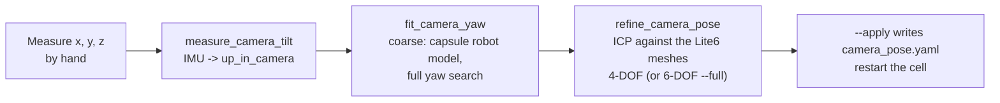

# Module: camera calibration

Every 3D position the perception pipeline computes is only as good as the **camera's pose in `world`** (the
*extrinsic calibration*): an error of 1° at 1.5 m distance moves everything on the table by 2.6 cm. This page
describes how the pose is represented and the three tools that measured it.

Result in use (2026-09-27): `x −0.380, y 0.571, z 1.475, yaw −0.6515 rad`, tilt 19.3° from straight down;
**4.0 mm RMS** between the camera's view of the robot and the robot model.

## Representation (`config/camera_pose.yaml`, `qb_arm/camera_pose.py`)

The pose of `camera_base` in `world` is stored as

| Key | Meaning | Source |
|---|---|---|
| `x`, `y`, `z` | position (m) | tape measure, then fitted |
| `up_in_camera` | the world's "up" direction expressed in camera coordinates (unit vector) | the camera's accelerometer |
| `yaw` | rotation about the world vertical | fitted against the robot |

Why this split: an accelerometer at rest measures gravity, so it tells the tilt (2 degrees of freedom) exactly, but
it cannot see the rotation *about* the vertical (yaw). Storing tilt and yaw separately lets each come from the right
source.

`camera_quaternion(up_in_camera, yaw)` builds the orientation in two steps:

1. **Tilt**: the shortest rotation that maps `up_in_camera` onto world +Z:
   axis = `up × Z`, angle = `acos(up · Z)` (handling the parallel/antiparallel cases).
2. **Yaw**: then rotate about world +Z by `yaw` — which leaves the tilt unchanged.

`q = q_yaw ⊗ q_tilt`. `kinect.launch.py` publishes it as the static transform `world → camera_base`.

## Procedure

All three tools are read-only with respect to the robot (they never move the arm) and write the YAML only with
`--apply` (the tilt tool unless `--dry-run`). `config_path()` resolves the installed YAML back to the source file
(symlink install), so results land in the repository.

### `measure_camera_tilt`

Averages `/kinect/imu` linear acceleration for 3 s (camera still), rotates the mean vector from the IMU frame into
`camera_base` (via TF), normalises it → `up_in_camera`. At rest the accelerometer reads +g **upwards** (it measures the
reaction to gravity). Prints |g| (sanity check ≈ 9.8) and the tilt of the lens axis from straight down (19.3° here).

### `fit_camera_yaw` — coarse, global

The yaw is unknown and can be anything, so a local method (ICP) would get stuck. This tool does an exhaustive search
against a crude robot model:

1. **Robot as capsules**: the live TF positions of `link_base … link_eef` form a chain; each consecutive pair is a
   capsule of radius 6 cm, plus a 12 cm column for the base.
2. Take one point cloud, 150 000 random points, transformed into a "tilt-only" frame (`camera_base` rotated by the
   known tilt, yaw 0).
3. **Score** of a candidate (yaw, dx, dy) = number of points (above 3 cm) within a capsule after rotating by yaw and
   translating to (x + dx, y + dy, z).
4. Search: yaw from −180° to 180° in 2° steps → best ± 3° in 0.25° steps → joint refinement of yaw/x/y by
   coordinate descent at 2, 1, 0.5 cm steps.
5. Reports the best yaw and the best *distinct* runner-up (> 20° away) to judge ambiguity.

### `refine_camera_pose` — fine, local (ICP)

**Iterative Closest Point** against the real robot surface:

1. **Model**: the Lite6 visual meshes (`link_base … link6`) sampled uniformly by area (one point per ~4 mm², from the
   binary STL triangles), placed at the live joint state → a KD-tree.
2. **Data**: 5 accumulated point clouds, in `camera_base`, kept only where they could be the robot (z > 2 cm, within
   0.6 m of the model's centre).
3. **Loop**, with a shrinking inlier distance 6 → 4 → 3 → 2 → 1.5 → 1.2 → 1 cm, 8 iterations each:
   - transform the data with the current pose, find each point's nearest model point (KD-tree);
   - keep pairs closer than the threshold (inliers);
   - solve the best rigid transform between inliers and their partners:
     - **4-DOF** (default): rotation about z only, closed form:
       `a = atan2(Σ(sx·dy − sy·dx), Σ(sx·dx + sy·dy))` on centred coordinates;
     - **6-DOF** (`--full`): Kabsch/SVD, `R = V · diag(1, 1, det) · Uᵀ`;
     - translation `t = mean(d) − R · mean(s)`;
   - compose it onto the pose.
4. Convert back to YAML form: `up = Rᵀ · Z`, yaw from the remaining z-rotation.
5. Report inliers within 2 cm and RMS before/after.

The 6-DOF run confirmed the IMU tilt within 0.2°, so the default keeps the tilt fixed (fewer parameters, more
robust). Note: the user's first hand measurement had x and y swapped (robot X points to the front).

### `measure_table` — the table plane

Averages 10 depth frames (median per pixel), deprojects them into `world`, keeps points 12–55 cm from the base within
3 cm of z = 0, and fits `z = a·x + b·y + c` by robust least squares (four rounds, dropping points more than 3× the
median residual off). Result (2026-09-29): `a −0.01468, b −0.00354, c −0.00170`, 1.7 mm RMS: the table is tilted 0.87°
against the robot base. `--apply` writes `config/table.yaml` (keyed `/**`), which `planning_scene_setup` (MoveIt's table
box, tilted to the plane) and the object detector (heights, fingertip clearance) read.

### Limits

- The camera sees the robot mostly from above; poses where the arm spans a large volume give the best fits.
- An attempt to fit the **claw's mounting yaw** the same way (claw meshes vs. cloud) was not usable: too few points
  (link6 hides the claw from above) and unmodelled parts (ESP32, cables). The claw yaw was confirmed visually in RViz.
