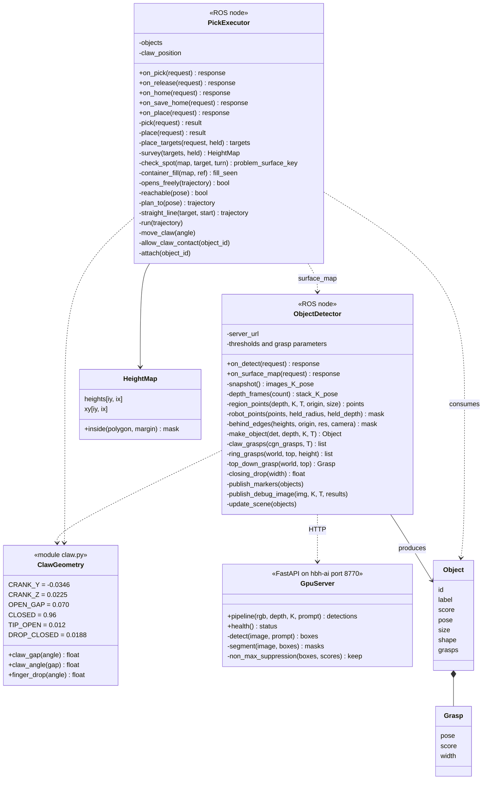

# Module: qb_arm_vision

Perception and picking. Repository `whoobee/qb_arm_vision`:

```
qb_arm_vision/
├── server/                       GPU inference server (Docker, runs on hbh-ai)
│   ├── app/server.py             FastAPI: /pipeline, /health
│   ├── Dockerfile, compose.yaml, requirements.txt
├── qb_arm_vision/                ROS 2 package (ament_python)
│   ├── qb_arm_vision/object_detector.py
│   ├── qb_arm_vision/pick_executor.py
│   ├── qb_arm_vision/claw.py     claw geometry shared by both nodes
│   ├── qb_arm_vision/handover.py handover geometry (hands, the claw's pose at the hand, pulls), no ROS
│   ├── qb_arm_vision/hand_tracker.py
│   ├── config/object_detector.yaml, pick_executor.yaml
│   └── launch/object_detector.launch.py   (both nodes, namespace qb_arm_vision)
└── qb_arm_vision_interfaces/     messages and services (ament_cmake)
```

The algorithms are described on [perception pipeline](05-perception-pipeline.md) and
[pick execution](06-pick-execution.md); this page documents the module structure, interfaces and deployment.

## Class view



## Interfaces (`qb_arm_vision_interfaces`)

```
# msg/Grasp.msg — a grasp for the claw: target pose of link_tcp, fingers closing along its y axis
geometry_msgs/PoseStamped pose
float32 score        # 0..1 (Contact-GraspNet confidence, or the geometric grasps' fixed scores)
float32 width        # m, opening needed

# msg/Object.msg — an object found on the table
string id                  # collision object id in MoveIt's planning scene, from the query: "white_bin", "tape_2"
string label               # detector label, e.g. "tape roll"
float32 score              # detector confidence
geometry_msgs/PoseStamped pose   # centre of the bounding box, z up, x along the long side
geometry_msgs/Vector3 size       # long side, short side, height (m)
shape_msgs/Mesh shape            # top-view outline extruded to the table, relative to pose
Grasp[] grasps             # best first

# msg/ObjectArray.msg — latched on /qb_arm_vision/objects
std_msgs/Header header
string prompt
Object[] objects

# srv/Detect.srv
string prompt        # "tape roll. bottle. cup." ; empty = the node's default
---
bool success
string message
Object[] objects

# srv/Place.srv — put the held object down
geometry_msgs/Point position   # relation "": object centre on the table (x, y; z ignored); (0, 0) = back where it was picked
string relation      # "", "on", "into", "next_to"
string reference     # object id from the latest detection, e.g. "white_bin" ("white bin" works too)
string side          # next_to: "left" (+y), "right" (-y), "front" (+x), "back" (-x); "" = the first that works
float32 gap          # next_to: m between the two objects; 0 = default (2 cm)
bool plan_only
---
bool success
string message

# srv/SurfaceMap.srv — what stands in a square region right now (object_detector)
float64 center_x
float64 center_y
float32 half_size         # m (at most max_map_half_size)
float32 resolution        # m per cell (0 = 0.01)
geometry_msgs/Point[] held_outline   # the object in the claw as it hangs now (world xy outline) ...
float32 held_bottom       # m ... and its bottom and top: its points are left out (+ robot_mask_margin)
float32 held_top
---
bool success
string message
uint32 cells              # cells per side; heights[iy * cells + ix]
float64 origin_x          # cell (ix, iy) centred at origin + (i + 0.5) * resolution
float64 origin_y
float32 resolution
float32[] heights         # m, world z per cell (75th percentile of its points); NaN = not seen
uint8[] flags             # per cell: ROBOT (1) = points on the robot or the held object fell into it,
                          # IGNORED (2) = outside the vision workspace or in a keep-out zone,
                          # VEIL (4) = just behind a taller edge (mixed depth: not seen)
float32[] hidden_top      # per unseen cell: how high something could stand there unseen (line of sight over the
                          # occluder, arm included; inf = unknown); NaN for seen cells

# srv/Pick.srv
string object_id     # from the latest detection
bool plan_only       # only plan (shown in RViz), don't move
---
bool success
string message
Grasp grasp          # the grasp used

# srv/Handover.srv — hand the held object to the user's hand (give) or take one from it (take)
string action        # 'give' or 'take'
bool plan_only       # only plan the way to the hand (shown in RViz), don't move
---
bool success
string message
```

During a handover `/qb_arm_vision/stop` (`std_srvs/Trigger`) stops the arm where it is, and during a take
`/qb_arm_vision/close` closes the claw now; see [pick execution](06-pick-execution.md#handover-give-and-take).

## `hand_tracker`

The user's hands from the ceiling Kinect, for the helping-hand features. MediaPipe HandLandmarker (CPU) on the colour
image + the depth image nearest in time → `/qb_arm_vision/hands` (`HandArray`) and `/qb_arm_vision/hand_markers`
(RViz *Hands*: palm sphere green = depth measured, amber = depth carried over, red = near the arm; bones; fingertips).
Started with the cell (launch argument `hands`, default true); parameters in `config/hand_tracker.yaml`.
While someone subscribes, it also publishes `/qb_arm_vision/camera_preview` (`CompressedImage`, JPEG 640 px wide,
≤ 15 Hz: `preview_width`, `preview_rate`, `preview_quality`) — each processed frame, after that frame's hands, so a
viewer (the control page's live view) can draw the hands exactly where they were found.

- **Depth**: anchored on the palm (a 17×17 window, nearly always visible). Every other landmark uses its own depth
  only within 3 cm (`tip_agreement`) of palm depth + MediaPipe's metric hand shape — else the depth camera (a few cm
  beside the colour camera) sees the arm in front of a fingertip, and the estimate is used. No palm depth (edge of
  the depth image): a tracked hand keeps its last depth (`depth_ok` false), a new one is skipped.
- **Tracking**: by palm position (MediaPipe's left / right is unreliable from above); a new hand after 3 detections,
  dropped after 0.5 s without one; a jump faster than 3 m/s is not the same hand; below the table − 3 cm: rejected.
  One Euro filter (steady when still, little lag in motion); `velocity` from it.
- **Per hand**: palm, fingertips, all 21 landmarks (world), their image coordinates, `arm_distance` (nearest
  landmark to the arm's links as 4 cm segments, from TF). **Per frame**: `present` (a hand over the vision workspace
  + 15 cm), `near_arm` (any hand within 15 cm), `rate`.
- **Environment**: MediaPipe 1.x in `~/prj/venvs/hands` (venv with system site packages, numpy < 2, the system
  OpenCV; model `models/hand_landmarker.task`) — `install.sh` step *hands* (`--no-hands` to skip). The node starts
  under the system Python and re-executes itself there. Feasibility tools: `qb_arm_install/tools/hands/`
  (`hand_probe.py`, `depth_check.py`).
- **Measured** (2026-10-01): ~18 fps with the cell running (≈ 40 ms inference with a hand); still hand: palm and
  fingertips steady to 1–2 mm, a flat hand 28 mm above the table; found in 99% of frames still, 81% moving.

## `claw.py`

The claw's parallelogram geometry, shared by the detector (grasp heights) and the executor (closing angle), so they
can't disagree. Values from `qb_arm/urdf/qbag.xacro`: the crank vector from the crank pivot to the finger pivot is
(y, z) = (−34.645 mm, 22.497 mm).

| Function | Formula / method |
|---|---|
| `claw_gap(a)` | `0.070 − 2·(CY·cos a + CZ·sin a − CY)` — gap between the pads at `claw_joint = a` |
| `claw_angle(gap)` | inverse of `claw_gap` by bisection over 0..0.96 (40 iterations; the gap shrinks monotonically) |
| `finger_drop(a)` | `−CY·sin a + CZ·(cos a − 1)` — how much further along the approach the fingers are than when open |
| `DROP_CLOSED` | `finger_drop(0.96)` = 18.8 mm |
| `inside_claw(points, a, margin)` | which points (link_tcp frame) lie on the claw's own parts at `claw_joint = a`: the fingers with their pads (moved in and forward with `a`) and the linkage plates between them (their top rises from −21.5 to −3.4 mm while closing), measured on the meshes; `margin` 8 mm, 3 mm on the gripping faces |
| `pinch_distance(points)` | distance from where the closing claw can pinch: x ±1 cm, y ±4.6 cm, z −3…+3.1 cm (take: is every hand clear?) |

`handover.py` holds the handover geometry without ROS: the claw's rotation at the hand (`claw_rotation`), the target
spots in front of the palm (`handover_targets`), the handover zone (`in_zone`), a hand's distance from the arm
(`arm_distance`, links as capsules) and from a box (`box_distance`), natural arm configurations
(`natural_configuration`), `Dwell` (how long a condition has held), `PullDetector` (a pull from the joint torques) and
`connected` (depth points connected to a seed through occupied voxels: the object in the claw).

## `object_detector` parameters (`config/object_detector.yaml`)

| Parameter | Default | Meaning |
|---|---|---|
| `server_url` | `http://hbh-ai.local:8770` | GPU server |
| `prompt` | `bottle. cup. box. tape roll. tool. can. container. toy.` | used when the request's prompt is empty |
| `box_threshold`, `text_threshold` | 0.3, 0.25 | Grounding DINO thresholds |
| `max_box_fraction` | 0.25 | ignore boxes covering more of the image |
| `max_tilt_deg` | 30 | network grasps: max angle between approach and straight down |
| `max_grasp_width` | 0.065 m | the claw opens 70 mm |
| `gripper_depth` | 0.1034 m | Panda hand frame → finger contacts |
| `grasps_per_object` | 5 | |
| `table_z` | 0.0 m | table surface in `world` |
| `min_object_height`, `max_object_height` | 0.005, 0.4 m | above the table plane |
| `workspace_radius` | 0.8 m | around the robot base |
| `reach` | 0.44 m | only for the "out of reach" hint in the debug image |
| `edge_threshold` | 0.02 m | flying-pixel filter |
| `fingertip_clearance` | 0.003 m | fully closed claw's fingertips above the table plane |
| `table_plane` | from qb_arm `config/table.yaml` | measured table plane a, b, c (`z = a·x + b·y + c`) |
| `slice_grasp_score`, `slice_step` | 0.2, 0.01 m | narrow-slice grasps (flat/long objects) |
| `fallback_grasp_score`, `top_slice` | 0.1, 0.03 m | top-slice fallback grasp |
| `max_grasp_depth` | 0.025 m | network grasps: max TCP depth below the object top |
| `finger_margin`, `max_finger_hits` | 0.01 m, 5 | finger-landing check |
| `ring_grasp_score`, `ring_grasp_directions`, `min_ring_hole_radius` | 0.3, 12, 0.02 m | ring grasps |
| `add_collision_objects` | true | put detected objects into the planning scene |
| `timeout` | 60 s | server request |
| `map_resolution`, `max_map_half_size` | 0.01 m, 0.5 m | surface map: default cell size, largest region (± half size) |
| `map_frames` | 7 | depth frames per surface map, median per pixel |
| `min_cell_points`, `map_cell_percentile` | 3, 75 | a cell with fewer points is not seen; its height = this percentile of its points |
| `max_view_slope_deg` | 60 | steeper surfaces (against the view) are left out of the map |
| `edge_jump`, `edge_veil` | 0.03 m, 0.04 m | cells just behind an edge this much higher (within its shadow + `edge_veil`) are not seen |
| `robot_mask_margin` | 0.03 m | around each link's collision box when cutting the robot out of the map |
| `boundaries_file` | qb_arm `config/boundaries.yaml` (launch argument) | the vision workspace and keep-out zones; `''` = none |

`pick_executor` parameters: see [pick execution](06-pick-execution.md#parameters).

**Parameter files** are keyed `/**/object_detector:` and `/**/pick_executor:`: the nodes run in the namespace
`/qb_arm_vision`, and a plain `object_detector:` key matches nothing (until 2026-09-29 the files were silently ignored).
The config files are copied at build time (`colcon build`), not symlinked.

## The GPU server

| | |
|---|---|
| Host | hbh-ai (`192.168.1.220`), user `whoobee`, docker group (no sudo) |
| Code | `~/prj/qb_arm_vision/server` (a copy of the repo's `server/`), `app/` mounted into the container for live edits |
| Container | `qb_arm_vision`, `restart: unless-stopped`, port 8770 (8765 is taken by speech-to-speech) |
| GPU | device 0, RTX 3060 12 GB (~9.7 GB in use incl. other services); the 3060 Ti runs speech-to-speech |
| Image | `pytorch/pytorch:2.8.0-cuda12.8-cudnn9-runtime` + transformers, FastAPI, OpenCV; Contact-GraspNet PyTorch port (elchun, pinned commit) |
| Models | `IDEA-Research/grounding-dino-base`, `facebook/sam2.1-hiera-base-plus`, Contact-GraspNet (NVIDIA, non-commercial licence) |
| Model cache | `~/.cache/qb_arm_vision` → `/models` (Hugging Face downloads survive rebuilds) |
| Concurrency | one request at a time on the GPU (a lock) |

Operations:

```bash
ssh hbh-ai.local
cd ~/prj/qb_arm_vision/server
docker compose up -d --build      # (re)build and start
docker compose logs -f            # logs
curl http://hbh-ai.local:8770/health
```

Contact-GraspNet's checkpoint pickles NumPy scalars, which PyTorch ≥ 2.6 refuses by default, so the server loads it with
`weights_only=False` (the checkpoint comes with the pinned upstream commit).

### `POST /pipeline` — request and response

Request (multipart form): `rgb` (JPEG/PNG), `depth` (16-bit PNG, mm, registered to rgb), `K` (JSON 3x3), `prompt`,
`box_threshold`, `text_threshold`, `max_box_fraction`, `z_min` (0.2), `z_max` (2.0), `forward_passes` (1), `grasps`
(true).

Response:

```json
{
  "frame": "camera_optical",
  "detections": [
    {"id": 1, "label": "tape roll", "score": 0.44, "box": [x0, y0, x1, y1], "pixels": 5210,
     "mask_png": "<base64 PNG>",
     "grasps": [{"T": [[...4x4...]], "score": 0.19, "width": 0.009, "contact": [x, y, z]}]}
  ],
  "timing": {"detect": 0.43, "segment": 0.62, "grasps": 3.1}
}
```

`timing` values are cumulative seconds since the request started.
