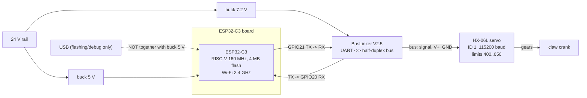
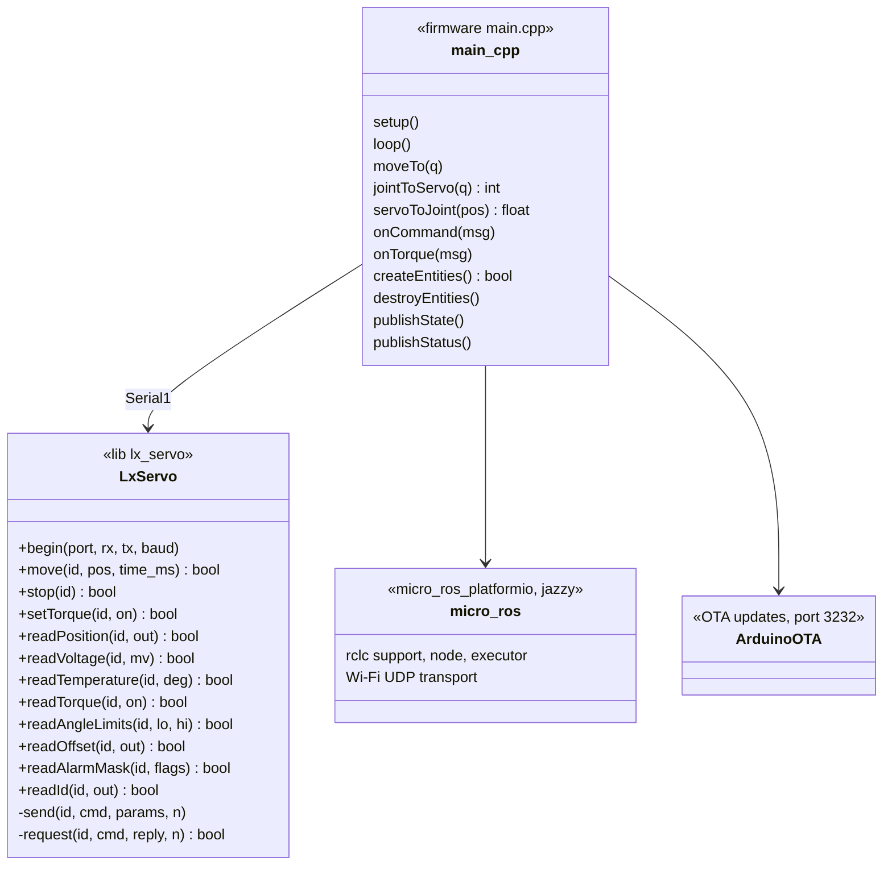
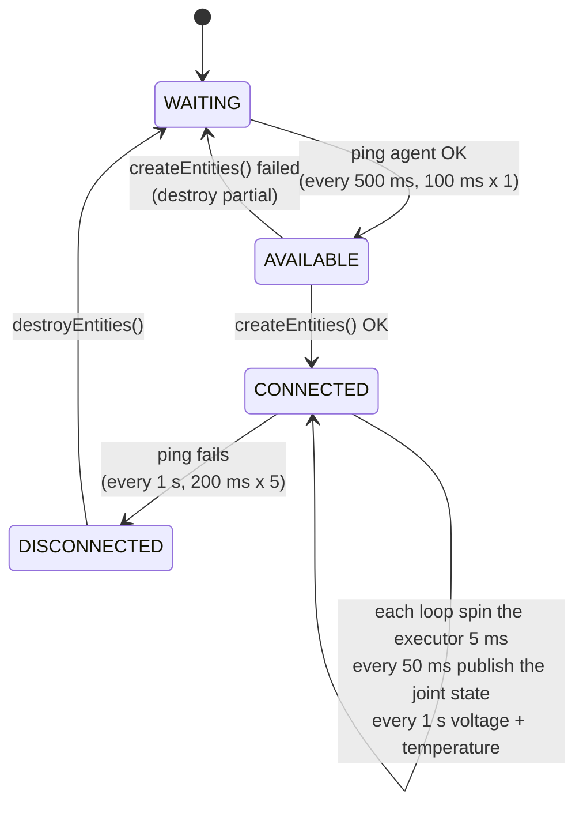
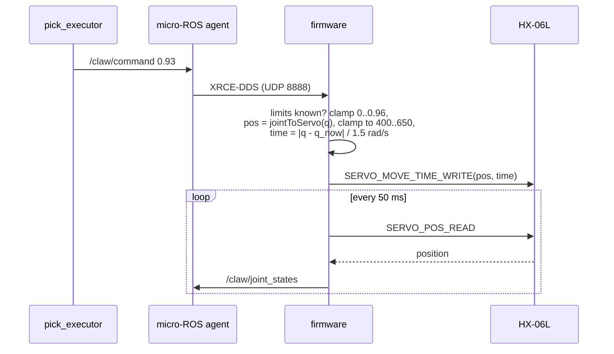

# Module: qb_arm_gripper (claw firmware)

The claw's controller: an **ESP32-C3** that drives the **Hiwonder HX-06L** bus servo through a **BusLinker V2.5** and
appears in ROS as the micro-ROS node **`/claw/qbag_esp32`** over Wi-Fi. Repository `whoobee/qb_arm_gripper`
(PlatformIO), on qBArm at `~/prj/qb_arm_gripper`.

## Hardware



| Item | Detail |
|---|---|
| Controller | ESP32-C3 (QFN32, rev v0.4), native USB-serial/JTAG (`303a:1001`) |
| Servo | Hiwonder HX-06L serial bus servo, position 0–1000 = 0–240°, reports position, voltage, temperature |
| Adapter | Hiwonder BusLinker V2.5: turns the ESP's UART TX/RX into the servo's single-wire half-duplex bus |
| Wiring | GPIO21 (TX) → BusLinker RX, GPIO20 (RX) ← BusLinker TX, GND common |
| Servo supply | 6–8.4 V on the BusLinker (7.2 V buck from 24 V). With only USB power the servo answers (reports ~3.3 V) but cannot move |
| Boards | gripper `40:4C:CA:FA:D7:BC` = `qbag-fad7bc` (192.168.1.123, wired); spare `EC:DA:3B:39:2F:64` = `qbag-392f64` (192.168.1.229) |

> **Power warning.** These small boards connect the 5V pin **directly to USB VBUS**. With the buck's 5 V on the 5V pin
> *and* USB plugged in, the buck back-feeds the PC: qBArm's USB port hit over-current and stayed disabled until a full
> power-off. Run from the buck with USB unplugged (update over Wi-Fi), or put a Schottky diode in the buck's 5 V line.

## ROS interface

| Topic | Type | Direction | Meaning |
|---|---|---|---|
| `/claw/command` | `std_msgs/Float64` | in | `claw_joint` target, rad: 0 open (70 mm) … 0.96 closed; clamped to 0..0.96 and to the servo's limits; moves at 1.5 rad/s |
| `/claw/torque` | `std_msgs/Bool` | in | `false`: servo limp (move the claw by hand); `true`: hold where it is; any command also turns it on |
| `/claw/joint_states` | `sensor_msgs/JointState` | out, 20 Hz | measured `claw_joint`, stamped with the agent-synchronised clock |
| `/claw/supply_voltage` | `std_msgs/Float32` | out, 1 Hz | servo input voltage (V) |
| `/claw/temperature` | `std_msgs/Float32` | out, 1 Hz | servo temperature (°C) |

All publishers and subscribers are *reliable* (joint_state_publisher subscribes reliably; a best-effort publisher would
not match).

## Software structure



### Main loop and agent connection

`setup()`: USB serial log, servo UART (Serial1, 115200), `JointState` message buffers, hostname `qbag-<last 3 MAC
bytes>`, optional static IP, Wi-Fi scan of all channels joining the **strongest** AP, micro-ROS Wi-Fi transport
(blocks until Wi-Fi is up), then TX power 8.5 dBm, modem sleep off, ArduinoOTA.

`loop()`, never blocking:



Independently of the agent state, every pass: `ArduinoOTA.handle()`; every 50 ms read the servo position; until the
servo has answered once, read its angle limits every 1 s (the servo may be powered after the ESP). The servo keeps
its last target without the agent.

**Session key.** `createEntities()` sets the micro-ROS client key to a value derived from the MAC. With the default
(random per boot) the agent kept the previous session's entities after every reboot, which showed up as ghost
subscribers; with a stable key a reconnect replaces the old session.

### Commands to servo positions



**Calibration** (two measured points, linear map; `platformio.ini` build flags):

```
CLAW_OPEN_POS   = 426   servo position with the claw fully open      -> claw_joint 0
CLAW_CLOSED_POS = 598   servo position with the pads touching        -> claw_joint 0.96 rad
RAD_PER_UNIT    = 0.96 / (598 - 426)
claw_joint      = (pos - 426) · RAD_PER_UNIT
```

The servo turns 41.3° (172 units × 0.24°) over the range where the model's crank turns 55°: the gearing is not 1:1,
hence the two-point map. Measured with torque off, moving the claw by hand.

## LX bus-servo protocol (`lib/lx_servo`)

Half-duplex serial, 115200 8N1. Every frame:

```
0x55 0x55 | ID | LEN | CMD | PARAM... | CHECKSUM
LEN      = number of params + 3
CHECKSUM = ~(ID + LEN + CMD + PARAM...) & 0xFF
ID 0xFE  = broadcast (only for reads with a single servo on the bus)
```

| Command | Code | Params | Reply |
|---|---|---|---|
| `MOVE_TIME_WRITE` | 1 | pos (u16 LE, 0–1000), time ms (u16 LE) | – |
| `MOVE_STOP` | 12 | – | – |
| `ID_READ` | 14 | – | id |
| `ANGLE_OFFSET_READ` | 19 | – | offset (s8) |
| `ANGLE_LIMIT_READ` | 21 | – | lo, hi (u16 LE each) |
| `TEMP_READ` | 26 | – | °C |
| `VIN_READ` | 27 | – | mV (u16 LE) |
| `POS_READ` | 28 | – | position (s16 LE) |
| `LOAD_OR_UNLOAD_WRITE` | 31 | 0 = limp, 1 = torque on | – |
| `LOAD_OR_UNLOAD_READ` | 32 | – | 0/1 |
| `LED_ERROR_READ` | 36 | – | alarm mask (which faults light the LED), not the current faults |

`request()` sends a read, then parses incoming bytes for a frame with a valid checksum, the same command, the expected
length and the right id, **skipping** anything else (e.g. the adapter echoing our own request), within 20 ms.

## Network and updates

| Topic | Solution |
|---|---|
| Credentials | `wifi.env` (git-ignored): `QBAG_WIFI_SSID`, `QBAG_WIFI_PASSWORD`, `QBAG_AGENT_IP` (192.168.1.171), `QBAG_AGENT_PORT` (8888), `QBAG_OTA_PASSWORD`, `QBAG_OTA_HOST`, `QBAG_STATIC_IP`. `scripts/load_env.py` (pre-script) turns them into `-D` defines; environment variables override. |
| 2.4 GHz only | The C3 has no 5 GHz radio; it joins "NamNet" (three APs on channels 1/6/11) |
| Packet loss | At full TX power the board lost 30–80 % of packets (small antenna/RF layout). TX power 8.5 dBm + modem sleep off + strongest AP: 0 % loss, ~5 ms, RSSI ≈ −57 dBm |
| OTA | ArduinoOTA with password, hostname `qbag-xxxxxx`; the servo is released (limp) when an update starts. `scripts/ota_auth.py` (post-script) passes the password to espota, because the platform resets the uploader flags after pre-scripts |

## Build environments (`platformio.ini`)

| Env | Purpose |
|---|---|
| `gripper` | the firmware, micro-ROS over Wi-Fi, flashed over USB |
| `gripper_ota` | same, uploaded over Wi-Fi to `QBAG_OTA_HOST` |
| `gripper_usb` | micro-ROS over the USB cable (no log output) |
| `probe` | read-only bus check: prints servo id, position, voltage, temperature, limits every second |

```bash
cd ~/prj/qb_arm_gripper
pio run -e gripper_ota -t upload     # normal update, over Wi-Fi
pio run -e gripper -t upload         # first flash / recovery, over USB (mind the power warning)
pio device monitor                   # log over USB
```

Only one board may run at a time (same node name and topics).
