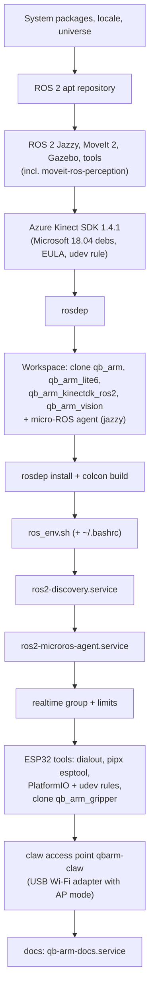

# Module: infrastructure

Everything around the ROS code: the installer, system services, environment, the forked drivers and the network.

## `install.sh` (repository `qb_arm_install`)

Recreates the whole qBArm machine on Ubuntu 24.04; safe to re-run (each step checks what is already there).
Tested end-to-end into a scratch workspace.



Options: `--ws DIR`, `--https`, `--branch`, `--accept-k4a-eula`, `--no-upgrade`, `--no-kinect`, `--no-build`,
`--no-bashrc`, `--no-discovery-server`, `--no-realtime`, `--no-esp`, `--no-microros-agent`, `--no-claw-ap`, `--no-docs`,
`--dds-iface IFACE` (the one interface ROS uses; default: the interface of the default route).
GitHub over SSH port 22 is flaky from qBArm; the scripts use `ssh://git@ssh.github.com:443/whoobee/<repo>.git`.

## System services (systemd)

| Service | Command | Why |
|---|---|---|
| `ros2-discovery` | `fastdds discovery -i 0 -l 0.0.0.0 -p 11811` | Fast DDS discovery server: every node registers here instead of multicasting |
| `ros2-microros-agent` | `ros2 run micro_ros_agent micro_ros_agent udp4 --port 8888` (after sourcing `ros_env.sh`) | Bridges the claw's ESP32 into ROS; always on, so the claw stays connected whichever launch runs |
| `qb-arm-docs` | `python3 docs/server/qb_docs_server.py --port 8080` | This documentation |

All run as user `whoobee`, restart on failure.

## The claw's access point `qbarm-claw`

The claw's ESP32 sits on the arm among metal; through the building Wi-Fi it lost up to 75 % of its packets and
firmware updates failed. qBArm therefore runs its own 2.4 GHz access point on a **second, USB Wi-Fi adapter**
(TP-Link Archer T4U v3, RTL8812BU, in-kernel driver `rtw88_8822bu`, supports AP mode) placed next to the arm:

| | |
|---|---|
| NetworkManager connection | `qbarm-claw` (autoconnect), interface `wlxec750c316d15`, mode AP, band bg, **channel 1** (the building uses 6 and 11), WPA2-PSK (CCMP) |
| Addresses | `ipv4.method shared`: qBArm = `10.42.0.1/24`, DHCP by NetworkManager's dnsmasq; fixed addresses per board in `/etc/NetworkManager/dnsmasq-shared.d/qbarm-claw.conf` (claw `10.42.0.10`, spare `.11`) |
| Password | generated at setup; in `~/prj/qb_arm_gripper/wifi.env` (`QBAG_WIFI_PASSWORD`, git-ignored) and the NetworkManager connection |
| micro-ROS agent | unchanged: it listens on all interfaces, the claw talks to `10.42.0.1:8888` |
| Result | 0 % loss, ~4 ms, RSSI about −42 dBm |

The firmware only knows this network; after 30 s without Wi-Fi it restarts and joins again (the servo keeps its
position meanwhile). **Don't `systemctl reload NetworkManager`**: it crashed on that once (assertion in
`nm-settings-utils.c`) and left the access point's dnsmasq orphaned (fix: kill that dnsmasq, `nmcli con up qbarm-claw`).

## Environment (`~/prj/ros2_ws/ros_env.sh`)

Sourced from `~/.bashrc`:

```bash
source /opt/ros/jazzy/setup.bash
source ~/prj/ros2_ws/install/setup.bash
export ROS_DOMAIN_ID=0
export RMW_IMPLEMENTATION=rmw_fastrtps_cpp
export ROS_DISCOVERY_SERVER="127.0.0.1:11811"
export ROS_SUPER_CLIENT=TRUE          # CLI tools see the whole graph
export FASTRTPS_DEFAULT_PROFILES_FILE=~/prj/ros2_ws/fastdds_qbarm.xml   # ROS over one interface (below)
alias cb=...                          # colcon build + re-source
alias kinect=...  qbarm=...           # partial launches
alias cell=...                        # the cell process manager (use this)
```

Other machines join with `ROS_DISCOVERY_SERVER=192.168.1.135:11811 ROS_SUPER_CLIENT=TRUE` (none do today).

**One network interface for ROS** (`fastdds_qbarm.xml`, written by the installer): shared memory, loopback and the LAN
cable only. With the Wi-Fi and the cable both on 192.168.1.0/24, every node advertised two addresses, discovery of
service clients got slower and the controller manager's replies to the spawner were dropped (*failed to send response
… (timeout)*): `lite6_traj_controller` stayed *unconfigured* on every cell start (2026-10-02). Shared memory keeps its
default 512 KB segments: 16 MB segments (so the Kinect's 3.7 MB colour frames go through shared memory instead of UDP
loopback) were tried on 2026-10-02 and reverted the same evening - the first-ever "Failed to poll cameras" crash of the
Kinect driver came minutes later, and the control loop overran more often.

**Real-time**: the `realtime` group may use real-time priorities (`/etc/security/limits.d/99-realtime.conf`); the
controller manager runs its 150 Hz loop with FIFO priority 50. A cell started from the control page inherits the limits of
`qb-arm-control.service`, not those of a login: the unit sets `LimitRTPRIO=99` and `LimitMEMLOCK=infinity` itself
(until 2026-10-02 page-started cells ran the loop without real-time priority). The kernel is not PREEMPT_RT, so "Overrun detected!"
warnings from the controller manager are loop-timing warnings under CPU load, not collisions.

## Forked third-party code

| Repository | Upstream | Changes |
|---|---|---|
| `qb_arm_kinectdk_ros2` | microsoft/Azure_Kinect_ROS_Driver (humble branch) | Port to Jazzy: `cv_bridge.hpp` include; install the node into `lib/<pkg>` so `ros2 launch` finds it |
| `qb_arm_lite6` | xArm-Developer/xarm_ros2 (jazzy) | none (pinned copy) |

The Azure Kinect SDK (`libk4a1.4`) only exists as Microsoft's Ubuntu 18.04 packages; they install on 24.04.
Use depth mode `NFOV_UNBINNED` (`WFOV_UNBINNED` at 30 fps crashes).

## Network

| Host | Address | Ports |
|---|---|---|
| qBArm | **192.168.1.135** (LAN cable `enx00e04c360283`, DHCP — reserve it in the router); 192.168.1.171 (Wi-Fi `wlp0s20f3`, backup) | UDP 11811 discovery, UDP 8888 micro-ROS, TCP 8080 docs, TCP 8081 control, SSH |
| Lite6 controller | 192.168.1.23 | UFACTORY SDK |
| hbh-ai | 192.168.1.220 | TCP 8770 vision server |
| Claw ESP32 | 10.42.0.10 on `qbarm-claw` | UDP (micro-ROS client), TCP 3232 OTA |
| `qbarm-claw` | 10.42.0.1/24 (qBArm, `wlxec750c316d15`) | DHCP/DNS (NetworkManager's dnsmasq) |

**Wired LAN (2026-10-02).** qBArm has no Ethernet port; a USB-C hub/Ethernet combo (USB 2.0 hub `214b:7250` +
Realtek RTL8152 `0bda:8152`, 100 Mbit) connects it to the router. Its udev rule `/etc/udev/rules.d/90-qbarm-usb-eth.rules`
keeps USB autosuspend off (with it on, the adapter dropped out right after plugging in: *status -71*). The
NetworkManager connection `qbarm-eth` routes the whole 192.168.1.0/24 over the cable (`ipv4.routes "192.168.1.0/24
0.0.0.0 50"` — the DHCP address comes with *noprefixroute*, so without it the subnet stayed on the Wi-Fi) and has the
default route (metric 100 < Wi-Fi 600). The Wi-Fi stays connected as a way in when the cable fails.
Arm link, 1000 pings each: cable 0.98 ms average, 2.1 ms worst, 0.13 ms jitter; Wi-Fi 1.57 / 14.4 / 1.04 ms.
ros2_control at 150 Hz, arm idle in servo mode: **2 overruns/min, longest loop 11.6 ms** on the cable against
40.5/min and 118 ms on the Wi-Fi — the arm's micro-freezes came from Wi-Fi round trips (`read()` blocks per cycle).

Name resolution for `.local` names via mDNS (avahi). Recommended: reserve qBArm's address in the router.

## Temporary state to clean up

- Passwordless sudo for `whoobee` (`/etc/sudoers.d/whoobee-nopasswd`), enabled "for now" on 2026-09-27.
