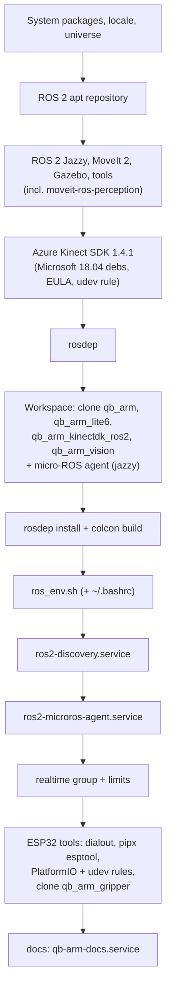

# Module: infrastructure

Everything around the ROS code: the installer, system services, environment, the forked drivers and the network.

## `install.sh` (repository `qb_arm_install`)

Recreates the whole qBArm machine on Ubuntu 24.04; safe to re-run (each step checks what is already there).
Tested end-to-end into a scratch workspace.



Options: `--ws DIR`, `--https`, `--branch`, `--accept-k4a-eula`, `--no-upgrade`, `--no-kinect`, `--no-build`,
`--no-bashrc`, `--no-discovery-server`, `--no-realtime`, `--no-esp`, `--no-microros-agent`, `--no-docs`.
GitHub over SSH port 22 is flaky from qBArm; the scripts use `ssh://git@ssh.github.com:443/whoobee/<repo>.git`.

## System services (systemd)

| Service | Command | Why |
|---|---|---|
| `ros2-discovery` | `fastdds discovery -i 0 -l 0.0.0.0 -p 11811` | Fast DDS discovery server: every node registers here instead of multicasting |
| `ros2-microros-agent` | `ros2 run micro_ros_agent micro_ros_agent udp4 --port 8888` (after sourcing `ros_env.sh`) | Bridges the claw's ESP32 into ROS; always on, so the claw stays connected whichever launch runs |
| `qb-arm-docs` | `python3 docs/server/qb_docs_server.py --port 8080` | This documentation |

All run as user `whoobee`, restart on failure.

## Environment (`~/prj/ros2_ws/ros_env.sh`)

Sourced from `~/.bashrc`:

```bash
source /opt/ros/jazzy/setup.bash
source ~/prj/ros2_ws/install/setup.bash
export ROS_DOMAIN_ID=0
export RMW_IMPLEMENTATION=rmw_fastrtps_cpp
export ROS_DISCOVERY_SERVER="127.0.0.1:11811"
export ROS_SUPER_CLIENT=TRUE          # CLI tools see the whole graph
alias cb=...                          # colcon build + re-source
alias kinect=...  qbarm=...           # partial launches
alias cell=...                        # the cell process manager (use this)
```

Other machines join with `ROS_DISCOVERY_SERVER=192.168.1.171:11811 ROS_SUPER_CLIENT=TRUE`.

**Real-time**: the `realtime` group may use real-time priorities (`/etc/security/limits.d/99-realtime.conf`); the
controller manager runs its 150 Hz loop with FIFO priority 50. The kernel is not PREEMPT_RT, so "Overrun detected!"
warnings from the controller manager are loop-timing warnings under CPU load, not collisions.

## Forked third-party code

| Repository | Upstream | Changes |
|---|---|---|
| `qb_arm_kinectdk_ros2` | microsoft/Azure_Kinect_ROS_Driver (humble branch) | Port to Jazzy: `cv_bridge.hpp` include; install the node into `lib/<pkg>` so `ros2 launch` finds it |
| `qb_arm_lite6` | xArm-Developer/xarm_ros2 (jazzy) | none (pinned copy) |

The Azure Kinect SDK (`libk4a1.4`) only exists as Microsoft's Ubuntu 18.04 packages; they install on 24.04.
Use depth mode `NFOV_UNBINNED` (`WFOV_UNBINNED` at 30 fps crashes).

## Network

| Host | Address | Ports |
|---|---|---|
| qBArm | 192.168.1.171 (Wi-Fi, DHCP) | UDP 11811 discovery, UDP 8888 micro-ROS, TCP 8080 docs, SSH |
| Lite6 controller | 192.168.1.23 | UFACTORY SDK |
| hbh-ai | 192.168.1.220 | TCP 8770 vision server |
| Claw ESP32 | 192.168.1.123 | UDP (micro-ROS client), TCP 3232 OTA |

Name resolution for `.local` names via mDNS (avahi). Recommended: reserve qBArm's and the claw's addresses in the router.

## Temporary state to clean up

- Passwordless sudo for `whoobee` (`/etc/sudoers.d/whoobee-nopasswd`), enabled "for now" on 2026-09-27.
